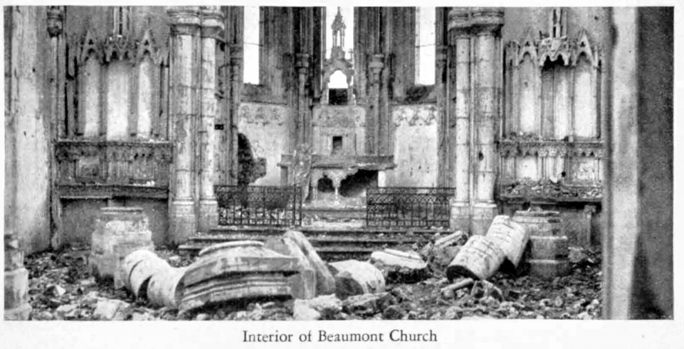

# Massachusetts Great War Killed In Action on 11-11 ... after Armistice was signed but before cease fire 

The final attack on 11-11 morning is generally considered to be even more unnecessary slaughter. For #WW100 Armistice Day, let´s remember those cut down that day in particular. Since I'm sitting in Boston and I know the ME NG Historian has my home state of ME covered, I'll focus on Massachusians.

# SITREP & OOB 11-11

## Situation Report (SITREP) 10 & 11 Nov

After the success of the Sept-October Meuse-Argonne offensive, the allies reorganizing, and preparing for a final push to Metz (and perhaps the Rhine?). It was scheduled for mid November -- 14th in the center, 11th on the right.

> "Early in November the Allied attacks, covering almost the entire front from the Meuse River to the North Sea, produced great disorganization in the German forces.
...
On November 9, while the Armistice negotiations were in progress, urgent orders were issued by Marshal Foch, the Allied Commander-in-Chief, directing that the enemy be pushed all along the Western Front and that be be given no time to rest or reorganize his troops." [^ABMC] 

## Order of Battle (OOB)

The allied order of battle Northwest to Southeast along the western Front

* GQGA Grand Quartier Général des Armées Alliées (GQGA) / Marchal Foch
* GHQ = [GQG](https://en.wikipedia.org/wiki/Grand_Quartier_Général_(1914–1919)) / [Pétain](https://en.wikipedia.org/wiki/Philippe_P%C3%A9tain) (Provins)
    + GAF Groupe Armées de Flandres / King of Belgium, incl. French Army of Belgium.
    + BEF British Expeditionary Forces / CG Haig (Fr. Armies: II, V, I, III, IV)
    + GAR Groupe d'armées de Réserve ou de Rupture (G.A.R.) / CG Fayolle (Fr. Armies: I, III)
    + Groupe d'armées du Centre (G.A.C.) / CG Maistre (Fr. Armies: V, IV)
    + AEF American Expeditionary Forces (Army Group) CG JJ Pershing  (US.Armies: I, II)
    + GAE Groupe d'armées de l'Est (G.A.E.) / CG Castelnau (Fr. Armies: VIII, VII)

[Large Map of 11-11 OOB, GHQ G-3 (c/o LoC)](./WLD-16804.png)

### AEF, US 1st Army (CG Liggett)

AEF is center-right in Allied lines, Meuse-Argonne operation, between GAC (Reims->Sedan axis) to left and GAE (Moselle) to right.
AEF sector divided between 1st and 2nd Armies (as of 12 Oct), left to right.  
[^CMH-77-8]

US 1st Army has Fr. Fourth to left, US 2nd Army to right.

> "5. OWN SITUATION AT BEGINNING OF TIlE DAY:
> The First Army advanced its line with the following 11 divisions in front from left to right:

        Corps / Divs (line) / Divs (Corps reserve)
        V         III       [Fr*] II Colonial Corps 
        77-2-89   90-5-32   15*-79-26-10*-81
        42        1          -

(The 3d, 29th, 36th, 78th, 80th, and 6th Divisions were in army reserve.)

> "6. OWN CHANGES, MOVEMENTS AND ACTION DURING TIlE DAY: Movement of 80th
Division to army reserve completed. Movement of 1st Division to III Corps Reserve continued.

(* Note - 1st Div, recently retired from left of line, supposedly moving from from V Corps Reserve to III Corps Reserve, but instead is surged toward Sedan only to be pulled up short to allow Fr 4th Armée to take Sedan.*)

(Map note: Fr XVII Corps as on map 1 Nov quickly reorganizes as Fr II Col. Corps during 6 Nov., and Fr XVII Corps takes charge of Second Army' left flank,  in contact on Fr II Col Corps's right flank.)

### AEF 2nd US  Army (CG Bullard)

        Corps / Divs (line) / Divs (Corps reserve)
        Fr XVII      IV       VI
        33          28,7      92
        -          7th Bde   (pioneers & Engrs)

(Army reserve: 4th (less 7th Bde), 35th Divs "in Area"; 88th Army reserve)

> "Early in November the Allied attacks, covering almost the entire front from the Meuse River to the North Sea, produced great disorganization in the German forces. ...
> On November 9, while the Armistice negotiations were in progress, urgent orders were issued by Marshal Foch, the Allied Commander-in-Chief, directing that the enemy be pusbed all along the Western Front and that be be given no time to rest or reorganize his troops." [^ABMC]

> Nov 10-11, Second Army participates in attack northeast of Pont-a-Mousson. 
> Nov 10, at 7 AM the Second Army begins attack.(Note 4) Its right, the VI Corps (Menoher), attacks east of the Moselle, driving in enemy outposts and occupying Bois de Fréhaut, Bois de la Voivrotte, and Bois de Cheminot. Its center, the IV Corps (Muir), pushes forward to general line extending from the Bois des Haravillers to the Fme des Hauts-Journaux. 
> Marimbois Fille and Bois de Dommartin are occupied. 
> Its left, the Fr XVII Corps (Hellot), occupies Bois de Marville, Bois les Hauts-Epines; enters Marcheville-en-Woevre and penetrates the enemy position in the Bois d'Harville.
> Nov 11, the advance of the right corps is halted by enemy artillery and machine-gun fire; the center corps approaches Bois Bonseil, and the quarry west of Rembercourt, and attacks Mon Plaisir Fme. The left corps occupies Butgneville, St-Hilaire, and Chateau et Ferme d' Aulnois. At 11 AM the armistice terminates hostilities.
> (Note 4) The right boundary of the army, utreme south, Is modified where It crosses the Moselle near Villey·le-Sec so that it follows the river to Plerre-la-Trelche, then proceeds to Blcqueley, Gye, and Bulllgny (all excl)." [^CMH-23-1]

# Remembering Massachusetts Soldiers recorded KIA on 11-11 

This list is compiled from *GOLD STAR RECORD OF MASSACHUSETTS IN THE WORLD WAR ( Vol II)*[^MaCommGold], selecting only those Massachusians listed as Killed In Action (KIA; or Died of Wounds the same day) on 11-11, the date of Armistice, whose lives were sacrificed by Generals who knew Armistice was about to be or already signed, to make the point that Germany was defeated on the battlefield as well as "at home". (See e.g. [PPT Sapper thread](https://twitter.com/pptsapper/status/1060000294124314625)  and [lives-wasted](http://www.historynet.com/world-war-i-wasted-lives-on-armistice-day.htm).)

In order left to right on the line, since we only know time of day for two of these.

## GAF / French Army of Belgium ###

Two US divisions, 37th Div and 91st Div, and 53d Art.Bde, were operating under (respectively) Fr. XXXIV and Fr.XXX Corps, French Army of Belgium, Group of Armies Flanders / Grand Army of Flanders, King of Belgians in titular command (and the French Chief of Staff in de facto command), in Belgium, Ypres-Lys offensive, 28 Oct - 11 Nov.

Relatively few Massachusetts soldiers were in these units, so none KIA 11-11. Mass.Comm Gold Star report [^MaCommGold] lists earlier KIA with these units

* One 2LT O'Brien of Williamstown was awarded the **Silver Star** posthumous for actions in October; 
* another 2LT, J A Kelly, **Belgian Croix de Guerre** posthumous; 
* one killed crossing Scarpe River Nov 2; one veteran Sergeant died of disease, having been gassed; 
* another killed in Belgium; an Engineer, died of wounds from prior offensive; 
* several others KIA or Died of Wounds in earlier offensives, but none 11-11.

## BEF/CEF, Belgium (CG Haig) ###

Allied Left Wing liberating Belgium (GAF and BEF) includes CANADIAN CORPS.

### BEF, Br. I Army (CG Horne) , 2nd or 3rd Canadian Div?

#### Harry Douglas MacAlpine

Our first entry is a bit of a mystery.

> **MacAlpine, Harry Douglas, Sapper,** C. E. F.: killed in action 11 Nov., 1918. 

> Enl. 25 Feb., 1917, 1st W. S. Royal Engrs., Canadian Army. 

> Born 2 March, 1887, at Bear River, N. S., son of Henry Judson and Luvenia (Hill) MacAlpine; 
> brother of William Edward and Alfred Freeman (1st Lieut., M. C). Married Josephine Sinnott 
> (deceased). Child: Walter Francis. Cousin of Edward E. Nickles, page 352. 

> (Mass.Comm.Gold-Star narrative [^MaCommGold])

A Greater Bostonian (apparently of Somerville, listed under Middelsex County), possibly with a Nova Scotian wife and other Nova Scotian connections, enlists in **Canadian Royal Engineers**. I haven decoded ´1st W.S.' but Canadian memorial records assign Sapper H.D.MacAlpine to **"Inland Water Transport" (IWT)** which is under/grouped as "Inland Waterway and Docks" (IW&D, sometimes IWTD), which includes narrow-gauge RR and canal-barge ambulances & hospital ships, as well as cargo barging for RE.  Classed as "Imperial service outside CEF" in some Canadian statistics, so apparently CRE outside of Division combat engineer Co's seems to be slurped into BEF RE?  IWT/IW&D would be Horizontal Engineering or Service of Supply in our nomenclature?

He is sometimes indexed as McAlpine. Only the Mass.Commission[^MaCommGold] source says KIA, others say Unknown or died of war only, very unclear.

> Buried: Longuenesse (St Omer) Souvenir Cemetery, Pas de Calais, France, V. E. 52.
(multiple sources)

Unknown where he died on on 11-11, or what unit he was with; quite logically it would be Canadian Corps in BEF taking Mons on 11-11, but could be with CEF in Siberia, or elsewhere with RE or other BEF troops. (RE IWT was very active in Mesopotamia and Italy.)

If he fell at Mons, as is somewhat likely for a Canadian KIA on 11-11, it likely to be 2nd Div or 3rd Div, notionally in Canadian Corps. Troops in Mons were 7th CIB (RCR, PPCLI, 42d Montréal Bn, and 49th Bn). Only 1 KIA in city, named, not this one, but could have been on approach?

His (C)RE specialty IWT was supposedly (partially? wholy?) drafted into Durham Light Infantry(DLI), also near Mons but rotated out?? 

Canadian links for **MacAlpine** - 

* [Can Govt Virtual War Memorial](http://www.veterans.gc.ca/eng/remembrance/memorials/canadian-virtual-war-memorial/detail/22102)  Service Number: WR/600554 (elsewhere, "WR prefix stands for Waterways & Railways");  Force: Army;  Unit:Royal Engineers;  Division: **Inland Water Transport**
* [Can Gov Remembrance Book](http://www.veterans.gc.ca/eng/remembrance/memorials/books/page?page=590&book=1&sort=pageAsc)
* [Can Great War Project](http://www.canadiangreatwarproject.com/searches/soldierDetail.asp?ID=114]
 **"Cause of Death: Died in War, unknown cause"** with much Unknown/Not Specified. 
* [CWGC](https://www.cwgc.org/find-war-dead/casualty/22102/)
* [RootsWeb, Nova Scotia Vital Statisics](http://sites.rootsweb.com/~canbrnep/vitstat1913.htm) deepens the mystery by presenting a different possible spouse or someone of same name in same county, also with Canadian connections: 

> **Severance, Annie Love,** d/o Mrs. Margaret Elizabeth Severance married at Melrose, Mass., 19 April 1913, to **Harry Douglas MacAlpine,** Somerville, Mass., s/o Henry MacAlpine. [8 May 1913 write up]
> - *The Register,* Berwick, Kings Co., Nova Scotia - 1913 Vital Statistics Published on Thursday"

Regarding IWT, we find

> In April 1918, Canadians with the Royal Engineers Inland Water Transport were drafted to the Durham Light Infantry ...
> *Filling the Ranks: Manpower in the Canadian Expeditionary Force* [https://books.google.com/books?isbn=0773549102], Richard Holt, 2017

which is confirmed by [6th Bn Durham Light Inf.](https://archive.org/stream/6thbattaliondur00ainuoft/6thbattaliondur00ainuoft_djvu.txt) getting a draft from RE IWT&D, but that Bn was reduced to Cadre and distributed to other Bns by 6 Nov, so nowhere in particular on 11-11. 

[Durhams History](https://archive.org/details/cihm_991347/page/n407) says Durhams were in reserve from 8 Nov, so not at Mons, any 11-11 battle dead in Durhams would be died of earlier wounds (or detached to a unit one-line, or hit be deep zone harassment).

So we don´t know where Harry served or fell; lucky to have any information on a Bostonian serving with Canadians and Brits at all, it seems.

### BEF, Br.IV Army (CG Rawlinson)

US 30th Div and 27th Div are in Army Reserve and do not figure in 11-11 KIA story.

## French Army Group of Rupture/Reserve, Fr.3rd Army 

Possibly two US Regiments 59th and 370th, in line?  Unclear map legend!

## French Army Group Center - None

## AEF, (US) FIRST ARMY, V CORPS (1-77-2-89)

V Corps holds the left of 1st Army, adjacent to GAC, Fr.IV Army, which has a fresh Fr.70th Div at its right corner.

CG Summerall, appointed in 2nd Army reorg Oct 12th, was rather aggressive. (See [lives-wasted](http://www.historynet.com/world-war-i-wasted-lives-on-armistice-day.htm) for more on him and 11-11.)

### Meuse; 2nd Div

2d Div HQ Fossé from Nov. 4th

#### Charles Sylvester Hart (Medical Corps)

> Hart, Charles Sylvester: killed in action 11 Nov., 1918 [in attack along the Meuse between Muzon  and Inor]. 

> Enl. 26 Sept., 1917, R. A., Medical Dept., Fort Ethan Allen; trans. 20 Nov., 1917, to Med. Dept.,  Base Hospital 66; 19 July, 1918, to Medical Detachment, 2d Engrs., 2d Div. Overseas 18 Dec, 1917. 

> Born 15 June, 1897, at Newbury, N. H., son of Fred S. (deceased) and Hannah S. (Muzzey) Hart  of Holyoke, 1926; brother of Clarence F. Jeweler. Square at Lancaster, N. H., named in his memory. 

> (Mass.Comm.Gold-Star narrative [^MaCommGold])

From the information given, we can not tell where along 2nd Div's line Medic Hart fell, but it's a narrow line.

Division history says -

> "Nov 10-11, elements of the Div cross
the Meuse east of the Bois de l'Hospice and reach the heights south
of Moulins, the north and south ridge through Senegal Fme, and
Warmonterne Fme." [CMH-23-2] 

### 89th Div

A Mass. solder originally with 89th is reported KIA in sector of 26th Div, so q.v.26th below.

The movements of his original unit just for completeness, and since there are good photos from their stretch of the Meuse.
 
> "Nov 2-5, Div advances through Barricourt, Tailly,
Nouart, Beauclair, and Beaufort, reaching the Meuse from Laneuville-sur-Meuse to Pouilly. 
Nov 7, Div relieves units of the 2d Div as far as a point south of Létanne. 
Nov 10, units cross the Meuse west of Pouilly and reach the high ground north of that place. 
Nov 11, divisional units cross the Meuse at Laneuville-sur-Meuse, occupy Stenay and a position northeast thereof; units on the left of the Div occupy the Bois de Hache and Autreville." [^CMH-23-2]

## FIRST ARMY, III CORPS (90-5-32)

### Ecurey; 32d Div (First Army, III Corps, line) (SS, CdG)

#### (Rev) 1LT William F. Davitt Chaplain - **0945 AM** 

**0945 AM** - Armistice was already signed, 11 am cessation already announced.

> **Davitt, William F., First Lieutenant, Chaplain:** killed in action 11 Nov., 1918, near Ecurey, 75 minutes before the armistice. 

>   Commissioned 1st Lieut., Chaplain, 6 Jan., 1918, and assigned to 120th M.G. Bn., 32d Div.; trans, to 125th Inf., 32d Div. He had volunteered as Chaplain, K. of C, at outbreak of war, and was assigned Oct., 1917, to Camp McArthur, Tex. Overseas 10 Feb., 1918. 

>   Born 8 Dec, 1886, at Holyoke, son of Lawrence (born in Canada) and Mary (Kane, born in Ireland, died 1920) Davitt; brother of James L. (1st Lieut., 94th Aero Sq., A. E. F.) of Willimansett. Holy Cross College, 1907; Grand Seminary, Montreal, Can. Priest, St. Anne's Parish, Lenox. One of the last American officers killed in the World War. Post 625, V. F. W., Chicopee, named in his honor, also Fr. Davitt Council, K. of C, Lenox, and a square in Worcester. 

>    **Silver Star** Citation 3 June, 1919: "For gallantry in action near Courmont, France, 4 Oct., 1918, in burying the dead under heavy shell fire." 

>    **Cited in G. O. No. 26,** 20 Nov., 1918: "For faithful and conscientious performance of duty  and for extreme coolness under shell fire in the performance of his duty as **Chief Burial Officer, 5th Corps,** during the Meuse-Argonne operations. ' 

>    **Croix de Guerre with palm:** "During the advance from the Ourcq to the Vesle from July 31 
to Aug. 6, 1918, he carried out his duties heedless of danger and without interruption under a 
violent fire. By his comforting words and his fine example of abnegation and bravery he 
encouraged the men of his regiment who were advancing to the assault." 
79
>    Recommended for D. S. C: "During the advance from Courmont to Mount St. Martin, 
Chaplain Davitt worked single-handed without ceasing for anything, collecting the dead 
of his Division (32d) and looking after the burial. He did this under violent fire, to which he 
apparently paid no attention. While doing this work he stopped to encourage with cheerful 
words and advice the enlisted men along the line who also were under fire. The results of 
his work were 125 American soldiers buried, many wounded cared for, and soldiers in the 
line encouraged." 

>    Cited for bravery August 6, 1918, during operations along the Vesle River: "To rescue 40 
wounded soldiers who were temporarily isolated from their command, he led a party of vol- 
unteers through a hail of machine gun bullets. All were rescued and returned to their com- 
mand without the loss of a single man." 

>   Cited for bravery Oct. 20, 1918, during the Argonne offensive: "To rescue three wounded soldiers, he leaped over the top of the trench, and, under enemy machine-gun fire, dragged them  to safety one by one." 

> **Name appears on Memorial Tablet, State House.**

> (Mass.Comm.Gold-Star narrative [^MaCommGold])

HQ 32nd Div at Vilosnes-sur-Meuse Nov.9-17 [^CMH-23-2]

Ecurey is 2 miles behind the lines of Nov 10-11, but would be in clear view up valley to artillery across the river, and where troops had fallen previous days?

> "Nov 9, ... leading elements ... relieve units of the Fr 15th Colonial Div at Peuvillers and 1.5 km east of Breheville. 
Night Nov 9/10, the remainder of the Div crosses the Meuse ... enters line east of Breheville and relieves part of the 128th Inf.
Nov 10, Div (less Arty) pursues, ...  advances so that part ... reaches a line from the Bois Dombras to the Cote du Mont 
but later withdraws, Div finally holds a line from 3/4 km south of Peuvillers, along the road from Damvillers to Jametz, the southwestern edge of the Bois Demange, the woods west of Thinte Rau, to 2 1/4 km south of Jametz; Fr 15th Colonial Div on right, 5th Div on left." [^CMH-23-2]

> "Peuvillers. Early on November 9 troops of the 32d Division attached to the 5th Division relieved units of the French 15th Colonial Division who had occupied this village the previous day. East of the village on November 10 the 32d Division had considerable fighting." [^ABMC]

## FIRST ARMY, Fr II Col. CORPS (Fr.15-79-26-Fr.10-81)

### near Ville-devant-Chaumont; junction of 79th Div (left) and Yankee Division´s M.G.co, 104th Regt of 26th Div (right)

The assult on this town claimed 3 from Massachusetts on 11-11, 2 the prior day, and likely more died of wounds later. Proceeding left to right, we remember first the fellow with the 79th Div.

#### John F. Lammers (79th)

> **Lammers, John F.:** killed in action 11 Nov., 1918 [near **Ville-devant-Chaumont**].

> Ent. 30 May, 1918, 152d D. B.; trans. 22 June to Co. D, **316th Inf., 79th Div.** Overseas 9 July,  1918. 

> Born 19 Jan., 1895, at Roxbury, son of John D. (deceased) and Annie S. Lammers of Lynnfield Center. Clerk. 

#### Frederick B Hamsworth (Horsch) (MG Co, YD 104th)

Our next two are from the same Machine Gun Co, 104th Inf Regiment, 26th (Yankee) Division:

> **Hamsworth, Frederick B.:**  killed in action 11 Nov., 1918. (aka **Frederick Blatchford Horsch**) [at the capture of **Ville-devant-Chaumont**]. 

> Enl. 26 May, 1917, M. G. Co., 2d Inf., Mass. N. G. (**M. G. Co., 104th Inf., 26th Div.**). Wounded 
in action 16 Oct., 1918. Overseas 27 Sept., 1917. 

> Born 3 Sept., 1893, at Newburyport, son of John H. and Mary E. (Thurlow) Horsch. Street junction in Haverhill named in his memory. 

#### Hugh Lawrence Kehoe (MG Co, YD 104th)

> **Kehoe, Hugh Lawrence:** killed in action 11 Nov., 1918 [at **Ville-devant-Chaumont**J. 

> Enl. 22 May, 1917; reported for duty 25, July; mustered 30 July, Co. K, 8th Inf., Mass. N. G.;
trans, to **M. G. Co., 104th Inf., 26th Div.** Overseas 6 Oct., 1917. 

> Born March, 1896, at South Williamstown, son of Patrick S. and Hannah E. Kehoe; brother of 
Mary A. and James P. of Nova Scotia, John S. of Newtonville, and Lewis S. of Allston. 

> Hospital attendant, employed at School for the Feeble-Minded at Waltham. Of Waverley. 

> (Mass.Comm.Gold-Star narrative [^MaCommGold])

79th Div - 

> Nov 9-11, Div attacks, captures
Crépion, Wavrille, Gibercy, and Ville-devant-Chaumont, and reaches
a line from Chaumont-devant-Damvillers (incl) , along the high
ground 1 1/2 km west of Romagne-sous-les-C6tes, to 1 1/2 km east of
Gibercy.
[^CMH-23-2]

104th Inf, 26th Div - 

> "Early in the morning of Nov. 11, the 1st and 2d Battalions (reserve and support respectively) were ordered to move to the eastern edge of the Bois du Wavrille, to attack in an easterly direction through Herbebois.
> The 3d Battalion was to hold its position, reached the day before, and to attack from there at the same time in the direction of Côte 265 (Hill 265).
> With the battalions ready for the jump off, an order was received fifteen minutes before the zero hour to hold their position and not to advance.
> Later, shortly before 11 o'clock, the infantry was ordered forward.
> An advance was made of between 200 and 300 yards eastward, straightening out the line along the Azannes-Beaumont road, which
> 1st Battalion reported seeing position was held at 11 o'clock."
> [^MaCommHist]

In addition to these 3 listed at Ville devt. Chaumont, 1 other in YD's sector were KIA 11-11, listed next, and 2 others of 26th Div YD also KIA "near Ville-devant-Chaumont" on 10 Nov, not listed here by the 11-11 groundrule for this memorial.

>"The total casualties of the 33d, 29th, 79th and 26th Divisions during their fighting on and near the Heights of the Meuse
> were almost 15,000 officers and men. Molleville Farm was the 79th Division Headquarters from November 9 to 11."
[^ABMC]

### Beaumont; ? 89th Div or 26th Div !! ?

#### 1LT James Wilson, Jr.

> **Wilson, James, Jr., First Lieutenant:** killed in action 11 Nov., 1918, near **Beaumont**. 

> Enl. 30 Dec, 1913, R. A., 22d Inf.; trans, to 15th Inf. Dis. 13 Aug., 1917, to accept commission. 2d Lieut., Inf., 14 Aug., 1917. 1st Lieut. 25 Aug., 1917. Assigned to **356th Inf., 89th Div.** Over-seas 4 June, 1918. 

> Born 17 June, 1891, at South Boston, son of James S. Wilson. His mother was reported as living  at Prince Albert, Saskatchewan, Can., in 1917. 

> (Mass.Comm.Gold-Star narrative [^MaCommGold])

Beaumont is Rear area of former Fr XVII then Fr II Cl Corps, right-rear of US 26th Div at time of death -- the opposite end of Yankee Div (26th) line from *Ville devt. Chaumont* mentioned above. Mass.Comm record shows him heading overseas with 356th Inf., 89th Div, but his location of death as Beaumont in 26th Div´s rear area; was he transferred or detached to 26th?

>"Nov 3, (26th) Div completes the relief of the Fr 26th Div and
assumes command of the Neptune Sector on a front extending from 1
km north of Beaumont to 1% km west of Flabas; Fr 10th Colonial
Div on right, 79th Div on left. Nov 8, the enemy retreats and the
Div, pivoting on its right, advances through Flabas to the line: Sous-
la-fosse-a-terre, Flabas, heights north of Flabas. Nov 9, Div advances
east to a line from 1H km northeast of Beaumont, along the eastern
edge of la Wavrille, the ravine Ie Fond-des-Vaux, to X km west of
Ville-devant-Chaumont. Nov 10, Div advances to Fme St-Andre,
the eastern edge of the Bois de Ville, and Ville-devant-Chaumont (incl)." [^CMH-23-2]

(The 89th, 1LT Wilson´s original unit, was in 1st Army, V Corps (Summerall) on 11-11,  a rather different part of line than Beaumont; listed above.) 

### Hautecourt, 81st Div (2nd Army Fr II Cl, in line)

Hautecourt is in the French Second Army area, where the lines have moved past Verdun.

The 81st is advancing in separate Battalions.

Hautecourt is beyond Moranville , just beyond northeasterly Bn(s)'s 11 Nov halt.

#### Wladislaw Prusak

> **Prusak, Wladislaw:** killed in action 11 Nov., 1918 [in attack on **Hautecourt**]. 

> Ent. 30 May, 1918, 21st Recruit Co., General Service Inf., Fort Slocum; trans. 3 June to Co. C, 2d Corps Arty. Park, Camp Jackson; 15 June to 156th D. B.; 28 June to Co. I, 321st Inf., 81st  Div. Overseas 31 July, 1918. 

> Born 1888 at "Porerotky," Russia; brother of Mrs. Francisca Bialkowski of Salem. 

> (Mass.Comm.Gold-Star narrative [^MaCommGold])

81st Div. Hdqrs - Sommedieue, Nov. 7-9; Belrupt. Nov. 9- 11+ (19th?) [^CMH-23-2]

> "Nov 9, Fr 10th Colonial Div relieves the Div in the left of the sector north of the Verdun-Etain road; 
the 81st Div attacks toward the northeast, enters Manheulles and the wooded areas of les Chairs-Chenes and la Noire-Haie, captures Moranville, and occupies the northern edge of the Bois de Moranville. 
Nov 10, Div captures Abaucourt and Ie Grand-Cognon and enters Grimaucourt-en Woevre. 
Nov 11, Div resumes the attack, captures Grimaucourt-en-Woevre and le Petit-Cognon, and advances to a line from a point 1 km  southwest of Hermeville to Abaucourt; minor gains are made northeast of Manheulles and in the southwestern comer of the Bois de Manheulles."
[^CMH-23-2]

> "on Nov. 9 attacked on a front extending from Eix to Fresnes, 
continuing on the 10th and 11th in conjunction with the advance of the 33d Division on the right. 
At the moment of the Armistice an assault was being delivered upon the strongly fortified village of Hautecourt and the
Bois de Manheulles." [^MaCommHist]

> "Moranville and the Bois de Moranville. These places in the outpost zone of the Hindenburg Line were captured by the
81st Division on November 9 in spite of determined hostile resistance. 
Abaucourt. Captured on November 10 by the 81st Division after severe fighting.
Le Grand Cognon. This wooded area was captured by the 81st Division on November 10 after a hard fight.
Grimaucourt-en-Woëvre. Captured by the 81st Division on November 10 but not held that night. The next day the division pushed forward through the town and about 1 mile beyond it.
"No attack was made here on November 10 but on the llth the 81st Division met resistance in its efforts to advance in the
Bois de Manheulles. Its front line was in the wood at the time of the Armistice." [^ABMC]

The Bn's of 81st were separated in two engagements. The other Bn objective Manheulles has pictures.

## SECOND ARMY ( FrXVII-IV-VI)

(Second Army officially formed Oct. 12.)

> "Early in November ... 
The Second Army was therefore ordered to keep close watch of the enemy for any indications of a withdrawal. 
At that time the Second Army front was held, in order from right to left, by the VI Corps with the 92d Division in line, the IV Corps with 7th and 28th in line, and the French XVII Corps with the American 33d Division in line.
... The nearest part of the sector held by the 28th Division was at the woods seen in the distance to the right."  [^ABMC]

> "On November 1, General Pershing issued instructions on the course to be followed by
the Second Army in the event of a German retirement on its front. Because of the Austrian
Armistice. new dispositions were being ended by the enemy between the Meuse and Moselle
Rivers. General Pershing, on November 5, ordered the Second Army to advance between the
Moselle River and Etang de Lachaussee towards Gorze and Chambley, in anticipation of a
probable enemy withdrawal which, in fact, got under way the next day." 
[^CMH-23-6]

### Haumont, 28th Div (PA NG) (2nd Army, IV Corps; Thiaucourt sector)

#### 1LT Francis Reed Austin (DSC) 1045 AM

**1045 AM**

> **Austin, Francis Reed, First Lieutenant,** Inf.: died 11 Nov., 1918, at Mobile Hospital 39, of wounds **received in action that day**, near Haumont, **fifteen minutes before close of hostilities.**

> Enl. 5 Jan., 1918, R. A., Camp Upton; assigned [from O. T. S.] to Co. D, 305th Inf., 77th Div. 
Corporal 1 April, 1918. Sergeant 8 May, 1918. [Detailed to British Automatic Machine Rifle 
School.] Dis. 12 July, 1918, to accept commission. Commissioned 2d Lieut., Inf., 14 July, 1918; 
assigned to 109th Inf., 28th Div. 1st Lieut., Inf., 28 Oct., 1918. Overseas 16 April, 1918. 

> Born 2 March, 1897, at Jamaica Plain, son of Francis Boylston (died 1926) and Sally (Reed, died 
1897) Austin; brother of William M. and Kiameche. Avenue at Fort Benning, Ga., named in 
his honor. Harvard, Class of 1920; prepared at Volkman School. One of the fifty-four Harvard 
students selected to attend the O. T. S. at Camp Upton, Jan. 5, 1918. Nearly all volunteered to 
join the 77th Div. when orders came for that division to go overseas, before the school course 
was completed. 

> **Awarded D. S. C:** "For extraordinary heroism in action near Haumont, France, November 
11, 1918. He led a platoon of machine guns and two one-pounder guns with their crews under 
cover of a fog within the enemy's wire, and attacked at close range a strong point held by 25 men 
and 10 machine guns. After this position had been reduced, concentrated machine-gun fire 
from the ranks forced Lieutenant Austin and his party to withdraw. Exposing himself in 
order to place his men under cover, he was mortally wounded, but he directed the dressing 
of the wounds of his men and their evacuation before he would accept any aid for himself. 
He died a few hours later." 

> (Mass.Comm.Gold-Star narrative [^MaCommGold])

PA NG 28th Div movements - 

> "Nov 4, the front is advanced to the northern edge of Bois des Haudronvilles Bas. Nov 6, the Fr XVII Corps is on the left. Nov 10-11, [28th] Div advances to the Bois Dommartin, Marimbois Fme, the northern edge of the Bois des Haravillers, and the Fme des Hauts-Journaux." [^CMH-23-2]

> "American IV Corps---East edge of Bois des Rappes to Bois des Haravillers, to advance toward Vionville ... At 7 a. m., on November 10, the Second Army attacked.  ...  The IV Corps, in the center, pushed forward to a general line extending
from Bois des Haravillers to Les Hauts-Journaux Farm. ... . On November 11, ... [T]he IV Corps
approached the Bois Bonsell and the quarry west of Rembercourt, and attacked Mon Plaisir
Farm." [^CMH-23-6]

> "**Haumont-lès-Lachaussée.** This village was lightly held by the Germans following the St. Mihiel attack. The 42d, 89th and 37th Divisions raided it several times and the 28th Division occupied it on two different occasions; from October 24 to 29, and again from November 9 to 11." [^ABMC]

Other 28th Div objectives included 

> "Bois de Dommartin. Located about 600 yards in front of the American lines after the St. Mihiel operation, this little wood was the scene of many small but bitter fights in which at different times the 89th, 37th and 28th Divisions, in that order, participated. It was occupied by the 28th Division on November 10 and held until after the Armistice."

> "Dommartin-la-Chaussée.  Site of a large German supply depot. The town was in the main line of resistance of the Hindenburg Line. Attempts of the 28th Division to capture it on November 10 were defeated with considerable losses."

> "**Mon Plaisir Farm.** A strongly organized place in the Hindenburg Line which was attacked at different times after the St. Mihiel offensive by the 78th and 7th Divisions. The 28th and 89th Divisions sent patrols to it. The farm was still in the hands of the Germans when the Armistice became effective."

>"Marimbois Farm. This farm was in German hands at the close of the St. Mihiel offensive. From September 16 on patrols of the 42d and, later, of the 89th and 28th Divisions frequently clashed with the enemy there. It was occupied by the 28th Division on November 9 and held until the Armistice."

(Which brings us to the right end of the Line.)

# Credits Works Consulted & Quoted#

Special Thanks to

* **The Angry Staff Officer** ([blog](https://angrystaffofficer.com/), [PPT Sapper (twitter)](https://twitter.com/pptsapper)), especially [Foch Pershing Sommerall 11-11 thread](https://twitter.com/pptsapper/status/1060000294124314625) for inspiration.
* [**Fotoxx**](https://kornelix.net/fotoxx/fotoxx.html) Free & Libre Photo enhancement (For Linux)
* [Lives Wasted On Armistice Day](http://www.historynet.com/world-war-i-wasted-lives-on-armistice-day.htm), **HistoryNet.com**.

The canonical works consulted and block-quoted with footnotes were Massachusetts and USA Army official histories, and OOB maps.

* [Order of Battle on Western Front 11 A.M., Nov. 11, 1918](https://www.wdl.org/en/item/16804/), AEF GHQ 3rd Section, c/o Library of Congress; also appearing in *[LoC Occaisional Paper 7](https://www.loc.gov/rr/geogmap/pdf/plp/occasional/OccPaper7.pdf): Maps of The First World War: An Illustrated Essay and List of Select Maps in The Library of Congress*, Ryan J. Moore, A Philip Lee Phillips Map Society Publication, Library of Congress, DC: 2014.

* **Commission on Massachusetts' Part in the World War**, *Report of the*, Jesse F Stevens,  Eben Putnam; Boston: 1929; 
[HaithiTrust](https://catalog.hathitrust.org/Record/007467745), 
[archive.org](https://archive.org/search.php?query=%22Commission%20on%20Massachusetts%27%20Part%20in%20the%20World%20War%22)
[WorldCat](http://www.worldcat.org/title/report-of-the-commission-on-massachusetts-part-in-the-world-war/oclc/680173970&referer=brief_results)
**vol I, *History* **; **vol II, *Gold Star Record of Massachusetts in the World War* ** . 

[^MaCommHist]: *Report of the Commission on Massachusetts' Part in the World War: History* (vol I), 1929

[^MaCommGold]: *Report of the Commission on Massachusetts' Part in the World War: GOLD STAR RECORD OF MASSACHUSETTS IN THE WORLD WAR* ( Vol II), 1929

* **US Army Center of Military History (CMH)** [history.army.mil](https://history.army.mil/catalog/browse/pubnum.html) Numbered Publications - series 23 and 77 are World War 1 - 
    - CMH Pub 23-2 *ORDER OF BATTLE OF THE UNITED STATES LAND FORCES IN THE WORLD WAR American Expeditionary Forces: Divisions* (Volume 2) .
    - CMH pub 23-6 United States Army in the World War, 1917-1919, *Organization of the American Expeditionary Forces,* (Volume 1) .
    - CMH Pub 23-14  United States Army in the World War, 1917-1919, *Military Operations of the American Expeditionary Forces,* (Volume 9).
    - CMH Pub 23-24 *World War I Historic Reference Book,*  American Battle Monuments Commission (Available on [ABMC.gov](https://www.abmc.gov/news-events/news/world-war-i-historic-reference-book-now-available-abmcgov))  (Prepared by the ABMC but also issued as  **CMH Pub 23-24** via CMH link above.)
    - CMH Pub 77-8 THE U.S. ARMY CAMPAIGNS OF WORLD WAR I
COMMEMORATIVE SERIES, *MEUSE-ARGONNE 26 SEPTEMBER–11 NOVEMBER 1918,* Richard S. Faulkner.

[^CMH-23-2]: CMH Pub 23-2 *ORDER OF BATTLE OF THE UNITED STATES LAND FORCES IN THE WORLD WAR American Expeditionary Forces: Divisions* (Volume 2)

[^CMH-23-6]: CMH pub 23-6 United States Army in the World War, 1917-1919, *Organization of the American Expeditionary Forces,* Volume 1

[^CMH-23-14]: CMH Pub 23-14  United States Army in the World War, 1917-1919, *Military Operations of the American Expeditionary Forces,* Volume 9

[^CMH-77-8]: CMH Pub 77-8 THE U.S. ARMY CAMPAIGNS OF WORLD WAR I
COMMEMORATIVE SERIES, *MEUSE-ARGONNE 26 SEPTEMBER–11 NOVEMBER 1918,* Richard S. Faulkner, 

[^ABMC]: CMH Pub 23-24 *World War I Historic Reference Book,*  American Battle Monuments Commission (Available on [ABMC.gov](https://www.abmc.gov/news-events/news/world-war-i-historic-reference-book-now-available-abmcgov)) (Prepared by the ABMC but also issued as  **CMH Pub 23-24**)

Noted but not used for this project - the French equivalent of CMH official History and OOB is the official history, ***Les Armées Françaises dans la Grande Guerre,***   by *Ministère de la Guerre, État-Major  de l'armée - Service Historique*. Paris: *Imprimerie Nationale*. 1922-1939, published as a serial. Available online from **Bibliothèque nationale de France**'s digital library **[Gallica](https://gallica.bnf.fr)**. OOB is *Tome X, Ordres de Bataille*, in two volumes. Prior volumes are the official history by year and theatre, and the associated annexes of Orders and Messages.

* [Tome X, Vol 1er, 10.1](https://gallica.bnf.fr/ark:/12148/bpt6k6279687d?rk=42918;4) **Ordres de Bataille des Grandes Unités*** [texteBrute=plain text](https://gallica.bnf.fr/ark:/12148/bpt6k6279687d/texteBrut)
* [Tome X, Vol 2e, 10.2](https://gallica.bnf.fr/ark:/12148/bpt6k63495098?rk=21459;2) **Ordres de Bataille des Divisions** [texteBrute=plain text](https://gallica.bnf.fr/ark:/12148/bpt6k63495098/texteBrut)

Other sources that are linked in the text - 

* Canadian Memorial links for MacAlpine - [govt](http://www.veterans.gc.ca/eng/remembrance/memorials/canadian-virtual-war-memorial/detail/22102), [CGWP](http://www.canadiangreatwarproject.com/searches/soldierDetail.asp?ID=114), [CWGC](https://www.cwgc.org/find-war-dead/casualty/22102/) [Remembrance Book](http://www.veterans.gc.ca/eng/remembrance/memorials/books/page?page=590&book=1&sort=pageAsc)
* MacAlpine marriage [Nova Scotia Vital Statistics, RootsWeb](http://sites.rootsweb.com/~canbrnep/vitstat1913.htm)
* *Filling the Ranks: Manpower in the Canadian Expeditionary Force* [https://books.google.com/books?isbn=0773549102], Richard Holt, 2017
* *[6th Battallion Durham Light Infantry](https://archive.org/stream/6thbattaliondur00ainuoft/6thbattaliondur00ainuoft_djvu.txt)*
* *[The Durham Forces in the field 1914-18](https://archive.org/details/cihm_991347/page/n407) [microform] : volume II : the service battalions of the Durham Light Infantry*;  Miles, Wilfrid, and Vane, William Lyonel; London etd: 1920.

