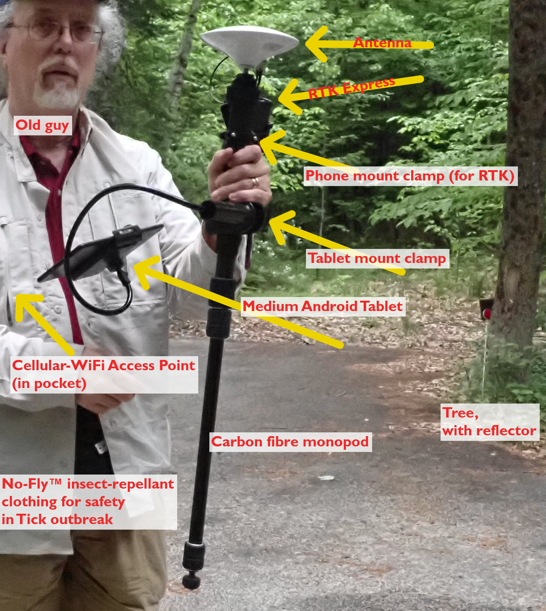
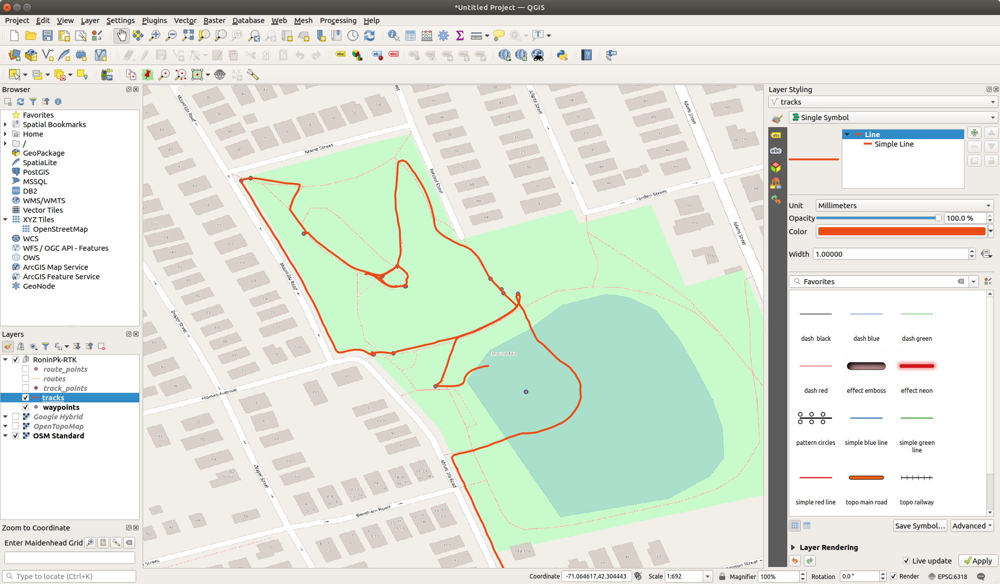
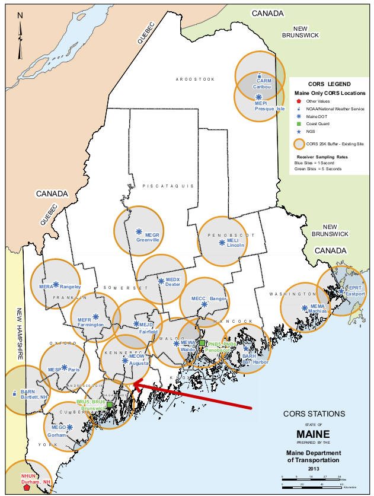
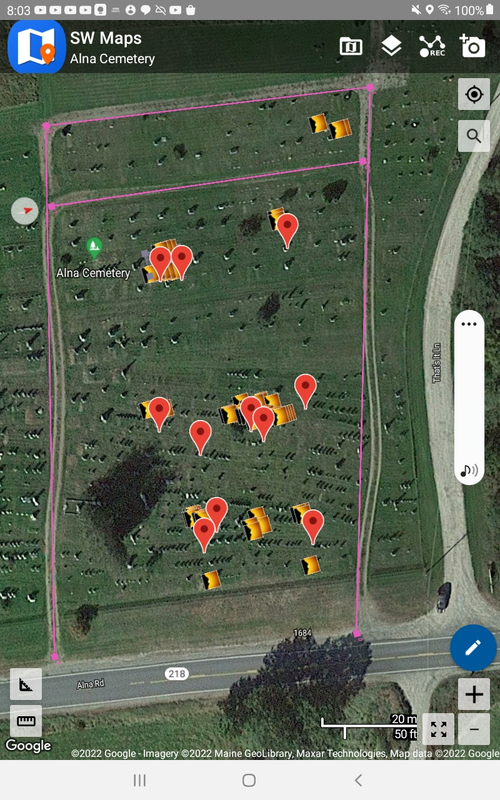

# RTK Experiments

## Intro

* Why is RTK

We get a false sense of accuracy from phone, car, hiking GPS.

"Stay on road" and perhaps inertial corrections let the GPS display cover for the erratic measurements.

If we mark a point with a GPS and then ask for directions to get back there, it likely takes us to the right place close enough, as buildings/driveways are _almost_ far enough apart to be _mostly_ non-overlapping in error. Most people don't need 1m, 0.1m, or 1cm accuracy.

If you download the "tracks" off a GPS that was left on in a parked car, you'll see a random "star" as the position computed varies this way and that. A disturbingly large star, that shows that only with a very long term average could you compute a 1m position. My Garmin GPS peering through a windshield-shaped hole with trees and house partially blocking what little sky it could see drew a 50×15m (150×50') error star for us. If the nearest houselots weren't vacant, many of the points in the star if chosen at random (whenever one hits the "save" button) the position wouldn't obviously be associated with my house! But the _centeroid_ of the star-cloud is roughly correct (slightly offset away from the house by i presume reflections).

Native GPS precision/resolution in Civilian mode is 30m; a 5 minute average can improve that to 5m, 12 hours average to maybe 1m?
Dual Frequency L1+L2 and DGPS correciton signals can improve that slightly, since the ionosphere bends L1 and L2 bands differently, but not by much. Military grade only improves on codeless L1+L2 20%. (They didn't want us that close but algorithms are winning.)

If one wants to map things smaller than a house accurately, or things hard to see from medium distance away (10-50m) even dual L1+L2 & classical DGPS/WAAS isn't good enough. 

Which is why surveyors use GPS equipment that is capable of correcting for all the errors by using a continuous error stream from a near-by (practically) identical receiver at a known location. (Known to ±1cm preferably.)

These devices cost less than new cars, but i've seen used cars for less lately. With a long-term occupation, it can get a ±1cm accurate position on the tripod, and then can share that accuracy with the portable GPS on a surveyor's rod.

* What is RTK? 

RTK is the latest walkabout form of enhanced GPS/GNSS position solution.

It's called **Real Time Kinematic** because it corrects in real time, when moving.†

In the simplest form, a base station on a known location records phase data on received GPS/GNSS sat signals, both L1 and L2 bands, and notes the corrections - and sends them to subscribers via Internet and/or direct data radio if nearby.

Subscription may be commercial, open/free, private, or public by e.g. MassDOT, MaineDOT (free, registration required). One can connect to the nearest station of the network by name (having looked up which is nearest) or a network may provide a Virtual base by weighted-averaging several nearest bases to derive a virtual correction for your location instead of just giving the nearest. (This requires disclosing your location to the Network.)

†( Why bother _calling_ it RTK? Because there is an _alternative_ phase-difference enhancement scheme, requiring same high-end GNSS receiver hardware, that is **non**-real-time, **non**-kinematic, that compares _logged_ recieved phases - logging for 12+ satellites in both L1 and L2 bands - at both a known base-station and an unknown station, logged over many hours, unmoving, with the log comparision and calculation done _later_ to get just one (nearly) _perfect_ location solution for the unknown base. Can be < ±1cm if close enough to the known base which was already known that well. This is great for professional surveyors setting up a chain of known positions extending from the nearest public base for their future use in their remote territory, moving their own base unit around. There's also a compromise that doesn't use Internet or data radios, so is not real-time but is still kinematic: One can also log raw data while moving around and capturing approximate GPS points, and compare raw field logs to base logs later, back in the office, to get corrected positions for the points collected in the field. )

## Open 

* Hardware solution that is partly Open Hardware

    - Open Hardware 
        - [git for board](https://github.com/sparkfun/SparkFun_RTK_Express_Plus/tree/main/Hardware); 
        - [graphics, case](https://github.com/sparkfun/SparkFun_RTK_Express_Plus)
    
        - [**ESP32**](http://esp32.net/) ([wiki](https://en.wikipedia.org/wiki/ESP32)) is **not** open hardware but proprietary; however the firmware open  
        «`ESP32 is a feature-rich MCU with integrated Wi-Fi and Bluetooth connectivity for a wide-range of applications`», perfect for IoT and connectivity of larger devices; programmable like an Arduino but also by other embedded-development-tool-chains.
        - u-Blox ZED-[**F9P**](https://www.u-blox.com/en/product/zed-f9p-module), is also **not** open hardware but proprietary; it's a Multi-band GNSS receiver, rather specialized.
    - Open Firmware 
        - for the ESP32 and device UI [git](https://www.sparkfun.com/products/18590)
        - but **not** for F9P, which requires a proprietary firmware blob that implements core GPS
    - Free _&/or_ Open Software
        - recommended starter Collector App is _Free as in Beer_ but **not** Open. [**SW Maps**](http://softwel.com.np/mobile_products) ([manual](http://softwel.com.np/images/download_manual/SW%20MAPS5.pdf)), built for local OpenStreetMap mappers in Nepal. ([youtube tutorials](https://www.youtube.com/playlist?list=PLBx4b7EynYBAl4niXT4MYWMG7EqpPUgHr); same fellow has a couple of QGIS tutorials also!)
        - two FLOSS Collector App alternatives need patches in App and/or RTK-Express-Plus firmware to work via WiFi+BT; one or both _might_ work on *some* tablets via USB to RTK (I haven't tested that yet):
            - [**Vespucci**](https://vespucci.io/) OSM editor for Android (competitor to OSMAND?), knows about external GPSs), assumes you want to upload points and lines to OSM; tutorials don't document how can it act as a collector for non-OSM projects.
            - [**QField**](https://qfield.org/) FLOSS GIS field collector app specifially optimized for QGIS projects, but can export KML as well as GPKG and GeoJSON, so not tied to QGIS.
            - All three are usable with Android tablet/phone's native GPS, and *should eventually* also be able to work with enhanced precision with RTK via BT/WiFi/USB. Alas only the non-FLOSS freeware works out of the box reliably _today_.

* Product
    - _Warning_ - If you're used to GPS being inclusive complimentary in your phone, standalone GPS prices will be as staggering as real camera prices - like high end phone without carrier subsidy. These are still nickel-to-dime-on-the-dollar compared to Professional Surveyor packaged equipment that likely uses the same receiver chip.
    - [RTK Express Plus Kit](https://www.sparkfun.com/products/18589) - everything but the pole, tablet, and clamps.
        
        

    - now available caseless ui-less with budget antenna too ( [blog](https://www.sparkfun.com/news/4893) [product](https://www.sparkfun.com/products/18292))
    - [SparkFun RTK Express Hookup Guide](https://learn.sparkfun.com/tutorials/sparkfun-rtk-express-hookup-guide) includes nice tour of the case and board (guide for both Plus and original)

* Experiments
    - kit: added recommended phone clamp, a tablet clamp and a carbon-fibre photo monopod i had on-land, and the Cellular/Wi-Fi AccessPoint i normally use, and voila
        
    
    - test run: hike around a park in Boston, using MAINE live correction data (sub-optimal but it worked).         
      Note how _closely_ to the path/sidewalk the track stays; marked points at pitchers mound, porta-potty, stairs, flag-pole, fountain, are all ±1m.
        
        

    - first real data collection: family cemetery in Maine, using Maine correction data (as should there)
          
        My first expedition is just within 25km radius of the nearest Maine CORS base-station;    
        a professional survey outside of radius would need to provide their own base on a <±1cm mark to achieve cm accuracy.  
          
        I geo-refereneced the [WPA map of the cemetery](https://digitalmaine.com/arc_wpa-cemetery/) in GEarth(Pro). (I need to learn to do that in QGIS.)
        And then set markers for known ancestors (and a few select Uncles+Aunts) using Plot Numbers from [FindAGrave.com](https://www.findagrave.com/cemetery/89622/memorial-search?firstname=&middlename=&lastname=Walker&cemeteryName=Alna+Cemetery&birthyear=&birthyearfilter=&deathyear=&deathyearfilter=&memorialid=&mcid=&linkedToName=&datefilter=&orderby=n&plot=&includeMaidenName=true&page=2#sr-49665532).   
        **Note** This WPA map is North right, viewed from road, downhill, as will be a couple screenshots, but then we will switch **North** up.
        
        I loaded the resulting KML file (including sketched traces of the driveways) into SW Maps as a reference layer, and created empty "stones" "photos" layers. I added a "plots" layer in the field when i used the GPS to draw a polygon around corners of most recent family plot.
        
        The red Google-Maps-ish markers are the KML look near here markers (and have text of who if clicked).
        
        The sunset icons show where a photo was gathered. Track isn't currently showing on this view.
        
        My camera's GPS was logging as i walked also. Let's compare the precision. Red Points on a dusty-rusty line are the normal GPS track points, connect the dots. Bright blue line is the RTK ground track.  On a few loops, the regular GPS Track tracks the RKT track _reasonably_ well if crudely, but others are just whacky - at no point did i jump the fence or even cross the drive north!
        
        Here the red-dots are from the Photo layer. At each headstone, i took a PHOTO using not my camera but using the **SW Maps** program on the **tablet**, which not only geotagged the photo at high precision, it included it in the Photos layer of the GIS project. Here we've imported the Photos layer together with the planning layer. Some of the stones are rather far from their plan point, but those could be funny-shaped larger plots. (Or bad metadata in grave index.) Note how far the highlighted red dot (Nathaniel Plummer in right hand detail panel) is from his plot marker.
        
        This is one of the 3 pictures taken for Nathaniel Plummer and wife.

* Caveats

    - Coordinate Reference System:  
    With an RTK system, you get coordinates in the US national referencesystem, 
    which is slightly different from the normal GPS and GMaps "WGS84" reference system.  
    To get sub-meter accuracy you have to understand and account for this, but
    the details would be an entire other talk and are thus omitted.

* Glossary
    - [Networked Transport of RTCM via Internet Protocol (NTRIP)](https://en.wikipedia.org/wiki/Networked_Transport_of_RTCM_via_Internet_Protocol)
    - [differential GPS (DGPS) ](https://en.wikipedia.org/wiki/Differential_GPS) can conceptually cover a range of correction enhancement techniques. Spcifically referred to  original LF harbor broadcasts to locally correct Selective Availability time offset for mariners (and VHF for air). Largely supplanted by WAAS (& end of SA). RTK is conceptually in the same family but moreso, transmitting corrections for subtler forms of error.
    - [real-time kinematic positioning (**RTK**)](https://en.wikipedia.org/wiki/Real-time_kinematic_positioning)
    - [GPS: USA brand of GNSS](https://en.wikipedia.org/wiki/GNSS); orther sats are usable simultaneoulsy.
    - [Wide Area Augmentation System (WAAS)](https://en.wikipedia.org/wiki/Wide_Area_Augmentation_System), US GPS brand of (GNSS augmentation](https://en.wikipedia.org/wiki/GNSS_augmentation)
    - [GNSS enhancement](https://en.wikipedia.org/wiki/GNSS_enhancement) latest generation of max precision. Codeless L1/L2, carrier-phase tracking, and RTK
    - Radio Technical Commission for Maritime Services (**RTCM**) standardized RTCM Messages for RTK corrections.
    - [National Marine Electronics Association (NMEA)](https://en.wikipedia.org/wiki/National_Marine_Electronics_Association) standardized format for raw GPS output, [**NMEA sentence format**](https://en.wikipedia.org/wiki/NMEA_0183#NMEA_sentence_format).
    - [spatial reference system (SRS) or coordinate reference system (CRS)](https://en.wikipedia.org/wiki/Spatial_reference_system)
    - [Continuously Operating Reference Station (CORS)](https://en.wikipedia.org/wiki/Real-time_kinematic_positioning#CORS) "a network of real-time kinematik (RTK) base stations that broadcast corrections to augment the local accuracy of GNSS (e.g. GPS) readings "

# Credits and © 

- Composite work © 2022 William D Ricker .
- WPA Map is Public Domain, thanks to DigitalMaine for scanning and sharing.
- Thanks to Greg T N1DAM for pungent commentary.
- OpenStreetMap maps are "© OpenStreetMap contributors" used under their guidelines; the data is available under the Open Database License.
- Two original photos copyright © 2022 William D Ricker.
- All modifications to images © 2022 William D Ricker, using [Fotoxx](https://kornelix.net/fotoxx/fotoxx.html). Thanks Mike!
- GoogleMaps and web-scarped images used as Fair Use for educational purposes.