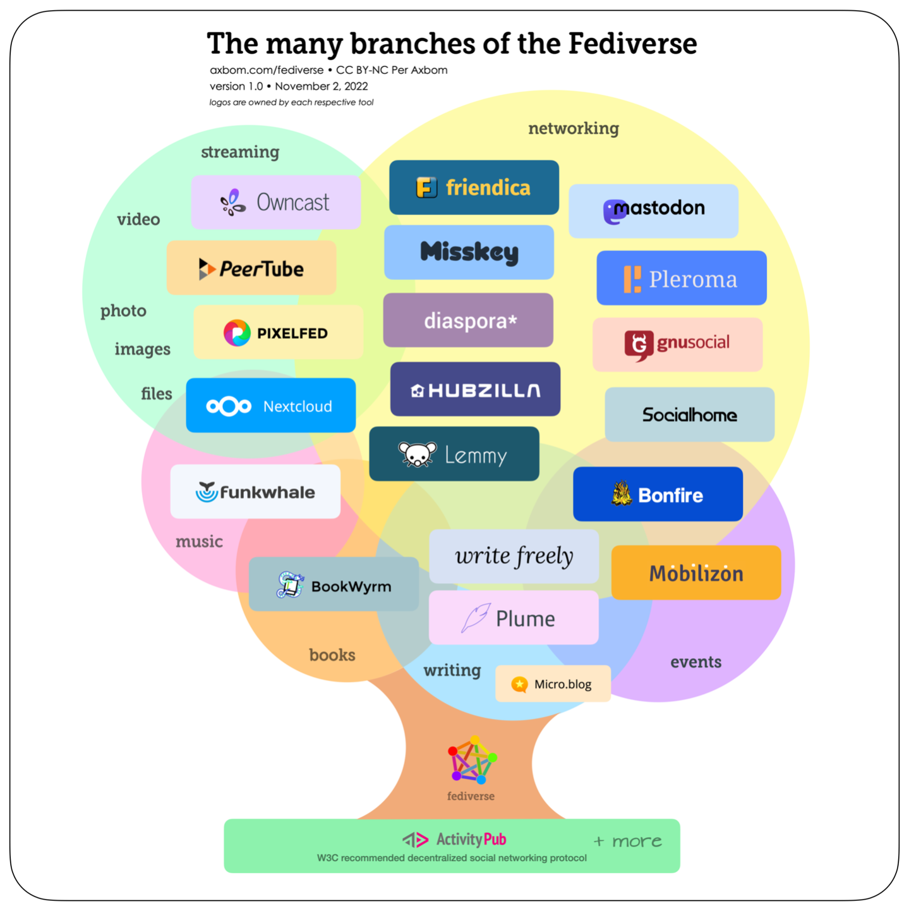
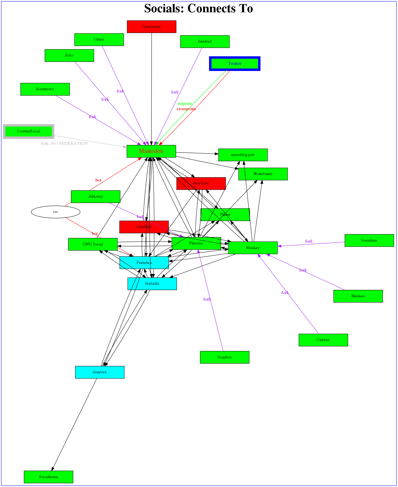

% Mastodon, or The Birdapp Migration 

Notes taken on the migration path

[@n1vux@Mastodon.Radio]("https://mastodon.radio/@n1vux") 
aka [BRicker@fosstodon.org](https://fosstodon.org/@BRicker)

Original version Nov 3, 2022; updated shortly after I learn something?
To see just the diffs, since you last looked, [view Diffs](https://github.com/n1vux/articles/commits/master/Linux/2022-Nov-Mastodon/Mastodon.md).

## Why

I think we know why.

As the bluebird app turns emerald green

## Where to? The Fediverse ! 

Choice is good? 

Alas having had ONE place for academics, activists, and journalist to find eachother was useful.

{ height=50% width=50% }
[CC BY-NC Per Axborm](https://social.xbm.se/@axbom/109275520716021795)

### What is the Fediverse ? 

The Fedirated Universe (Fediverse) is every server that publishes and subscribes via W3C recommended **[ActivityPub](https://en.wikipedia.org/wiki/ActivityPub)** decentralized social networking protocol, playing nicely with others.

<https://fediverse.party/> lists 10 major federated (non-centralized) social apps, with info pages for each

Except as noted the following Fediverse projects are microblogging and were started 2014-2018.

* diaspora* (**Macro**blogging; supports Markdown; 2010)
* Friendica (**Macro**blogging; 2010)
* GNU Social (2010; first microblogging)
* Hubzilla (**Macro**blogging; channelized?)
* **Mastodon**
* Misskey
* PeerTube (**Video**)
* Pleroma (lightweight microblogging, so Twitterish but less?)
* Pixelfed (**Image**)
* Funkwhale (**Audio**)

which omits forks, old-school precursors, private gardens, & minor players that appear on charts and lists.

### Connections in the Fediverse 

{ height=50% width=50% }

Key

* Microblogging
* Macroblogging
* Media Streaming/Sharing

### Other "choices" ?

Mostly just like Twitter, Non-Federated & Centralized, but with additional problems; but a few are Non-Federated &/or Centralized in some sense.

* **Private-Label Social**  
  There is (are?) [firm(s)](https://www.disciplemedia.com/) selling turn-key Social Media phone+web apps that will provide a walled-garden community for the sponsor's palls. At remarkably low rates since the app is merely branded for each client.  
  Likely invitation-only or sponsor's mailing list / website only.
  _That reminds me i need to check the Beta ..._

* **Alt-Right choices** (without fact-checking)  
  (which private gardens might be purchased from above vendor(s)?)

    * "Truth" Social
    * Parler
    * Rumble ? _never heard of it but it's listed_
    * Newsmax _news app's comment section, or do they have a full social walled garden?_  

* **Old School**

    * antique bboards/forums - Web 1.0 ports of Dialup Bulletin Boards (usually obsolete PHP code) e.g. `/.`, `reddit`, `4chan` etc, various Forums packages
    * MetaFilter
    * IRC still exists ! ( _even tho newer AIM, G-chat gateway, etc have shut down_ )  
      IRC is **decentralized** - lots of servers - but theyre **not** Federated; so while FLOSS and standards-coforming for no lock-in, moving hosts is painful, as we found out when an old reliable FLOSS-friendly host got sold.
    * Slack (commercial multimedia chat for corps; some FLOSS project use it instead of dogfooding FLOSS because they have Slack at day-job, it just works (same as the MacBook Air), _etc_ )
    * USEnet mostly doesn't exist anymore (_and the history is hard to find_) but a few of the old news groups live yet! Somewhat Federated & decentralized, but with Google Groups defacto Center, less so than in the good old days.
    * Mailing lists ( _like our NatickFoss discussion list_ ) - since there are list-servers other than Google, **decentralized**, and if you forward to another list, somewhat **federated** ! But very old school in handling of media attachments.
    * Blogs with RSS and automatic track-back links. **Federated & decentralized**.
    * WebRings - **Federated & decentralized**!

* **Alt-Left alternatives? (or Alt and not Alt-Right??)**

or at least, pro-Democracy, and suppressing "fake news" is fact-based. But not necessarily Progressive or "left".

[BlueSky](https://en.wikipedia.org/wiki/Bluesky_%28protocol%29) looks to federate by its own rules, unlcear if bridging to Fediverse ActivityPub would be plausible or allowed.

    * **BlueSky** - BlueSKy is apparently a Protocol in competition with the Fediverse's ActivityPub, with a demo implementation only just in Beta; backed by Dorsey, to make something that his Twitter could've been but didn't as “protocol for large-scale distributed social applications that will allow for account portability, algorithmic choice, interoperability and performance". Anti-commercial. [oct.25 article](https://uk.finance.yahoo.com/news/jack-dorsey-bluesky-social-app-twitter-050005805.html). Started as a Twitter FLOSS spinoff? Original rumors of Blockchain denied. Dorsey BlueSky [may be collaborative](https://davetroy.medium.com/no-elon-and-jack-are-not-competitors-theyre-collaborating-3e88cde5267d) with Musk Twitter!?(_sounds like a conspiracy theory but by an insider so might be real?_)  Not ready yet. Intersting to watch.

    * **TribelSocial** claims to be pro-Democracy, but is reportedly just as data-harvesting as the big Socials where we're the product, not the customer.

* **Counter.Social (CoSo)**  
  Overtly political Twitter-alternative, run by an anonymous, career Grey-hat hacktivist.  
  _Anitifa? Anarcho-Socialist? Unclear, but not GQP. Radically anti-troll._

    * "No trolls. No abuse. No Ads. No fake news. No foreign ifluence ops." 
    * "Deepfake Detector. Botsentinel. Identity Breach Alerts. Factlayer."
    * Private groups are supposedly E2E encrypted, which is tricky.
    * Originally a clone/fork of Mastodon; an (A)GPL compliant fork, but not federated because history.
    * Blocks countries considered by hacker-in-chief to be opposed to democratic West.
    * Supports VR Goggles as well as Browser and Mobiles! ( _So is Meta before Meta™ is Meta_ ?)
    * ( _Does it try to detect VPN from blocked countries?_ )
    * _The promises and claims sound good technologically, one can debate the absolutist blocking of countries that run professional trolls as wise or over-reactive; but IDK who is running it, any other decentralization is indistiguishable from single Corp Edge, just can't see what if any Corp, so interesting but wait and see for me. Also, not being decentralized/federated, is hit harder in Migration._ [TheJester's view of history](https://countersocial.documize.com/s/c30dhakp0nhtab60utag/countersocial-blog); [history&interview by a CoSo users](https://directorblue.blogspot.com/2018/10/the-anti-social-networkwhat-is.html).

## Mastodon Microblogging : TOOT to the Fediverse

<https://fediverse.party/en/mastodon/>

**Mastodon** is the current center of the Federated Multi-Verse (Fediverse) per above graph from Fediverse Party data.

### Not exactly what you're expecting?

Instead of Tweeting, we **Post** (or **Toot** if one wants a pun); instead of `#Twitterstorians`, there are `#Histodonts`; there is no Verified ✓ , just verified URLs. Unless you buy a server, there's usually no charge, just a **tip jar**.

Instead of an edge-cloud with eventual-consistency distributed DB run by one mega corp, Fediverse is scaled by having many collaborating instances under separate management that collaborite, each scaling according to own daily output & input, and funds available.

Each instance server can _but is not required to_ exchange content with (most) others, Mastodon or fork or other compatible project (see chart).

Each instance sets it's **own content policy, moderation policy, privacy policy**, open enrollment or invite only, etc., and picks which nodes it trusts to federate with.  

(E.g. [mastodon.radio](https://mastodon.radio) does NOT accept federation with nodes that have a looser a policy registered, or fail to enforce their stated policy, e.g.,  `masthead.social` which is nominally for journalists, whose policy _says_ **NoSpam**, but is actually just unmoderated spam. This isn't censorship, this is decentralized federation providing for policy backbone.)

Since there's no Algorithm, Favorites ⭐  are like they _used to be_ on Twitter ages ago before they adulterated it with faceless `^`Algorithms`^`: they tell the author you like it (and perhaps them), but doesn't help the post fly further. If you want to boost the post, you use the Boost 🔄 button  to relay it to your own Followers (like RT on bluebirdapp).

Also since there's no Algorithm, **#HashTag** all the things.

* Tutorial Video <https://youtu.be/mrsiej2dpBY>
* [brief Mastodon guide for social media worriers](https://axbom.com/mastodon-guide/)

### Picking a "Mastodon server" (host node)

* [The Importance of Choosing the Correct Mastodon Instance](https://carlchenet.com/the-importance-of-choosing-the-correct-mastodon-instance/)
* [Choosing a Mastodon instance and why i joined Social.coop](https://agaric.gitlab.io/raw-notes/notes/2020-07-26-choosing-a-mastodon-instance-and-why-i-joined-social-coop/)
* [Mastodon choice wizard](https://instances.social/), can check out registered nodes (by appending instance name e.g. <https://instances.social/fosstodon.org>)
* <https://joinmastodon.org/servers>
* (One could reasonably pick a server of one of the non-Mastodon but compatible kinds. I can't give hints on that.)

Many are named `Mastodon.${TLD}` but not all; can be whatever someone wants. 
(If not masto- or -don something, it may be a clone or an API compatible as opposed to a Mastodon instance _per se_ , or they had a better pun.)

* [Mastodon.social](https://Mastodon.social) the original and default node; bilingual German and English; _getting hammered by new refugees._
* [Mastodon.xyz](https://Mastodon.xyz)(invite only temp.) [mstdn.social](https://mstdn.social) [mastodon.online](https://mastodon.online) alt generics
* [fosstodon.org](https://fosstodon.org)(waitlist), [social.linux.pizza](https://social.linux.pizza)(waitlisted) - FOSS/FLOSS
* [social.coop](https://social.coop) strong code of conduct, activism centered, see article link above. 
* [Mastodon.Art](https://Mastodon.Art) [Mastodon.Radio](https://Mastodon.Radio) [scicomm.xyz](https://scicomm.xyz) [glammr.us](https://glammr.us) (museums galleries archives) [tenforward.social](https://tenforward.social) [tabletop.social](https://tabletop.social) ... special interest communities
* have your own!! Turnkey hosting at usual suspects' DigitalOcean, Exoscale, _etc_ standard rates; or recommended specialist managed hosting with <https://masto.host/> (from $6/mon, throughput limited not fixed # of accounts) and <https://federation.spacebear.ee> (as recommended by FediTips).
* You can have accounts on more than one to compartmentalize your social life (similar to having Alt accounts on TW, FB, but with natural-branding by hosts' themes)

Alas the published indices don't currently show any US-based regional servers.

And a lot of natural birds of a feather communities aren't yet represented, but likely will pop up during the migration period.  _I don't feel like putting up the cash to start one, but we could chip in to have our own server!_

### Notes

* Mastodon DMs are not encrypted, and instead of being readable only by any Twitter DevOps who cares to gain privilege (or comply with a government order/request), are readable by sender & recipient's node admins, whomever they are.   A DM is just a Post or Reply with Visibility reset from default (likely World **🌎**) to Private (**🖂** or **@** icon), addresee(s) only. Arguably even worse substitute for secure messaging than Twitter DM.  
* * Note that this 'Visibility' means DMs go to EVERYONE who is @-mentioned therein; so omit the @'s if you're trying to talk ABOUT someone privately!!
* Follow `@feditips@mstdn.social` for how-to tips (more below)
* You can move between instances later, <https://docs.joinmastodon.org/user/moving/>.
you can move followers **and follows** with you, but posts won’t.

### Additional 

follow `#FediTips` in a spare column to get tips, follow `@feditips@mstdn.social` to get them in your stream, or subscribe via [RSS](https://mstdn.social/@feditips.rss); <https://fedi.tips/> is the Archive.  **[Beginners Start Here](https://fedi.tips/mastodon-and-the-fediverse-beginners-start-here/)** has a brilliant explanation of WTAF is a Federated Network.

> Federated networks have been around for centuries, and all of us have used them all our lives. The entire world is built around federated communications networks. The postal service is federated,…

elucidating that what's different is this decentralized, federated social network is not that it's novel, but that it's not the private walled garden of singular mega-corporation, it's a return to how things used to be in real life and in Internet 1.0, but with the sort of modern interface that set Twitter apart from e.g. Usenet.

Intros

* [GorillaSun](https://gorillasun.de/blog/getting-started-with-mastodon)
* [Em0nM4stodon](https://infosec.exchange/@Em0nM4stodon/109282181601490676)
* [djnavarro](https://blog.djnavarro.net/posts/2022-11-03_what-i-know-about-mastodon/) 
* [eishiya](https://mastodon.art/@eishiya/109302863700761738)

#### Is Confusing Bad?

Setting reasonable expectations is **welcoming**; setting unreasonable expectations "it's easy!" may drive away folks.

> Matt Blaze [@mattblaze@federate.social](https://federate.social/@mattblaze/109301093901463161)

> I have to disagree with my friends who keep hammering on the idea that people shouldn't say Mastodon is confusing. The user experience is fine (it's confusing, but not in any unexpected ways, and you can figure it out). But onboarding process, ambushing prospective users to choose a server, is something lots of people have trouble with. Not at even acknowledging that it's confusing amplifies how off putting this can be.

> I'm no expert here, I've only been around for a few days. But I've helped a number of people sign up, and every one of them has been BAFFLED by this. So was I when I signed up. Claiming that it's not confusing just signals that they aren't welcome, or that this place isn't for them.

#### Content Warnings 

For things that some folks would rather not see or forward, use a Content Warning.

@vantablack@beach.city](https://beach.city/@vantablack/109298070673055369) writes:

    okay more new user tips
    content warnings are extremely important here
    they're ingrained in our culture
    they're not censorship, but rather consent
    they allow someone to decide if they wanna engage with your post, and if so on what terms
    they're a courtesy, and you have legiterally no reason to not use them as much as possible
    they're one of the best features mastodon has
    think of it like a subject line or a title for your post
    you're MORE LIKELY to get "engagement" if you use them right

Content Warnings allows you to display a warning, and hides the content of your post; folks who want to view can click to unwrap, and others can scroll past. 
[an Intro post to CW](https://infosec.exchange/@Em0nM4stodon/109282181601490676)

This is more built-in in Mastodon & ActivityPub, and enforced; it was just a convention in TW&FB. 
Each node will have policy as to which Content Warnings are _required_ on their node, and nodes with tighter warning policy will not accept un-warned content from those with looser. Failure to abide by home-node CW policy is expected to result in "Moderation" (which may be timeout/warning or straight boot/ban if Mods are busy, guess what, it's AOL September for Mastodon, they're busy).

 It's suggested that **Twitter** is a content-warning topic as well as the usual. 

[Article discussing content warnings](https://blog.djnavarro.net/posts/2022-11-03_what-i-know-about-mastodon/) usage in Mastodon.

#### Blocking/Muting

Not only can you block or mute a single annoying account, if the host (=node, =instance) name looks like it exists solely to be a source of bother (Spam, Trolls, Ponzi, Phishing, …), you can block the whole instance.

#### Slow Mode

> In `Preferences > Appearance`, you can select the option “Slow mode” to hide automatic feed updates. You will then have to click at the top of the timelines to see new posts (ex: “10 new items”).
> @Em0nM4stodon@infosec.exchange

[more hints from same message](https://infosec.exchange/@Em0nM4stodon/109287715784844066)

#### #CamelCaseHashtags

> When writing hashtags, please use CamelCase instead of alllowercase! Example: not "mastoart", but "MastoArt".

> That way, they're easier to read and it's easier to spot typos :] In addition, screen readers generally do a much better job with camel case because they can see the word breaks.

> The hashtag suggestions often suggest the all lower-case version because so many people use those. Please resist the temptation to just click it and move on, type out the CamelCase version :D

> #FediTips

[eishiya](https://mastodon.art/@eishiya/109302863700761738)

#### POSSE

**Publish (on your) Own Site, Syndicate Elsewhere** _or perhaps **E**verywhere_.

Don't have your created content locked into a host that may vanish or claim ownership.

Use Mastodon and the other social media to spread awareness and have discussions, but keep the actual content yours.

If using free services to host your content, be sure to keep another copy elsewhere for safety !! Backup all the things.

<https://indieweb.org/POSSE>

(_I'm using GitHub Pages for this content. Which you might think is giving _them_ content, but the _original_ copy is on my harddrive and checked into a Git repository that they have a copy of ... and i can replicate to any other webserver or repository i want, it won't go away if M$ ever closes or pivots GH. But as long as GitHub.io exists, RSS or SocialMedia links to (t)here will be good; and if it vanishes, this can (will) reappear elsewhere._)

#### RSS

> FediFollows @FediFollows@mastodon.online

> RSS fans!

> You can get RSS feeds of any specific tag in 
<https://fedi.directory> by adding `/feed/` to the end of the tag's URL.

> For example the tag for "Gardening" is at the URL:
<https://fedi.directory/tag/gardening/>  

> ...so if you wanted to use RSS to track all new gardening accounts, the feed would be:
<https://fedi.directory/tag/gardening/feed/>
> When new accounts are added to tags you follow like this, they will appear in your RSS feed.  
> #RSS #Fediverse #Mastodon

#### Verification 

> Fedi.Tips @feditips@mstdn.social

> There are no "verified" badges on here. If you see someone using a symbol like :verified: it's just a custom emoji that means absolutely nothing.  
> However, there are still ways you can verify your identity on here. For example we know that the European Commission's official account is @EU_Commission  
> Here's an article going through how to verify your account on Mastodon and the Fediverse:  
> <https://fedi.tips/how-to-use-mastodon-and-the-fediverse-advanced-tips/>  
>  #HowDoIVerifyMyAccount
> There's no charge on here for verifying, and anyone can do it.

(I have inserted `<a rel="me" href=...>` tags in hopes link here will verify.)

#### Streaming

> Fedi.Tips @feditips@mstdn.social
**Livestreaming people!**

> Do you want people on Mastodon to be able to follow your livestream and be notified when you go live?

> There's a free open source streaming platform called @owncast which is also part of the Fediverse:

> ➡️  https://owncast.online

> You can follow OwnCast streams from Mastodon, and a post will appear in your timeline when they go live.

> For example you can follow music accounts like @live or tech & gaming streamers like @Hamish or @hatnix 

> #Fediverse #ActivityPub #OwnCast

#### Replies Etiquette

> Per Axbom @axbom@social.xbm.se

> An etiquette tidbit I just learned from @HunterZ

> When you write threads, you can set the visibility of all the reply posts to "Unlisted". This way all the non-initial posts won't flood user timelines in reverse chronological order (and interspersed between others' toots), which can confuse. People will just see the initial post and upon clicking that see the whole thread.

> I will try to remember this. But I will obviously also forget at times.

> #FediTips

#### Data Loss ? Exposure to randy Billionaires ?

One of the guiding lights [posts](https://social.xbm.se/@axbom/109301136826923094)

> Per Axbom @axbom@social.xbm.se

> Mastodon gGmbH is a non-profit (only since 2021), but that is not what makes it ”not possible to buy”. The software is licensed under the GNU Affero General Public License v3.0 so any code based on it, or any modifications, have to be made freely available.

> I guess a big player can come in and make a big instance and lure people there (easier-to-use, better performance, apps, etc) but they would have to surrender and make available any code changes for free.

> Now a billionaire could just refuse and drag things out in court. But Mastodon as we see it would still be open source and free and possible to install for anyone. The community would likely rally to best any improvements.

> So there is no way a billionaire can take away the premise of open-source software and our option to use Mastodon for free. But they could use all sorts of tactics to make something else appear more attractive. Some may be seduced.

Ovid asks a great question - 

> Q. Given the federated nature of Mastodon, if a server goes away (domain expires, doesn't pay the bills, etc.) do I lose my account? (And thus, do I forever lose my history unless I've backed it up?)

My answer 

> A. yes and no. The JoinMastodon index compact requires 60 day notice of node shutdown. The account transfer tool moves profile, follows, and (amazinglu) followers. 
>   This works, someone ran into life events and had announced they can't transfer years of trust to new Ops quickly, so shutting at EOY.
> Posts alas aren't transferable - I'm guessing because no algorithm to assure bulk remoderation to new host policies?
> But also,  under POSSE, better to treat microblog as ephemeral, save the good ones into a macroblog or static web page?

(Obviously if a node goes down unexpectedly and irrecoverably, well, that's bad and sad. Volunteer run nodes fueld off tip-jars are NOT expected to have cross-region disaster recovery replication let along in-region hot-spares.)

#### Importing Follows from TW bluebird site

> Bryan Cantrill [@bcantrill@mastodon.social](https://mastodon.social/@bcantrill/109299388045950092)

> I love @Luca's Fedifinder  (https://fedifinder.glitch.me/); t's been very important to get networks rehydrated here!  For me, it seems to stop at "14999 accounts scanned" when scanning followers;  are others hitting this as well? Do folks happen to know if this is a Twitter limitation?

#### Finding kindred spirits

in addition to 

* picking host node `@MyFavoritThing` , 
* putting `#HashTags` in your **Profile** 
* and in your customary `#Introductions` post, 
* and searching for same, 
* there's node <https://a.gup.pe> 🐟  which creates a **virtual user for a group topic.** The mere act of Following `@ExampleTopic@a.gup.pe` [brings it into existence](https://a.gup.pe/u/exampletopic) if not already there, and having followed, you'll get in your home stream any message that tags `@ExampleTopic@a.gup.pe` as the bot Boosts as the topic-user anything tagging it. (Which this message just did.)

### Applications

* Basic Mastodon **web** interface (default on most instance nodes) looks like TweetDeck in Dark mode: it has Columns. You can monitor `#NatickFoss` or `@algot@mastodon.art` in a column.
    * [Pinafore.social](https://Pinafore.social) - alt web interface
    * [Halcyon.social](https://Halcyon.social) - alt web interface
* There are a couple choices in iOS **Apple App** Store and **Android Google Play** Store, which get different reviews from different people. They look more like Twitter Android, but differ how Local vs Federated feeds are navigated to. Both have requested Notifications permission only (if turned on). I presume will request access Pictures (& files?) if i try to post a picture from it?
    * **Tusky** (Android) [@tusky@mastodon.social](https://mastodon.social/tusky)
    * **Mastodon** (official Android client) - has a small index of major thematic nodes in Start page.
    * if you run both on same device, eventually either disable/remove one or turn off notifications on one!!
    * Similar choices for **iOS**, i haven't tested.

**MORE "Delightful Fediverse Clients"**

> Don Watkins :linux: [@donwatkins@fosstodon.org](https://fosstodon.org/@donwatkins/109302794890546466)
> 
A curated list of Fediverse client applications based on the ActivityPub protocol. - delightful-fediverse-clients - Codeberg.org <https://codeberg.org/fediverse/delight>

## -30-

Feel free to follow either or both me, 
[@n1vux@Mastodon.Radio]("https://mastodon.radio/@n1vux") 
aka [BRicker@fosstodon.org](https://fosstodon.org/@BRicker)

**Q&A** and more **Demo** 
