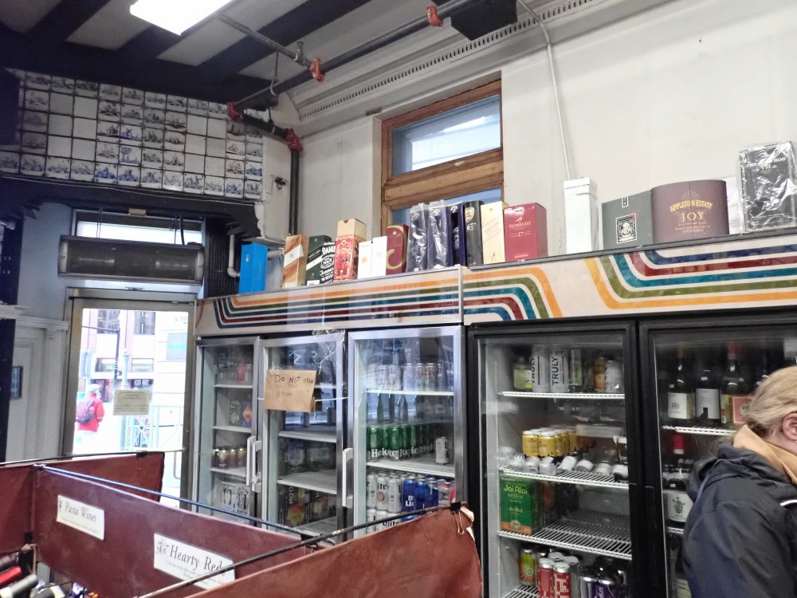

% History of MaltCon
% Dennis McCunney and Bill Ricker
% 2008-2017 [and 2024-2025]

**In Memory of Dennis McCunney**

Died 2025-04-29

#     History of MaltCon

_In order to honor Dennis's work, I'm editing and publishing his
unpublished, coordinated draft of MaltCon history. 
I'm hopeful that I might keep this as an ongoing project?
If so, the current convenient location is possibly temporary._[BR] 

## 2017 draft history by Dennis McCunney

_The following history is built on a skeleton of a Draft that Dennis McCunney wrote in early 2017_
[^2017-01-19_Draft] 
_that was reviewed by Bill R, and Dennis revised once;_
_and was intended for posting to the mailing list later that month, but never posted._
_So I'm using it to let Dennis give his own Eulogy._

_I've augmented by pieces pulled from list archives *etc*., as noted with footnotes;_
_those are also by Dennis, unless otherwise marked in the footnote._

_Corrigenda should be sent directly to me, Bill._

_— Bill, hereafter_ [BR]

[_Longer  editorial insertions prefixed _[Bill:]_, and shorter ones thusly._ [BR]]

-----

(We got a flurry of new list members at Arisia [2017], and it's been a while
since I talked about this on list, so some background is probably in
order.)

MaltCon is a "virtual con within a con", taking place within the
context of a literary SF convention.  (It is possible for a MaltCon to
take place outside that context, but it has not thus far.)

It began in 2005.  MaltCon member **Laura Anne Gilman** was Executive
Editor at the Roc Books SF/fantasy imprint of Penguin/Putnam, and
maintained a newsgroup on SFF.Net.  Various of the Usual Suspects were
hanging out in her group, and saying 

> "Philcon is fast approaching.
Has anyone heard from Programming about what they want us to do?"

Philcon was being its usual "Wait till *after* the last minute" self,
and no one had.  (It's better about that now.)  The discussion reduced
to 

> "We'll all be together at a con, in a hotel with a good bar and
single malt selection.  We'll find each other, have single malt, and
have fun.  Who *cares* what Programming does?"

Philcon 2005 was \[the [last](https://fancyclopedia.org/Philcon) held\] at Center City Marriott. 
The badge art was a picture Tom Powers had taken of LAG's hand holding a wee dram.
Laura Anne is our patroness in consequence. [^2012-03-21]

A light bulb blinked on over my head - MaltCon, a virtual con within a
con.  I created MaltCon badges (whose graphic was a picture of Laura
Anne's hand holding a tasting glass of scotch), and gave them out at
Philcon.  

It started an informal tradition. For a few years, MaltCon was *very*
low key.  You encountered me at a con.  I had a flask.  Perhaps you
did too.  We shared single malt and I gave you a badge.

People began to say "I have a room where we can get together and share
interesting drams", and it started to become a group.  

[_So_] I created this mailing list as a
Google Group in March of 2008 as a way we could keep in touch, plan
for future gatherings, and share news and notes on spirits.

[_Dennis's 2008 MaltCon Google Group (aka list) invitation message:_]

> Since it seems to be taking on a life of its own, I thought I'd take MaltCon 
to the next level. I've created a mailing list for the Usual Suspects to hang 
out, plan for future instances of MaltCon, and discuss our favorite beverage. 
I anticipate the list will be low traffic. 

> This is not a public list. Membership is by invitation, and the group is not 
visible in Google's public lists or searches. If you know other folks you 
think should be here, drop me their names and email addresses offline. 

> ... it's the day after Lunacon, with too little sleep and lots
of single malt ... I look forward to your presence.
[^2008-03-17_invitation]

[_Official Group description:_] [^2008-03-17_description] 

> A discussion area for members of MaltCon, the "virtual con within a con" 
devoted to the joys of single malt whiskey.

[Bill:] _Backspacing to January 2004,  my family met **Elaine Brennan** 
while having brunch at a Park Plaza Arisia, 2004, 
discussing upcoming local WorldCon, Noreascon 4.
We quickly discovered Scotch was among our shared interests.
Elaine was aware of several sets of Fans (and Pros) who had small Scotch sharing circles out of sight._

> There have always been bottles of single malts at Smofcon, and those bottles have always been shared 
> -- even well before Maltcon became a thing. 
[-Elaine] [^2017-12-01_Elaine]

[Bill:] _Elaine introduced me to TechnoFandom's custom of carrying a road case of leftover party supplies 
(though I knew some of TF previously through NESFA + Boskone). 
(And thereby we also got to use the Presidential Suite's lavatory used by President Clinton.)
We hatched a plot to attempt to cross-fertilize those multiple circles._ [^2017-04-05_Bill]

[Bill:] _I did some TF work at Noreascon 4 and took a special-order bottle of Caol Ila Cognac Finish 
to the N4 TF party. (G&M PC, special order with Joe @ Federal, I told him 
I'd take two bottles if i could get it by N4; took MBTA to pick it up Saturday of con.
Amazingly most at TF party complained it was too smokey.
Elaine was by then laid-up with a stress-fracture of the foot;
we spent a few hours with Elaine and Pam entertaining each other with tales
and me pouring Caol Ila for Elaine and applying first cold then warm compresses to the foot — not a cure, but it sure helped :-)
Once Dennis coined the phrase MaltCon and invited badges-as-invites,
we became a committee of three on this mission._ [BR]
[^2009-01-12_Bill] , [^2014-03-13_Bill]

[Back to Dennis:]

Whenever there are enough folks with hip
flasks, and **Bill**, **Elaine**, or I get a chance to make badges, Presto!
Instant MaltCon. Just add single malt. [^2008-12-14]

[_Going forward, Bill, **Paul, and RKOV** are the carriers of MaltCon label. And we hope someday Elaine again?_ \[BR]\]

I met Bill Ricker at Arisia in 2001.   
[_OTOH, it might have been 2004? Dennis was on InnKeeper desk._ \[BR\]]  
[_Dennis remembered meeting Elaine at MilPhil 2001._ \[offlist email Dennis to BR\]]

Bill was a major scotch fan, and had a road
case of interesting things he'd accumulated, so Bill's stock formed
the base for early group efforts.  

[Bill: _I describe that as the stones for making [**stone soup**](https://en.wikipedia.org/wiki/Stone_Soup).
At the time, Seth and I were both on good bonus plans and were actively collecting. Seth came by airplane so he brought a lot of very small samples. I travelled by car so brought the larger ones, and thus variety was assured. 
 **Stones for Stone soup**.  ¶ My road case was acquired cheap at the [MIT Swapfest](https://w1mx.mit.edu/flea-at-mit/) to ship Scotch (**Black Adder "Smoking Islay"**, 55% bot.2006) and the world's ugliest ashtray (same sourcing as road case) to the west-coast when celebrating winter holidays with my mentor in Scotch, Technico-Aesthetic Criticism, and SciFi as Lit Crit, **[Mike "MAP" Padlipsky](../MAP/)**.   This dram was subject of the first reply [^2008-03-17_reply] on MaltCon list, approriately enough by patroness Laura Anne Gilman aka LAG!
 On which trip MAP blind-tasted me on **McCarthy's Oregon Peated Whiskey**, Clear Creek Dis., challenging me to guess the age and location; I did not guess Oregon 3y/o.
When I told this to **Joe @ Federal**, he reached back without looking and picked it off the shelf for me.
(Which is excactly what his boss Len had done a decade earlier when i asked for a better but affordable cognac.) So those were the two drams in my two "try this" blind tasting flasks at Arisia a few weeks later.
 One of the bottles I opened at [MAP's Wake](../MAP/Malt/tasting.html) will be at Dennis's MaltCon remembrance(s)._]

"The donations will make their next appearance at the
[_next MaltCon_] Expression … and become part of group stocks." 
[^2017-04-09]

It's taken on a life of its own.  There [have been] formal MaltCon
Expressions at Arisia, Boskone, [Lunacon,] Heliosphere, [ReaderCon,] Albacon, Philcon, 
[_and one or two official at each of WorldCon & World Fantasy Con_ \[_merged from_ [^2012-10-04]\]].

[B]ut there are unofficial gatherings at other places that are planned 
on this list, like gatherings at Worldcons.  There are also gathering similar to
ours elsewhere.  For instance, Covert Beach holds scotch parties at
Balticon and Capclave[;] MaltCon has an overlapping membership with his
efforts, and his gatherings get announced here.  If Bill or I should
make one of Covert's events, we're civilians.  It's his show and he
does it well. 
[_Now called **"Quiet Gathering"**, with **Bob MacIntosh** and **Mike Nelson**, well known among MaltCon, as coordinators._ \[BR\]] 

MaltCon began with an emphasis on single malts, but I've been pushing
to expand the group's taste. We've always had bourbon, which is at
least a first cousin, but my assumption is that every spirit has
offerings considered top shelf.  Educate me!  Share some with us.
Tell us how quality is defined in your preferred spirit, and what
makes you like to drink it.  That expansion has been proceeding
nicely, and gin, tequila, rye and other things can now be found in our
spread.

The emphasis is on sharing, and at this point, everything you see laid
out at an Expression was contributed by MaltCon members.
[_We strongly suggest sharing at next visit; first visit it's not expected._]
Some bottles go back home with their owners, and others were donated to the group
stocks for which Bill is the Curator. [The Stone Soup is doing well. Thank you all!]

MaltCon is a virtual con within a con. It is a separate function that
just happens to take place at an SF convention, and [usually] has no formal or
official connection with the surrounding con. It is a private party
hosted in the room of a guest at the hotel and the guest may have whom
they please in their room. …
Attendance at a MaltCon expression requires an invite or a MaltCon
badge (and invitees without a badge are normally given one at the
expression.) There is *no* requirement for a membership in the
surrounding convention, and people invited may have no interest in the
surrounding con. They are there because of whisky, not SF.
If there is a requirement that an attendee at the party be a member of
the surrounding convention in addition to having a MaltCon badge or
being a MaltCon invitee, that party is *not* a MaltCon expression, and
the actual MaltCon expression will take place in a space that does not
impose that requirement.  [^2012-10-04]

In keeping with its virtual nature, MaltCon has only as much
organization as is necessary to function.  We have not yet had actual
programming, though that's not out of the question.  Bill *has* done a
"tour of Scotland in four drams", as an introduction to single malts
for new attendees unfamiliar with them, but whether that occurs
depends on the expression, and whether there is time and space for it.

One tradition that *has* arisen is that I sometimes lead formal
**"Absent Friends"** and ***"Fuck Cancer!"*** toasts to those no longer with us
[_and as wishes for friends fighting Cancer_[BR]].  
A depressing number are folks I knew personally, and several were
MaltCon attendees and on this list.

[_And now we add **Dennis** himself to that list; as many as I can reconstruct are listed below._ [BR]]

My response when asked why I do this is simple.   "I want to have a
party at the con I want to attend, with fine spirits I want to drink,
and attended by people I want to hang out with at a con."   Knowledge of
spirits if not required - we can impart it.  Congeniality is.  We've
had very few altercations between people who just didn't get along,
and I want it to stay that way. 
[^2017-04-12]

MaltCon Expressions have somewhat different characters, influenced by
size and location.  Arisia [was] by far the largest Expression, and size
brings other things in its wake.  A few years back we shifted to
Stealth mode, where we deliberately try to be as low key as possible.
Arisia is a party con skewing to a younger demographic, and we had too
many problems with folks whose spider sense detected a party and were
looking to get hammered.  That's not what we're about.  We're about
tasting and learning. We try to avoid people even knowing we exist
unless we tell them. 
 [_and since then it's gotten even more careful if at all there_[BR]]

The Boskone Expression is similar to Arisia's, with an overlapping
attendance, but is smaller because Boskone is.

Albacon is a small relaxacon, with a tiny fraction of Arisia's attendance.  
The Albacon Expression will be a main con party, 
and [2019]'s GoH Chuck Gannon is a MaltCon member.
 [_MaltCon was invited to Albacon._[BR]]

At Philcon, MaltCon is the _de facto_ pro party since SFWA no longer
hosts a party there, and [has been] unofficially assisted by the con.

HELIOsphere [was] a new con, and [which desired a] new MaltCon Expression.

[_ReaderCon and Lunacon had had MaltCon in years gone by,_
(_see time-line in appendices_)
_and we'll be returning to ReaderCon by invitation this summer 2025._ [BR]]

I think I also speak for Bill here when I say I'm *delighted* at the
way MaltCon has progressed. [_Agreed!_ [BR]]

Thank you all for being part of it.

-------------

## 2017 — 2025

[Bill:] 

_The impetous for the publishing of this page is to let Dennis speak to his legacy, 
so I've not attempted to continue the history into the future **yet**._

_2017 through 2019 continued roughly as Dennis outlined in the 2017 draft (as augmented) above._

_After Boskone 2020, MaltCon joined the Host Cons in Plague Virtual mode._

_As Cons returned to Hybrid and then full-but-careful in-person, neither Bill (protecting vulnerable relatives) nor Dennis (health declining) were travelling, much so Denis (having discussed with Bill and iirc Elaine) deputized **Rick Kovalcik** (RKOV) and **Paul Kraus** to keep things moving._

__TODO__ _fill in_

-------------

## 2025 —

**Dennis McCunney** died **2025-04-29** after a long battle with Cancer (***Fuck Cancer!***). 
He was so optimistic about the experimental, tailored treatments available at the nearby research center,
which may have provided some partial remission but — gone too soon.

***MaltCon will continue***, _with Bill, Paul, and RKOV leading (and Elaine as Wise but Remote Elder, perhaps someday back in the fray? )._
_More details TBD, after we properly remember Dennis at **ReaderCon**. We intend to do likewise at **Albacon** and **Philcon**._

[BR]

--------------

# Appendices

[by [BR]]

## “Absent Friends” and “Fuck Cancer” Mourning Roll

Mostly observed at Philcon MC toasts led by Dennis, and on email list, but elsewhen/elsewhere as needed.
This is **not** a full list, but just what can be reconstructed from email archives.

_Addenda & Corrigenda should be sent directly to me, Bill._

*  Mike "MAP" Padlipsky d. 2011-03-03, benefactor of MaltCon _in absentia_ (see _Prehistory_).
*  Alice “Badger” Washburn, d. 2011-12-26, waked at MaltCon 08.01 (Arisia 2012)
     _Joe @ FedWine donated a bottle of Dalmore 12 for the wake as suited Badger's taste. Alas he's listed below too._
*  Danny Lieberman, d. 2012-10-19, announced and toasted at Maltcon 12.x Albacon, and again at Lunacon MC13.03. 
     Repeat toast MC 19.01 [HS] :
     “added a toast to the late MaltCon member Danny Lieberman, who lost a battle with Lymphoma a few years back.  Danny left a chunk of money in the care of a mutual friend to be used for good fannish purposes, and that provided the seed funding that allowed **HELIOsphere** to begin. 
     He was a literal angel investor.” [_Dennis, MC19.01 report_]
*  Jan Howard Finder d. 2013-02-25 , friend of the MaltCon family tho not a member, remembered at next Lunacon MC13.03, Philcon annual roll-up MC13.05 (_and probably an AlbaCon as well iirc?_).
*  Jay Lake, (d.June 1, 2014), was included in a “health and strength dram” appended to Lunacon 2013 MC13.03 ***“Fuck Cancer”*** when his got worse; and **"Absent Friends"** MC14.05. 
*  Peggy Rae Sapienza (formerly McKnight, Pavlat), d. 2015-03-22, MC 15.05
*  Dave Hartwell d. 2016-01-20 (Philcon 2016) 
*  Dave Kyle d.2016-09-18 (Philcon 2016 and Albacon 2017(?))
*  Hugh Casey, PSFS & Philcon past-everything, ***“Fuck Cancer”*** wishes for recovery MC 15.05. (d. 2020) 
*  Dallas Mayr (Jack Ketchum) d. 2018-01-24, author friend of members, MC 18.05.
*  Gardner Dozois (d.2018-05-27) & Sue Casper (d.2017-02-24) . MC 18.05
*  Vonda McIntyre, d. 2019-04-01, MC 19.01 (HS)
*  Danny Lieberman, MC 19.01 (HS) _see above at 2012._
*  Debra Doyle, d. 2020-10-31.
*  Ed Meskys, d. 2021-07-25. 
*  Leo d’Entremont d.  2021-08-01/02.
*  2022 π-e _The **Chicon8** Dark Mode Expression_ (**WorldCon**) had a ***“Fuck Cancer”*** toast reported, but no notes as to which specific friends.
*  Robert A “Bob” Madle d.2022-10-08 , aged 102, first and last of First Fandom, Philcon. 
*  Joe Howell, _Federal Wine & Spirits_, friend and benefactor of MaltCon [_see Badger entry above_], ***"Fuck Cancer"*** on email. 
     Joe played himself at Federal, in Paul Giamatti's _The Holdovers_.[^2024-Feb-14_Bill]
      [GoFundMe](https://gofund.me/a940f09b) support encouraged. 
     (_Still fighting July 2025, GoFundMe call re-upped; will be repeat F-C'd at ReaderCon 2025_.) 
     (_see footnote for further details_)
*  **Dennis McCunney**, MaltCon [*co*]Founder and leader of many a ***“Fuck Cancer”*** and/or **“Absent Friends”** toast at MaltCons, d. 2025-04-29, was remembered with a virtual gathering May 2nd and will be remembered thusly at ReaderCon 2025.
     (_and presumably each MaltCon for the rest of the year_).

_Addenda & Corrigenda should be sent directly to me, Bill._

---------

## Timeline: Maltcon list of recorded events

Numbering was initially inconsistent as to whether 0y.0n or 0y.n , and didn’t even start numbering until 2008.

(If a MaltCon members is known to be a Guest of Honor etc., or a GoH attends MC, that will be noted.)

_Addenda & Corrigenda should be sent directly to me, Bill._

*  prehistory, turn-of-millennium & earlier
    - TF acquired a foundling [road case](https://en.wikipedia.org/wiki/Road_case) to move leftover booze between TF parties. [TF](https://techno-fandom.org), [wiki](http://tf.wiki.stonekeep.com/)
    - Bill was inducted into Malt mania by Internet Old Boy, pre-web Scotch logger, member of MITSFS (before NESFA) and author of 1st (? 2nd ?) thesis on SciFi as LitCrit, Mike Padlipsky aka [MAP](../MAP/). One of the bottles opened at his Wake will be at Dennis's MaltCon remembrance(s).
    - Dennis met Elaine among the SMOF of the floating WorldCon committee at MilPhil (2001).
      [_Bill & famly were there too, did we talk to either? IDK_ [BR]]
    - LAG’s friends enjoy drinking Scotch in Philcon and other con hotel bars.
*  2004
    - Arisia (BPPH): 
        Elaine meets Bill, discuss cross-fertilizing Scotch-at-con cliques, and invites Bill & family to TF dead-dog to meet TF and some other Scotch+F&SF fans.
    - Noreascon 4 (WorldCon, Hynnes+Sheraton)
         Bill volunteers for TF set-up/tear-down (only; advantage of being local), and brings a special-cask Caol Ila for TF party, which is mostly used as medicine for Elaine’s pain in the foot.
*  2005 
    - __TODO__ [_I don’t remember what if anything we did Arisia (BPPH), Boskone (Sheraton) in 2005 ?!_[BR]]
    - Philcon (December; Last at City Center Marriott): Dennis coins “MaltCon”for LAG’s SFF.net newsgroup fanclub, first badges)
*  2006
    - Arisia (last @ BPPH); _Dennis invited Bill to join Gmail “beta”_
    - Boskone (last at Sheraton Boston)
    - Lunacon (#49, last at Sheraton Meadowlands); Paul Kraus inducted into Dennis’s MaltCon by elevators
    - Philcon (City Center Sheraton)
*  2007
    - Arisia (1st at Hyatt Ziggurat Cambridge; Dennis on “InnKeeper” desk.)
    - Boskone (1st at Westin Waterfront/Seaport)
    - Lunacon 50 (return to Rye Brook Esher Hilton)
    - Readercon (“Boston” Marriott, Burlington)
          (_I believe this is the one where my darling Pam, who doesn't normally care for Peated Scotch, and a lady Pharmacist whose name I don't remember took my then quite new bottle of Port Charlotte **PC6** into a corner and had a jolly good time._)
    - Albacon
    - Philcon (last in Philadelphia City)
*  2008
    - 08.01 Arisia (First known serial-numbered MaltCon; Hyatt Night Banquet Manager attended; oldest badge in original digital archive? Patroness LAG was GoH.)
    - 08.02 Boskone 
    - 08.03 Lunacon 51
            (MaltCon email list started Monday 17th after.)
    - 08.04 Balticon [_Elaine as present triumvar; notable as the only MaltCon Balticon Expression?, this being before we had heard of Covert Beach apparently?_[BR]]
    - 08.05 ReaderCon
    - 08.06 Philcon (first at Cherry Hill NJ; Dennis is Hotel Liaison.) 
*  2009
    - 09.01 Arisia (Hyatt Ziggurat; Walter H Hunt GoH)
    - 09.02 Boskone 
    - 09.03 Lunacon (discovery of revived **Speyburn** malt)
    - unofficial: 4th Street Fantasy (MN), Seth.
    - 09.04 ReaderCon 20
    - 09.05 Montréal Anticipation (WorldCon)
*  2010
    - 10.01 Arisia (last at Hyatt Ziggurat; pic of Dennis in mufti; LAG & Arwen “drink their year” thanks to bargain **Strathisla** from G & M; earliest spread, bottle-kill photos?)
    - 10.02 Boskone (John Picacio, Art GoH)
    - 10.03 Lunacon
    - 10.04 ReaderCon (Charlie Stross, GoH)
    - 10.05 Philcon 
*  2011
    - 11.01 Arisia (1st at Westin Waterfront/Seaport)
    - 11.02 Boskone (Charlie Stross, GoH)
    - 11.03 LunaCon
    - 11.04 ReaderCon (Bill recorded WhiskyCast [Virtual Tasting _Beta_-test episode](https://whiskycast.com/whiskycast-virtual-tastings-august-2011/) as remote while in hotel room; [_my audio wasn't the best; I upgraded after!_ [BR]])
    - 11.05 Philcon (Mark@WhiskyCast guest)
*  2012 
    - 12.01 Arisia
    - 12.02 Boskone 
    - 12.03 LunaCon
    - 12.04 ReaderCon (Peter Straub, GoH; _last MaltCon at ReaderCon for 13 years, long story._)
    - 12.05 Albacon’s first MaltCon, invited. (KRADeC, Media GoH; _notable that **Danny Lieberman**'s death was phoned in to MaltCon in real time._)
      
*  2013
    - 13.01 Arisia (Seaport)
    - 13.02 Boskone 50 (Seaport)
    - 13.03 LunaCon 
    - 13.04 “Albatoga”
            (Albacon team’s WFC2015 bid+working session (concurrent with WFC2013) in Saratoga; MC 13.04 was the invited and _only_ party; _notable that MC was larger than the host con, since a committee member’s husband came in for the party but wasn’t needed for committee sessions. Our Suite had a dishwasher! First “Annual” expedition to [9 Maple Ave Jazz and Whisk(e)y bar](https://duckduckgo.com/?t=ffab&q=9+Maple+Ave&atb=v265-1&ia=web). I even found a Scotch to the taste of the one committee member who didn't like whisky._)
    - 13.05 Philcon (Mark@[WhiskyCast](https://whiskycast.com/) guest of MaltCon, and [recorded a tasting panel](https://whiskycast.com/whiskycast-virtual-tastings-november-2013/) on-location at the hotel) [^2013-11-12_Bill]
*  2014
    - 14.01 Arisia Stealth Expression (Tanya Huff, Writer GoH)
    - 14.02 Boskone 
    - 14.03 Lunacon
    - 14.04 number was skipped (Albacon slid to 14½ in 2015)
    - 14.05 Philcon
*  2015
    - 15.01 Arisia (Special guest tasting presented by "**Uncle Charlie**" of **Maltman/OMC/Big Peat** range)
    - 15.02 Boskone (Steven Brust GoH)
    - 15.03 Albacon “14½” (Dark Rums for GoH)
    - 15.04 WFC Saratoga
         **Yankee Distillers** did a tasting in ConSuite.
         2nd “Annual” expedition to [9 Maple Ave Jazz and Whisk(e)y bar](https://duckduckgo.com/?t=ffab&q=9+Maple+Ave&atb=v265-1&ia=web).
         Grand unboxings of (a) Suntory “Royal” 60 new old stock;  (b) Bill’s birthday 1958 G&M GG.
    - 15.05 Philcon
*  2016
    - 16.01 Arisia Rye Expression (GoH Ursula Vernon; Blind Canadian Rye tasting experiment launched)
    - 16.02 Boskone 
    - 16.03 Albacon 
    - 16.04 Lunacon (last at [Escher Hilton](https://fancyclopedia.org/Rye_Town_Hilton) Rye Brook)
    - 16.05 Philcon “Dave Kyle Memorial”
*  2017
    - 17.01 Arisia
    - 17.02 Boskone
    - 17.03 HELIOsphere 1 (Charles Gannon, Special Guest)
    - 17.0x Lunacon accidental non-Expression (the last Lunacon, back at Tarrytown Marriott; KRADeC, Music GoH)
    - 17.04 Albacon (Charles “Chuck” Gannon, GoH)
    - 17.05 Philcon (Art GoH Don Maitz and Special Guest Janny Wurts)
*  2018
    - 18.01 Arisia
    - 18.02 Boskone
    - 18.03 HELIOsphere 2 (Chuck Gannon, Cecilia Tan)
    - 18.04 ?not used?
    - ----- May: Mark and the WhiskyCast PodCast posted his tasting notes on some samples I'd slipped him from MaltCon foundlings. (Mark's home and studio are just across the river from Philcon, so I frequently have visited him on same trip, and sample swapping is a thing we do.)
        - [Leo's latest KC: Rolling Standard 4 Grain](https://whiskycast.com/ratings/rolling-standard-midwestern-four-grain/)
        - [Stan's Rochester Red Saw Rye](https://whiskycast.com/ratings/red-saw-rye/)
        - [Millers' Westchester 914 Bourbon](https://whiskycast.com/ratings/914-bourbon-whiskey/)
        - previously in 2016, Mark reviewed Leo's find of [Rieger's](http://whiskycast.com/ratings/riegers-kansas-city-whiskey/), and only later landed an interview with Rieger.
    - 18.05 Philcon (Steven Brust, GoH)
*  2019
    - very unofficial Arisia (BPPH exile)
    - unofficial Boskone
    - 19.01 HELIOsphere
    - 19.02 Albacon (Bruce Coville GoH )
with  **36Locks/Schenectady Distillery** visit excursion!
    - 19.03 ?not used? 
    - 19.04 Philcon
*  2020
    - 20.01 Boskone Lite Expression.
    - CoNZealand WorldCon virtual MaltCon within hybrid convention breakout
    - ReCONvene virtual convention   NotAMaltCon
    - Virtual Philcon NotAMaltCon
*  2021
    - Not-a-MaltCon Albacon
    - 21.01 Philcon Pandemic Expression
*  2022
    - ---- Virtual Not a Boskone not a MaltCon 
    - 22.01 HELIOsphere
    - 22.01?2? Philcon “Very Last Minute Expression”
*  2023
    - 23.01 HELIOsphere (Chuck Gannon)
    - 23.02 Albacon Hybrid (Walter H Hunt GoH, Dan Kimmel (Special-Remote))
    - 2023.π-e Chicon8 Dark Mode
*  2024
    - (24.01) Boskone
    - (24.02) Albacon 
    - (semi unofficial) HELIOsphere ?
    - (semi unofficial) WFC 50 Niagara Falls (Michael Swanwick, Toastmaster)
    - (24.03) Philcon
*  2025
    - 25.01 Boskone
    - 25.02 ReaderCon 34 (returns to Boston Marriott, Burlington; and MaltCon returns)
    - 25.xx Albacon (Patroness LAG “online GoH”)
    - 25.xx Philcon (Chuck Gannon, GoH)

_Addenda & Corrigenda should be sent directly to me, Bill._

----------

## Con History links

For reference, history listings for each Convention mentioned.

* [Albacon](https://albacon.org/2025/history-of-albacon/)
* [Arisia](https://corp.arisia.org/history)
* [Boskone](https://data.nesfa.org/boskone-history/boskone-history.html)
* [HELIOsphere](https://fancyclopedia.org/HELIOsphere)
* [Lunacon](https://fanac.org/conpubs/Lunacon/) [Fanac.o preserved flyer for Lunacon 52](https://fanac.org/conpubs/Lunacon/Lunacon%2052/Lunacon%202009%20PR.pdf)
* [Philcon](https://fancyclopedia.org/Philcon) 
* [ReaderCon](https://readercon.org/readercon_past)
* [WorldCon](https://www.worldcon.org/worldcon-history/) [long-list](https://www.smofinfo.com/LL/index.html) aka World Science Fiction Convention
* [World Fantasy Con](https://worldfantasy.org/past-conventions/list-of-conventions/)

------------

## End Notes: The Emails

Emails by Dennis McCunney, to MaltCon List, except as noted.

As can be inferred from date of Mailing List invitations,
and first message [^2008-03-17_first], and reply being Monday March 17, 2008,
the list was launched the day after Lunacon 2008, the 51st Lunacon,
at Hilton Rye Town aka Escher Hilton. 

 [_There had been MaltCon at 50th Lunacon the year before, but due to 'flu and a storm, I [BR] had to roll my membership, so I wasn't with Dennis for that one._[BR]]

[_As nearly as I can reconstruct, it'd have been Arisa 2006 MaltCon than Dennis introduced me to GMail, when it was only 1½ years old, newer than Google Groups!_[BR]]

[_End-notes in HTML will be arranged in order Used; in MarkDown, they are arranged in order by date._]

[^2008-03-17_invitation]: 2008-03-17_invitation 

    2008-03-17

    DMcCunney dennis.mccunney@gmail.com has invited you to join the MaltCon group with this message:
    
    Hi, folks,
    
    Since it seems to be taking on a life of its own, I thought I'd take MaltCon 
    to the next level. I've created a mailing list for the Usual Suspects to hang 
    out, plan for future instances of MaltCon, and discuss our favorite beverage. 
    I anticipate the list will be low traffic. 
    
    This is not a public list. Membership is by invitation, and the group is not 
    visible in Google's public lists or searches. If you know other folks you 
    think should be here, drop me their names and email addresses offline. 
    
    A couple of you have spouses whose email addresses I don't have handy. Please 
    invite them. And feel free to smack me on the head and say "Hey, stupid! You 
    forgot X!", because it's the day after Lunacon, with too little sleep and lots
    of single malt, and I undoubtedly have.
    
    I look forward to your presence.
    
    Cheers,
    
    Dennis
    
[^2008-03-17_description]: 2008-03-17_description  
    
    Group (list) Homepage description

    A discussion area for members of MaltCon, the "virtual con within a con" 
    devoted to the joys of single malt whiskey.

[^2008-03-17_first]: 2008-03-17_first [First Post](https://groups.google.com/g/maltcon/c/5b34bCii4OU/m/NoKQzwscBlcJ)

    Welcome to the MaltCon mailing list. The list is an adjunct to the
    virtual con within a con devoted to the joys of single malt whiskey,
    where members can keep in touch and discuss our favorite beverage when
    a MaltCon isn't actually taking place somewhere.

    This is a moderated invitation only list. The atmosphere is relaxed
    and rules are few. This is a place for hanging out and casual
    conversation. The main topic is single malt whiskey, but I know
    better than to expect that is all that might be discussed. As long as
    things wander back on topic occasionally, I'm happy.

    It's possible that disagreements will occur. That happens too,
    especially in subjective matters of taste. If it starts to get heated
    and personal, take it to private email, so the rest of us don't have
    to listen.

    Beyond that, come on in, kick off your shoes, pour a shot of your
    favorite brand, and relax in good company.

    Cheers!

    Dennis McCunney

    Virtual Con Chair

[^2008-03-17_reply]: 2008-03-17_reply [reply](https://groups.google.com/g/maltcon/c/ETaTYjE4fyI/m/7jDmxxz0ancJ)

    **Laura Anne** (our Patroness) replied, re two different drams,

    > That stuff was _evil_. In a mostly positive use of the word.

    > I still want to do a side-by-side tasting of that
    [McCarthy Clear Creek Oregon Single] 
    and some PacNorth wines,
    because I swear there's a commonality in the undernotes...
    
    [**Terroir** _in Whiskey is possible!_ [BR]] 
     Bill replied offlist

    > If you get to LA, "Uncle" Mike has the majority (and bottle) of "my"
    bottle of Black Adder "Smoking Islay" cask strength which you sampled
    (to Dennis's delight) at MaltCon 08.1 aka Arisia
    (Mike's New Years present, along with the "Worlds' Ugliest Ashtray"
    (_/plural intentional in SF context/_)).

    Dennis replied on-list,

    > Laura Anne's expression and comment went a long way toward making my day. 
    It was a "My work here is done." moment.
    That stuff *was*, um, emphatic.

    [_Note: Laura Anne was writer GoH at Arisia '08.
     Her comment after taking a swig of peated overproof from a flask was    
    **OOHH FUUCK**._   
    _LAG has written a mythical-magical-realism trilogy involving wine_,
    [_The Wineart War_](https://www.lauraannegilman.net/series/the-vineart-war-trilogy/),
    (_which (spoiler!) includes a little whisky too; highly recommended!_)
    _and has side-gigged as a wine demonstrator in the Pacific Northwest._ [BR]]

[^2008-12-14]: 2008-12-14  [reply to "Hi Folks"](https://groups.google.com/g/maltcon/c/MBfTiAjXCxA/m/kOU3m3tpgn8J)

[^2009-01-12_Bill]: 2009-01-12_Bill  [reply to "MaltCon 09.1 Badges"](https://groups.google.com/g/maltcon/c/rNSIKwUGsh0/m/IObGv027aiIJ)

[^2012-03-21]: 2012-03-21  [reply to "Pax East?"](https://groups.google.com/g/maltcon/c/B2FXb96VqdQ/m/brf18WIN2DEJ)

[^2012-10-04]: 2012-10-04  ["MaltCon background and policies"](https://groups.google.com/g/maltcon/c/7cIsFURC_4U/m/_wFN7WClew8J)

[^2013-11-12_Bill]: 2013-11-12_Bill ["Philcon MaltCon 2013 report" Bill](https://groups.google.com/g/maltcon/c/TvLBoMKoKW8/m/Q69nJoGndLkJ)

    Includes Report of MaltCon - WhiskyCast Virtual Tasting recorded at Philcon

[^2017-01-19_Draft]: 2017-01-19_Draft  Dennis McCunney, offlist to Bill Ricker, after feedback on first draft (same day).  Second **draft** is as discussed, intended for sending to list, but no record it was ever sent.
This was composed after Philcon 2016 and Arisia 2017 new invitations had grown our list. 
 [_I presume Dennis intended to send it just before/after Boskone 2017 MaltCon announcement, but it's not in list archives, so it never went?_ [BR]]

[^2017-04-09]: 2017-04-09  [reply to "MaltCon 17.0x - the Lunacon non-Expression" ](https://groups.google.com/g/maltcon/c/ASj2O8bachU/m/_jJXzF-ODgAJ) 

    > > Will the rum be at Philcon??

    > I *did* say "The donations will make their next appearance at the
    Philcon Expression in November and become part of group stocks." in my
    after action report... :-)  
    

[^2017-04-12]: 2017-04-12  [reply to "MaltCon 17.0x - the Lunacon non-Expression" ](https://groups.google.com/g/maltcon/c/ASj2O8bachU/m/t9RezXdHDwAJ)

[^2014-03-13_Bill]: 2014-03-13_Bill [Fwd: @federal: Scotch Tasting on Thursday, March 20th](https://groups.google.com/g/maltcon/c/VUe_SSnBNos/m/tEksARwZqKoJ)

    [PC Private Collection](http://www.gordonandmacphail.com/gordon-macphail/our-ranges/private-collection.html)

    > Caol Ila Cognac finish that I had at Noreascon [IV]:  was in this series;
    sadly not in current offerings, the Tokaji or Sassicaia barrel offerings don't do it for me. (although the Caol Ila Madeira wood was fine a few years ago.)
    (This line also includes some seriously old vintages, 1940's-1970's, but those and "Generations" 70yo won't be in a public tasting.)
    I also have Imperial Port Wood PC.
    You might think i like G&M from the above ... you'd be right.

    This omits the rest of the legend.
    I ordered it at a tasting shortly before N4, 
    telling  Joe @ Federal if he could get it for me for Noreascon I'd take two, one for con one for later. 
    It came in after I'd already moved into hotel, so I had to take T and a backpack to fetch it.
    I spent an evening applying cold then warm compresses to Elaine's damaged foot and Caol Ila to rest of Elaine.
    It didn't cure Elaine's foot, but it sure helped :-). 
    The walkway from Pru to Marriot C-P had locked down by the time my kidlet was swooning in wee-hours (so much for staying awake 24 hours!), so I tipped a cab handsomely to drive us one block from Sheraton.
    
    (N4 was September 2004.)

[^2017-04-05_Bill]: 2017-04-05_Bill [re comparing hotels](https://groups.google.com/g/maltcon/c/7_aZ7ptXhys/m/bX6f55d1DQAJ)  reply to and in thread of Dennis's "MaltCon 17.0x - the Lunacon non-Expression".

    TF had the Presidential Suite at the Park Plaza (when Elaine took Pam and
    me up to start cross-fertilizing the previously insular fannish-malt cliques),
    complete with a Bidet in the lavatory.
    (A little creepy to realize the Clintons had used that exact toilet.)

    *Dennis, Paul K, and Noel R provided refinements which are inlcuded, others provided extra specifics.*

    > (PK) > That was 2013 … 2014 became 2014.5 and was held in May of 2015 … because we could not find an appropriate and affordable facility for the fall of 2014. And since we decided we were not holding an Albacon in 2015 because of World Fantasy, we called it 2014.5 and decided that the Wombat would have approved (he was the Ghost of Honor).)

    > (NR) > That was likely the year we put Cris in the room (who was the Chair), and I was able to arrange it as Assistant Chair.  (And you're most welcome.)

[^2017-12-01_Elaine]: 2017-12-01_Elaine  [re MaltCon? at SmofCon](https://groups.google.com/g/maltcon/c/rhXbIrgBY9Y/m/6txNAoqYCAAJ)

    > There have always been bottles of single malts at Smofcon, and those bottles have always been shared -- even well before Maltcon became a thing.  

    to which Bill [replied promptly](https://groups.google.com/g/maltcon/c/rhXbIrgBY9Y/m/nPrpYXmbCAAJ)

    > Of course ... we three (Elaine, Dennis, and I) were uniting three or more previous sharing circles under one common brand (which Dennis had been using for hall flask sharing previously).

[^2024-Feb-14_Bill]: [re Joe @ Federal](https://groups.google.com/g/maltcon/c/zX7MZ9yqfK8/m/FTSg0ZGAAgAJ)

    Thread includes 
    
    Bill 
    
    > Those of you at Boskone MaltCon may have heard rumors this weekend of our beloved Joe at Federal's health.
    
    > Long story short in interest of privacy, Joe Howell's heart-attack last week was as benign as such a life-threatening event can be - his heart is actually fine; it was caused by the systemic stress of another serious medical condition, which it brought to appropriate attention, and for which he's now had the initial surgery. But he faces a long rehab road to recovery now.
    
    Gloria
    
    > P.S. Am I accurately remembering a mention last year of Joe having a cameo in a Paul Giamatti film?
    
    Bill
    
    > Yes, which is now available for streaming.  
    >**"The Holdovers"**
    
    >Shot on location at Federal, among many other Boston and area locations.  
    >The 1970s decor wasn't entirely removed, here's my pic of 1970s brown-rainbow on the coolers.  
    >I think it goes nicely with the decorative tiles over the door.
    
    
    
    Bill
    
    > I note in passing "**The Holdovers**" was nominated in multiple BAFTAs categories, and won for Susan Shopmaker, casting dir., for "Casting"  and for  Da'Vine Joy Randolph, "Best Supporting Actress".   
    > Given the previously noted media buzz/discussion of Joe's scene and one line, I'll consider the "Casting" win a partial win for Joe ;-) .  Losing to *Oppenheimer* in other categories is no shame this year - BAFTA was all about serious films this year; even *Barbie*, a comedy with a heart of serious commentary, got blanked. For a 1970s period-piece comedy-of-manners to get anything was sailing against headwinds of history.
    
    My prior (2023) comments on list re this photo:  
    
    > And in his natural environment - they'd rented the store for the evening shoot.
    
    > They did a very nice job of "stage setting" to make it reasonably authentically 1970s package store, so I heard.
    > (1970s is before Lennie bought the store - he bought mid 80's and upgraded the stock and clientele,
    > and later hired Joe who took Scotch to the next level.)
    > IDK if they borrowed actual antique bottles from collectors or created replicas; probably heard at the time.
    
    > I saw the 1970s swoosh graphics still on the beer coolers a few days later, still in place.
    > I thought i had a photo of the 1970s decor but i can't find it.
    > Aha!  I looked up when they shot here, Feb & Mar of 2022.
    [[Boston Globe](https://www.boston.com/culture/entertainment/2022/02/04/the-holdovers-movie-paul-giamatti-massachusetts/)]
    > Apparently i visited Joe after visiting the Dentist on the 24th, one of the few times i've ridden the (T) since Plague.
    > (Boston must have had good sewer viral load that week.)
    
    Links 
    
    - Joe Howell [IMDB](https://www.imdb.com/name/nm15201619/?ref_=ttfc_fc_cl_t38); 
    - [clip with film-maker Alex Payne commentary "How Truths Are Told at a Liquor Store in ‘The Holdovers’" + "Anatomy of a Scene"](https://youtu.be/oEfpz_Umuro); 
    - [short, veritical "reel" with Giamatti explaining how Federal & Joe were selected](https://www.youtube.com/shorts/iHn_oT8SDT0).
    - Joe's role had been discussed on list [Sept 2023](https://groups.google.com/g/maltcon/c/P6XEmhypmuk/m/zkc2abBoBQAJ) & [Oct 2023, Felicia forwards FWS "Joe Howell Steals the Scene"](https://groups.google.com/g/maltcon/c/NwQOR0PT1so/m/XbgbAINIAQAJ) when movie was released.
    - list announcement  of health issues [Feb 13, 2024](https://groups.google.com/g/maltcon/c/zX7MZ9yqfK8/m/ydDY08hwAgAJ) just after Boskone 2024
    - FWS 2024 GoFundMe appeal forwarded to list by RKOV [2024-06-01](https://groups.google.com/g/maltcon/c/NZxpIn516Qg/m/C9hdEFoLBQAJ)
    - FWS 2025 GoFundMe appearl forwarded to list by Bill [2025-07-17](https://groups.google.com/g/maltcon/c/CzRApFTIu0E/m/I0erMCauBAAJ)
    