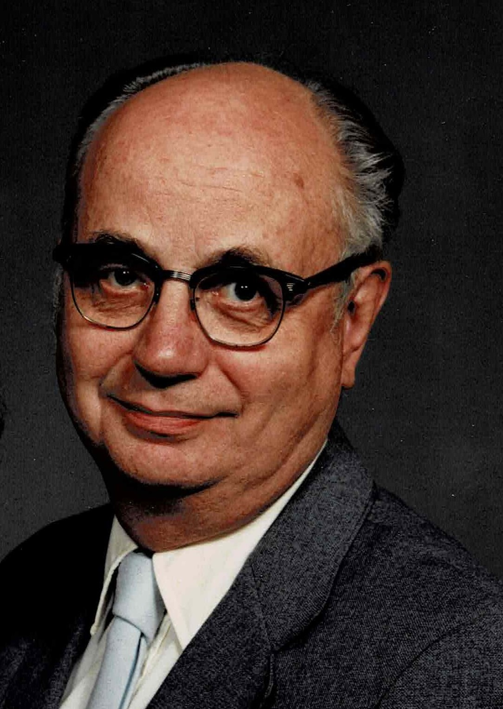

% George A Ricker Memorial

# Obituary

_As seen in Maine Sunday Telegram and Lewiston Sun-Journal, Feb 26, 2023;
authored by the family, 
so Copyright &copy; 2023 Estate and Heirs of Geo. A Ricker._

{ height=20% width=20% }

**George Albion Ricker** died peacefully at home in Windham, surrounded
by family, February 16. George, age 90, grew up on the family farm,
Ricker Hill Orchards, in Turner, Maine, with his late parents, Albion
and Mabel Ricker, and his brother Don.  His late grandparents William
and Mary Ricker lived across the dooryard.  He was also predeceased by
baby brother Billy, as well as aunts, uncles, several cousins, and many
classmates from Leavitt Institute in Turner.

He attended the University of Maine at Orono and graduated in 1954
with a bachelor’s degree in History and Government, minor in English.
He spent most of his two years in military service at Vint Hill Farms
Station.   He enjoyed free time exploring the Virginia countryside,
government buildings in Washington, and genealogical research at the
Library of Congress.   He collected data from extended family and built
on earlier research by family and friends.   This interest in genealogy
persisted through many decades of research in primary sources from Maine
to Connecticut and rural New York State.   He taught adult ed classes
for beginning genealogists [before computers and the Internet took over].

His career in secondary education included several weeks in Princeton,
Maine, before he was drafted in November, 1956.   Two years later he
took his new bride, Margaret “Wendy” Dow Ricker, to Lebanon, NH,
where he taught English for two years.

For the school year 1958-59 he and his wife were “house parents” in
Dorm 6 at Cornell University where he was studying for his master’s
degree in Guidance.

From 1959 to 1973 he served as Guidance Director at Calais and Woodland
high schools in Washington County, Maine, then Windham High and Bonny
Eagle High in southern Maine. In 1962 he attended an NDEA Institute
in guidance at UMaine-Orono.   This eventually led to a Certificate
of Advanced Studies from UMO in 1968, activity in state and national
teachers organizations [MEA, NEA] and guidance associations.

As computers took over much of guidance, George succeeded in moving
back to the classroom at Bonny Eagle, primarily in English and speech.
When he took early retirement in 1991, he had a seasonal job for the
family farm, running a picking crew or farm stand.

In early years, and in retirement, he and his family often enjoyed
combining travel with national conferences.  In 1983, he and Wendy were
honored by Little People of America, Inc., with the Distinguished Service
Award (Auxiliary) for their years of mentoring other parents of children
with dwarfism.

To celebrate their 60th wedding anniversary, George and Wendy took
a cruise from Florida, through the Panama Canal, and on to Hawaii.
Other favorite destinations included Alaska,  Australia/New Zealand,
Italy, and especially Great Britain.

In recent years, George’s major community involvement was serving as
Secretary for the Little Meeting House.

George is survived by his wife Wendy, their children Ruth and William
(Pamela), their grandchildren Michael Janis and Lou (Jae), his brother
Don (Tootie) and family, and cousins near and far.

A memorial service will be held at the North Windham Union Church on
Thursday, March 2nd,  at 10 am (masks provided).

Donations in George’s memory may be made to the Little Meeting House
(P O Box 962, Windham ME 04062) or the [North Windham Union Church](https://www.northwindhamunionchurch.org)
(723 Roosevelt Trail, Windham ME 04062).

# Memorial Service

## Order of Worship

[North Windham Union Church](https://www.northwindhamunionchurch.org)

United Church of Christ

March 2nd, 2023

Funeral

George Ricker

* Welcome
* Invocation - Rev Debra Girard
* Pastoral Praye - Rev Debra Girard
* Hymn _How Great Thou Art_
* Intro to the 23rd Psalm  - Rev Debra Girard
* Unison Reading, 23rd Psalm
* Words of Hope - Rev Debra Girard
* Poem - Crossing the Bar, by Alfred, Lord Tennyson
* Speakers - Bill Ricker and Ruth Ricker
* Hymn - Amazing Grace
* Benediction  - Rev Debra Girard

## Crossing the Bar

### 1. anecdote 

Dad and Art Bierce, 
his long term car-pool from North Windham to Bonny Eagle High (18 years!),  
his opposite number in English Dept  
(English Lit vs American Lit, a convivial rivalry),  
the pair referred to as Statler & Waldorf by Gen X & Gen Jones students raised on *Sesame Street* and *The Muppet Show*,  
had pledged to read Tennyson's "*Crossing the Bar*"  
at **each other's** funerals  
-- irony fully intended -- they taught rhetoric, so of course the irony was intended!

Dad having read Tennyson for Arthur, 
Arthur can not be here today to read Tennyson for Dad.

But the poem shall be read.

###  2. Crossing the Bar

*By Alfred, Lord Tennyson*

Sunset and evening star,  
      And one clear call for me!  
And may there be no moaning of the bar,  
      When I put out to sea,  

But such a tide as moving seems asleep,  
      Too full for sound and foam,  
When that which drew from out the boundless deep  
      Turns again home.  

Twilight and evening bell,  
      And after that the dark!  
And may there be no sadness of farewell,  
      When I embark;  

For tho' from out our bourne of Time and Place  
      The flood may bear me far,  
I hope to see my Pilot face to face  
      When I have crost the bar.  

-----------

## B. Tree of Life design

While Tree of Life is a very popular metaphor,  
making this urn a best-seller,  
that's but a small part of why we chose this design for Dad.  

A Tree is especially appropriate for *his* Life, perhaps a life of trees.

He was born to an Apple family, an Orchard surrounded by woods,  
to which he returned at the end of his teaching career,  
so consider it an Apple Tree.

He had a life-long and infectious love of family history and genealogy,  
so consider it a Family Tree.

He took great pleasure in his woodlot and his ability to heat his house thereby.   They say cutting wood warms you thrice (cut, split, burn),  
but he also hauled, stacked, re-cut, hauled and restacked, and carried upstairs, so **his** wood warmed him **seven** times.  
He was very sad when he voluntarily gave up his gasoline chain-saw in 2014 in interest of safety, having started backing-off that and gas snowblower in 2012 at 80;  
he cheered up when i gifted him an electric safety "gator" saw,  
which he could use within extension-cord range of the house for several more years.  
So consider it the trees he harvested,  
and those he left for us.

---------

## C. Bill's Remembrance

Dad shared his love of many things with us.

### love of travel

* Dad loved to travel
* possibly from growing up riding as companion for distant apple deliveries, and Masonic and Pomological meetings, 
* possibly from reading about far places.
* as kids we drove everywhere as a family, usually with a small travel-trailer behind the station-wagon. We saw 47 of the lower 48 states, counted only if we'd stopped at the State Capitol building; ands many of the greatest National Parks (and Mom & Dad saw the rest later!).
* as young-retireds, our parents upgraded from the tiny camp trailer to smallest large RV and wandered as far as Alaska's Arctic Circle one summer but mostly south in winter as migratory snowbirds; and they continued to tour after selling on the RV.
* We shared a week together in FL just before plague in 2020 when our winter snowbird sojourns overlapped. Dad and I drove from his brother's cottage to one of the island parks for a day; i poked fortifications, Dad read his newspaper in the shade. He knew where the gift-shop with the ice-cream was. Then we had a joy ride over the sky-bridge and back just because it was there.

### love of reading and love of learning

* Dad shared by example his love of reading - literature or genre, travel or history.
* So when i was at Arlington School - which once shared a driveway here - the only day better than School Lunch Pizza day was Scholastic Book Service book day.
* From Dad i also learned to look for bargain used books. Buck-a-Bag or Buck-a-foot day on the Sunday of a Library weekend booksale was his favorite. We scoured such sales to collect Readers Digest condensed volumes, which Bonny Eagle Vocational students would rebind into custom anthologies for his classes needing faster paced, gentler introductions to good literature.

### love of history

* While known as a teacher of English and Guidance counselor, Dad's major was History & Government with a minor in English with just enough Education classes to do student teaching. (Professional Credentialling has reversed since then!)
* So our available books and travel both included a lot of history.

### love of family history

* growing up as he did with four generations sharing a door-yard on the farm that was first cleared and settled when Maine was still just a District and several Counties of Massachuesetts, family history was as near as great-grandmother's sick-bed and the family attic.
* since the Library of Congress was the one air-conditioned public building within distance of his army post, he naturally advanced to formal genealogy, reading town histories and family histories, first of his family and then of his fiancée's as well. Which got her and her Aunt interested too, and now me.
* as with Guidance, he largely passed the torch on Genealogy when computers took over!

### love of public speaking and drama

* Dad was a strong advocate of public speaking and drama in schools.
* Mom and Dad met at college drama club!
* He taught and coached debate, speech, drama.
* Dad encouraged not just _his_ students but also _my_ practice at public speaking in H.S., 
* which has served me well professionally, 
* and again today.
* Thank you once again, Dad.

### love of Boston Red Sox

* and inadvertently love of Boston
* Dad would nearly annually  ironically ask, 
* "How did i raise two city kids?"
* Dad, you taught us to love the Red Sox, win or lose;
* and to enjoy walkable cities;
* and with your Guidance research and instinct helped pick perfect Boston colleges for each of us.
* So naturally we came to love Boston as well as Maine.
* That we found jobs and stayed there isn't entirely your fault.
* in 2004, his kid brother, our Uncle Don, had just 2 tickets to one Red Sox World Series home game. So he took his brother on a once-in-a-lifetime roadtrip. Short in mileage by either of their travel standards, but long in memories.

and of course

### love of family and friends

-----------

## Ruth's Remembrance

_Copyright &copy; Ruth E Ricker 2023_

Dad was the fudge guy. The apple guy. Many people's favorite teacher.

These things I've heard over the years when I've come back to southern
Maine and more recently on Facebook.

A colleague and friend who did thoughtful things quietly behind the
scenes.

Family man. Our Dad.

I was a surprise. Not [that]{.underline} kind of surprise.

The dwarfism part, that was a surprise. They didn't detect things like
that over sixty years ago.

I was fortunate to be born to open-minded parents, with decent resume
for preparing a kid who is different for the world, a psychologist and a
guidance counselor.

One of the reasons we moved to southern Maine from Calais, was so we
would be closer to specialists in Portland and Boston.

One of those specialists told them early on that I'd have to learn to
speak up for myself. My parents chuckled. They knew any kid of Dad's
would have that covered.

In the early 1960s Dad tried to look up LPA in the phone book when he
was in Washington, DC for a guidance meeting, but LPA wasn't listed. LPA
found us and we did join.

Mom and I went to my first convention when I was 8. When we got home, I
hadn't seen Dad and Bill for a week. I hugged Dad and as he held me, I
told him I loved him but I loved the little people more.

Can you imagine?

I've apologized for that many times when reminded as an adult, but Mom
and Dad knew then how important this community was for my well-being.

They were parent support leaders in LPA.

> *Treat this kid like your other kids,*
>
> *tease them like your other kids,*
>
> *get them involved, play to their strengths.*

That was the guidance counselor in him, \"Play to your strengths."

On family trips with the trailer, I had a hard time keeping up with the
walking. Dad and one of his former students who was a welder designed a
contraption with long handles attached to the seat of an old kitchen
chair and bicycle tires. The "Rickershaw".

Before disability laws, Dad made wooden stools every fall the week
before classes started to fit in my new classroom.

When the Maine Mariners first came to Portland they had free tickets for
area high schools, so Dad and I went to a game. He was one of those
guys, people, who get ready, coat in hand, to make a break for it right
as an event ends.

When there were only a couple minutes to go in the second period Dad
stood up in the aisle and put his jacket on and motioned for me to
follow suit.

> *Why are you standing up Dad?*
>
> *It's almost over.*
>
> *Daaaaddeeee there's three periods.*

Oh. He sat down. Grudgingly.

He usually loved it when I said, Daaaddeeee, especially in exasperation.

He'd exclaim, "Two points!" (One for each syllable) This of course would
make me more exasperated.

I gestured a lot. Dad would grab my hands when I was trying to make a
point, and that would silence me briefly, and he'd announce

> *Look, she can't talk without her hands.*
>
> *Dadddeeeee*.
>
> *Two points!*

He didn't have a sister but he teased his cousins too.

We looked for a college which had a reasonably small campus (play to
your strengths) and at that time, Northeastern's was. Dad joked I picked
a school between the two institutions I knew best in Boston, Fenway Park
and Children's Hospital.

I was still followed at Childrens when I was in college. One time, Dad
took a personal day and drove to Boston to meet me at Children's for an
ortho appointment.

Specialist appointments were more Mom's domain but Dad was the
designated door guard.

Chief of orthopedics was a busy guy, ducked out of the appointment as
soon as he was done, if you weren't fast with your questions. I asked
Dad to come and stand in the doorway. And he did.

I remember this being a concept but honestly, I didn't remember asking
Dad to drive down when I was in college. But he remembered. He mentioned
it last fall. It [still]{.underline} tickled him that I asked him.

I'm sure Dad bragged in the car to Arthur.

"I won't be meeting you Thursday because my little girl who moved away
to college still needs me."

Dad was standing in the back of a hotel ballroom at an LPA event when I
was a young adult. I was making announcements and said something in
gest.

Dad cringed.

Yeah, I totally inherited Dad's public speaking manner.

He warned me that it could backfire. It happened to him occasionally at
the MTA/NEA meetings and conferences.

If one jokes too much, people don't take one seriously that one time one
is passionately serious about something important.

Mom and Dad designed their dreamhouse and had it built on the other side
of town, the summer I was 18.

Danny the contractor taught with Dad at Bonney Eagle. He asked Dad why
the plans had the windows only a foot off the floor in the living room,
it was going to be more complicated, more expensive to do that.

Dad simply explained that was so "Ruthi's kids will be able to see out."

Danny knew me and took it on as a worthwhile project which he explained
to any crew member who questioned it.

There's a photo of my son looking out the window in the display.

Of course, all kids start out kind of short, my niece benefited as well
when she was very young.

Dad was tickled to find out that his grandson was blue eyed and
left-handed like him, unlike the others. They bonded over ice cream and
squeezing excessive amounts of Hershey's syrup into milk (Dad was very
proud of that) and of course the apple stand in Standish.

After taking the grandkids to the wildlife park in Gray, Dad made wooden
cutouts of animals; only some of this collection was native to Maine.

Dad posed them in the woods behind their house for the kids to discover.

I have friends who continue to hear Dad's voice in their heads when they
confuse "lay" and "lie".

My college roommate still quotes him, "Good Lord child, where did you
learn to talk?"

He corrected his osteopath's use of lay/lie often enough that she did
start saying "Lie down" not "lay."

Dad was correcting the grammar of nursing staff at Maine Medical Center
this winter.

In the depths of his delirium in the basement of the ER. That gave me
hope, that spirit.

I think of him whenever I notice a grammatical mistake.

I think of him a lot of course.

Different things happen and think, I have to remember to tell Dad that.
Something in the news.

Or to ask him what he thinks about the pitch clock. We sometimes watched
the last few innings of a game together on the phone in our separate
living rooms when I still lived in Boston

I plan to still watch the Red Sox with him.

And listen to his advice. And roll my eyes. And say, DAD DEE!

-------------

