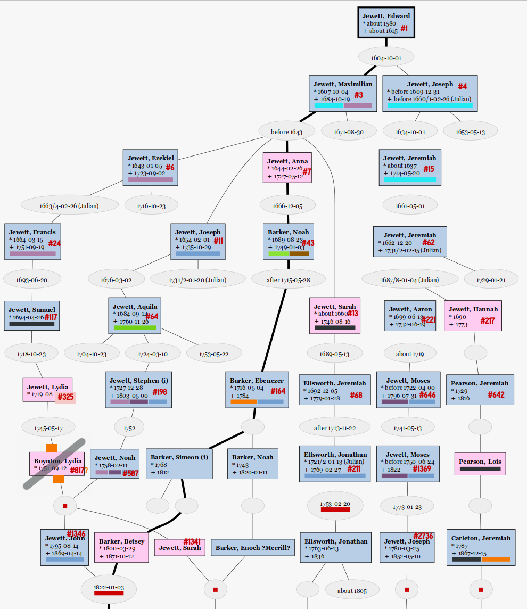
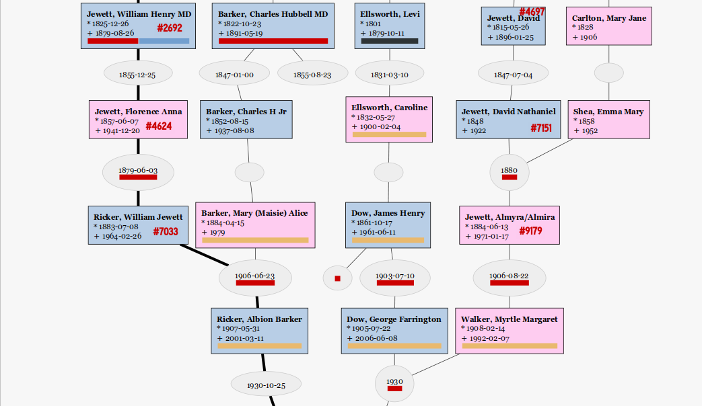

% My Jewett Lines & Updates for Jewetts of America
% William D Ricker
% © 2023, 2024

---------

* [↑ § Genealogy](..)
* [↑↑ Articles Home](../..)

---------

# Jewett Ancestors not previously listed

This page reports my tangled Jewett pedigree, noting additional Descendants (non-living only) of [_Jewetts of America_](https://archive.org/search?query=%22Jewetts+of+America%22) ([OpenLibrary](https://openlibrary.org/books/OL7001732M/History_and_genealogy_of_the_Jewetts_of_America#editions-list)) volumes 1 & 2 persons therein. (_Hereafter referred to as JoA and the numbering there as J#._)

As far as I know (AFAIK), none of the un-numbered persons listed here were in the Newsletters, Quarterly, or Annual publications of the society. (_If [JoA society](https://www.jewett.org/) newsletter editor would like this reformatted for newsletter, i would consider - and will also share further details with the Historian._)

Siblings and/or parents of two numbered ancestors mentioned here do appear in Newsletter/Quarterly articles, but not discussing the un-numbered ancestors given here, as noted below.

I've made my own [index of Vols 3 & 4 clusters](joa-v3+4-clusters.html), and i have verified none of those newly numbered clusters match these un-numbered lines. Though several are adjacent: 

* J#17 Hannnah [JoA:iii:1], aunt & m. cousin, sibling of ancestor J#15 Jeremiah , which latter is in my [J#217](#j217-hannah-jewett) Hannah and [J#7151](#j7151-david-nathaniel-jewett) David N lines; 
* J#22 Joseph  [JoA:iii:14], Step-father, and half-sibling of ancestor J#15 Jeremiah, so ½uncle, ditto;
* J#63 Jonathan  [JoA:iii:26], uncle, bro. of J#64 Aquila [iii:26], which latter is in my [J#4624](#j4624-jewett-florence-anna) Florence and [J#1341](#j1341-jewett-sarah-aka-sally) Sarah  lines; 
* J#645 James [JoA:iii:154], Uncle, bro. of ancestor J#646 Moses, which latter is in my [J#7151](#j7151-david-nathaniel-jewett) David N line; James died of woulds at seige of Louisburg, where many ancestors fought, some died ; 
* J#2735 Moses [iv:878], uncle, as bro. of ancestor J#2736 Joseph, which latter is in my [J#7151](#j7151-david-nathaniel-jewett) David N line.

# Jewett Ancestry of William Ricker  

## Chart Key

* This view shows connection of  &#x2460; **J#1 Edward** to your humble reporter, who would appear two lines below the bottom margin. 
* This view is omitting non-Jewett in-laws as well as all living persons. Produced in the [GRAMPS desktop program](https://gramps-project.org/blog/).
* On Marriage: Red &#x1F7E5; denotes consanguineous marriage; often but not always Jewett! Text below should indicate degree of cousinship.
* On Person: red &#x1f534; is medical doctor; sky blue is immigrant; orange &#x1F7E0; is unsure connection; purples &#x1f7ea; are clergy or deacon/elder; lt.green is proprietor; dk.brown &#x1F7EB; is slave-holder; medium blue &#x1F7E6; is soldier or militia, if paired with deep purple, Revolutionary service; tan is Mayflower descent line carrier (marked &#x1F4AE; in text below).  Black &#x25A0; marks end of line on old wall fan-chart, (or killed/executed/witch, but not on _this_ chart).  (_These colors are my own mnemonic choices for my selection of filterable "tags" on people and families in GRAMPS._)
* grey strikeout One line from my parents' fan-chart, J#6 Ezekiel to J#817 Lydia, I think is busted; the line is correct in the JoA books, but it's not the _right_ Lydia for _our_ tree; and so appears struck-out with translucent gray above, and is discussed below [re J#587 Deac. Noah Jewett’s wife Lydia](#re-j587-deac.-noah-jewetts-wife-lydia-is-not-j325-lydia
).

## Notations

Numbers that are prefixed with **J#** (pr prefixed with only **#** in chart above) are [_Jewetts of America_](https://archive.org/search?query=%22Jewetts+of+America%22) numbers from those books, which books are referred to as **JoA**. 

Other family descendency ids provided as _Cross-Reference_ are identified when used and listed in [Bibliography](#bibliography-for-cross-reference-numbers). 

Jewett Descent Generation numbers are shown in circles &#x2468;&nbsp; in the descent outline. These are usually given as superscripts^9^ in most other family genealogies, but the JoA books use the descent number as superscript, ala Aquila^64^,  Maximilian^3^; which I will use here only when quoting the JoA known descent.  Generations from **other** families' progenitor are shown conventionally as Noah^5^ Barker.

----------

# &#x2468; J#4624  Jewett, Florence Anna 

(William H.^2692^, John^1346^, Noah^587^, Stephen^198^, Aquila^64^, Joseph^11^, Maximilian^3^, Edward^1^) [[JoA:i:459](https://archive.org/details/historygenealogy01jewe/page/459/mode/1up?q=2692+4624),[JoA:ii:697](https://archive.org/details/historygenealogy03jewe/page/697/mode/1up?q=2692+4624)]

(b. 1857-06-07 - Double Branch, GA, d. 1941-12-20)

sp. **Ricker**, Albion (Allie) Swett 
(b.  1857-12-07 - Turner, ME, Androscoggin Co, Maine, USA, d. 1914-08-14 - Turner, ME, Androscoggin Co, Maine, 
USA), 

m. 1879-06-03 - Turner, ME, 
Androscoggin Co, Maine, USA

_Cross-Reference_ &mdash;  Ricker#4892 (in [Ricker Gen.](https://worldcat.org/title/35526599)).

&#x1F7E5; _Note that Forence's paternal grandfather &#x2466; **J#1346 John Jewett**'s wife **Betsey Barker** [under J#164 Ebenezer q.v.](#j164-ebenezer-barker-sr)  is his fourth cousin, of Jewett descent: Betsey^5^ Barker, Simeon^4^, Ebenezer^3^, Noah^2^, Barzilla^1^ Barker m. &#x2462; **J#7 Anna (Hannah) Jewett (Barker)**, dau. of &#x2461; **J#3 Maximilian**, so that their children have doubled Jewett._

3 children, enumerated at _loc.cit._ but not expanded in JoA:

## &#x2469; J#7032 1. Ricker, Bess(ie) Jewett

(b. 1880-11-21, d.  1906-08-04) [obit](https://www.findagrave.com/memorial/254094331/bessie_jewett_mitchell)

sp. **Mitchell**, Arthur Albert (b.  1880, d. 1914), [obit](https://www.findagrave.com/memorial/254094225/arthur_albert_mitchell);  
m. 1902-12-17

_JoA listed as ONE child, no J#; actually **two** sons; Arthur A had probably 3 more chn. by his m.2 [Cora May Irish](https://www.findagrave.com/memorial/254094027/cora_may_prince), per obit; and she remarried also (his m.2 of 3), per F-a-G, into one of the other two major Apple Orchardist families in town._

*  Mitchell, Alfred Ricker (b.  1905-01-09, d. 1961)  [obit](https://www.findagrave.com/memorial/254095215/alfred_ricker_mitchell);
sp. Ayles, Marion E (Morris) (d.  1991), m. 1925-05-09

*  Mitchell, Donald Bates (b.  1906-08-02, d. 1988)  [Obit](https://www.findagrave.com/memorial/254095339/donald_bates-mitchell)
sp. Bailey, Grace L (Forster) (b.  1909, d. 2000) [obit](https://www.findagrave.com/memorial/96275214/grace-louise-mitchell);
    - no issue from this marriage.
    - (Her (m.2); she (m.1) Francis Lee **Bailey** sr. - 3 sons, including noted attorney **F Lee Bailey (jr)** (1933-06-10 - 2021-06-03; [obit](https://www.dignitymemorial.com/obituaries/houston-tx/francis-bailey-10221337), [news](https://www.abajournal.com/news/article/disbarred-lawyer-f-lee-bailey-who-took-on-the-demons-of-society-dies-at-87)); 
_AFAIK her other children may yet live so not included._)
    - _Don Mitchell was fostered in his Uncle Will's household (see next **J#7033**), his mother Bessie having died when he was age 2 days. As foster-brother, he was very close to his cousin A.B.Ricker for life. Don adopted Grace's sons, per Obit. Don had one leg permanently deformed by Polio._

##  &#x2469; J#7033 2. Ricker, William Jewett, aka "Will" and "W.J."

(b.  1883-07-08 - Turner, ME, Androscoggin Co, Maine, USA, 
d.  1964-02-26 - Turner, ME, Androscoggin Co, Maine, USA)
[(F-a-G)](https://www.findagrave.com/memorial/81717447/william-jewett-ricker)

sp. **Barker**, Mary "Maisie" Alice 
(b. 1884-04-15, d. 1979), 
[(F-a-G)](https://www.findagrave.com/memorial/81717470/mary-ricker) (&#x1F4AE; _Cooke, via Burgess_)

m.  1906-06-23

&#x1F7E5; Mary is also desc of **J#587 Deacon Noah Jewett**,  via [**J#1341 Sarah/Sally Jewett (Barker)**](#j1341-jewett-sarah-aka-sally), who had married **Enoch (Enoch Merrill?) Barker**, her fourth cousin via **J#7 (H)Anna(h) Jewett (Barker)**,  so Mary and Will were 3d Cousins by Jewett, 4th by Barker from **J#64 Ebenzer Barker**, _etc_.

_Cross-Reference_ &mdash;  Ricker#9675

2 children:

###  &#x246A;  1. Ricker, Albion Barker &#x1F4AE

(b.  1907-05-31 - Ricker Hill, Turner, ME, Androscoggin Co, Maine, USA, 
d.  2001-03-11 - Lewiston, Androscoggin, ME, Androscoggin Co, Maine, USA)
[(F-a-G)](https://www.findagrave.com/memorial/239726280/albion-barker-ricker)

sp. **Field**, Mabel Klose 
(b.  1908-02-25 - Sheffield, Berkshire Co MA, 
d. 1998-10-03),
(&#x1F4AE; _Warren_)
[(F-a-G)](https://www.findagrave.com/memorial/239726317/mabel-c-ricker); _middle name sometimes spelt 'Close' but VR says Klose;_

m.  1930-10-25 - Sheffield MA, Berkshire Co MA, Massachusetts, USA

_Cross-Reference_ &mdash;  - Ricker#15716.

3 children: 

* 1.  &#x246B; Ricker, George Albion &#x1F4AE;
    - (b.  1932-03-28 - Lewiston, Androscoggin Co ME,
    - d. 2023-02-16 - at home, East Windham, Cumberland Co ME);
    - burial TBD in Turner;
    - [Obit and Eulogies](../GAR/GAR-Memorial.html).
    - sp. _living; living descent_ (_including this reporter_ &#x1F4AE;; _see my Remembrance or eulogy at link above_).
    - _Cross-Reference_ &mdash;  Ricker#29711.

* 2.  &#x246B; Ricker, William Gordon  
    - (b.  1935-04-02 - Ricker Hill, Turner, Androscoggin Co, ME,  
    - d.  1935-04-04 - Ricker Hill, Turner)  
    - [(F-a-G)](https://www.findagrave.com/memorial/239726354/william-gordon-ricker)

* 3. &#x246B; _LIVING SON WITH MULTIPLE DESCENT_

### &#x246A; 2.  Ricker, E Louise &#x1F4AE;
(b. 1908-09-15,
d. 1990-11-24 - Auburn, Androscoggin Co, Maine, USA)

sp. **Boothby**, Laurence Bizzell 
(b. 1908-11-04, d. 1998-06-06 - Auburn, Androscoggin Co, Maine, USA),
( &#x1F4AE; _Cooke Howland Bradford Brewster Allerton_)

m.  1931-08-15

multiple children, _of whom most are living; two alas are share-able_:

* &#x246B; Boothby, Eleanor Belle 
    - (b.  1934-05-12, 
    - d. 2015-04-27 - Auburn, Androscoggin Co, Maine, USA)
    - [obit](https://www.sunjournal.com/2015/04/29/eleanor-b-thayer/)
    - _ex-sp living?; living descent_.

*  &#x246B; Boothby, Charles Laurence "Charlie"
    - (b. 1935-05-08, 
    - d. 2022-01-23 & bu. Bangor, Penobscot Co, ME),
    - [(F-a-G)](https://www.findagrave.com/memorial/236179869/charles-laurence-boothby),
    - [obit](https://obituaries.bangordailynews.com/obituary/colonel-charles-boothby-1084276639). 

    - sp. **White**, Judy 
        - (b. July 7, 1935, Bangor ME,
        - d. April 11, 2023, & bu. Bangor ME), 
        - [obit](https://www.brookingssmith.com/memorials/judith-boothby/4029667/index.php)

    - two of their 3 sons pre-deceased them:
        -  &#x246C; Timothy E (b. 1961, d.  1984) [(F-a-G)](https://www.findagrave.com/memorial/236180211/timothy-boothby) 
        -  &#x246C; Andy (b. 1963, d. 2018) [(F-a-G)](https://www.findagrave.com/memorial/236180226/andrew-charles-boothby), 
        -  &#x246C; _other descent living_.

*  &#x246B; ⎄_other descent living_.

##  &#x2469; J#7034 3. Ricker, Anna 
(b. 1887-07-07, d.  1927-10-06)
[(F-a-G)](https://www.findagrave.com/memorial/81537386/anna-r-hatch)

sp. **Hatch**, Emery Bunker Newton "Dick"
(b. 1889-06-28, d. 1983-09-14 - Rockport ME)
[(F-a-G)](https://www.findagrave.com/memorial/81537431/emery-b-hatch),

m. 1912-08-01; 

he (m.2) Katherine Devlin 
[(F-a-G)](https://www.findagrave.com/memorial/81537366/katharine-d-hatch)

4 children:

* 1. &#x246A; Hatch, Barbara (b. 1913-06-07, d. 2001-09-10)
[(F-a-G)](https://www.findagrave.com/memorial/81537206/barbara-hatch);
    - nm; no issue.
* 2. &#x246A; Hatch, Gwendolyn (b. 1914-09-14, d. 1972)
    - sp. **Pulliam**, Richard E. (d.  2009), m. 1938-04-25;
    - no issue.
* 3. &#x246A; Hatch, Marion (b. 1916-08-22, d.  2018-07-27)
    - [(F-a-G)](https://www.findagrave.com/memorial/239583106/marion-bowman), [obit](https://www.pressherald.com/2018/07/31/marion-bowman/)
    - sp. **Bowman**, Ben Cook (b.  1912-12-22, d. 2001-02-01);
    - no issue.
    - _She was the doyen of Mid-Century Modern when MCM was new; and was also once a [professional genealogical researcher](https://archive.org/details/researchinameric00kirk/page/60/mode/1up?q=Marion+Hatch+Bowman). He was Newberry Library Librarian among other posts._

* 4. &#x246A; Hatch, Priscilla (b. 1921-02-07, d. 2011-11-22)
    - [(F-a-G)](https://www.findagrave.com/memorial/239587198/priscilla-moore)
    - sp. **Moore**, Robert Hugh (b.  1919-02-04, d. 2005-11-11)
    -  &#x246B; _multiple living descent._

------------

# &#x2466; J#1341 Jewett, Sarah (aka Sally)

(Deac. Noah^587^, Stephen^198^, Aquila^64^, Joseph^11^, Maximilian^3^, Edward^1^)
[[JoA:i:165](https://archive.org/details/historygenealogy01jewe/page/165/mode/1up?q=1341)]

_sister of John #1346 mentioned [below](#j164-ebenezer-barker-sr)_

sp. **Barker**, Enoch ?Merrill?

&#x1F7E5; Enoch M was her 4th cousin, via **J#7 Anna (Hannah) Jewett (Barker)**,
dau. of . of &#x2461; **J#3 Maximilian** (line: Enoch M^6^, Noah^5^, Ebenezer^4^, Noah^3^, Barzilla^2^ **Barker** (m. &#x2462; **J#7** (H)Anna(h) Jewett), James^1^ Barker).
[J#43](#j43-noah-barker) Noah^3^ Barker#20 is covered as  below.

Cross-Reference_ &mdash;  [Barker#79 Noah^5^ & #150 Enoch^6^](https://archive.org/details/barkergenealogyr00bark/page/398/mode/1up?q=79+150+Noah+Enoch).

&nbsp;&bull;&nbsp;&bull;&nbsp;&bull; 
_Updates for one child, IDK if there are others:_ 
&nbsp;&bull;&nbsp;&bull;&nbsp;&bull; 

## &#x2467; Barker, Charles Hubbell, M.D. 

(b. 1822-10-23   - Cornish, York, ME, 
d. 1891-05-19 - Wayne, ME, Kennebec Co, ME)
[(F-a-G)](https://www.findagrave.com/memorial/95382994/c-h-barker),
[obit](https://books.google.com/books?id=HiAbAAAAMAAJ&dq=Bowdoin%20Obituary%20%20%20%22Barker%20Charles%20H%22&pg=PA57#v=onepage&q=Barker&f=false),

sp. (m.1) Small, Mary A(nn) 
(b. 1820-09-18 - Limington, York Co, ME, 
d. 1854-09-01 - Wayne, Kennebec Co, ME), 
[(F-a-G)](https://www.findagrave.com/memorial/95383249/mary-ann-barker)

m. 1847-01-00

sp. (m.2) Small, Abbie C 
(b. 1825-12-12 - Limington, York Co, ME, 
d. 1879-08-04)
[(F-a-G)](https://www.findagrave.com/memorial/95383357/abby-c-barker), 

m. 1855-08-23

5 children (_Bowdoin Col. obit seemingly under-counted!, "leaving" probably meaning **surviving** children, for which "1 each" is alas correct, only first and last grew to adulthood._):

### &#x2468; 1. Barker, Charles H Jr, Dr.

(b. 1852-08-15, d. 1937-08-08)
[(F-a-G)](https://www.findagrave.com/memorial/115664241/charles-h-barker)

Dentist

sp. Burgess, R Louise (b. 1854-11-24, d. 1909-09-15), (&#x1F4AE; _Cooke_)

3 children:

* &#x2469; 1. Barker, Mary (Maisie) Alice (b. 1884-04-15, d. 1979), &#x1F4AE;
married &#x1F7E5; her 3d Cousin 
[**J#7033 William Jewett Ricker**](#j7033-2.-ricker-william-jewett-aka-will-and-w.j.), _q.v._.  
(Common ancestors **J#587 Deacon Noah & Lydia (Boynton) Jewett**).

* &#x2469; 2. Barker, Albion "Al" C. (b. 1885, d. 1973) &#x1F4AE;
[(F-a-G)](https://www.findagrave.com/memorial/115664489/albion-c-barker)

married, no issue. _Senior electrical engineer for growing power company._

* &#x2469; 3. Barker, A. Louise (b. 1879, d. 1958) &#x1F4AE;
[(F-a-G)](https://www.findagrave.com/memorial/115664368/a-louise-barker)

nm; no issue; school teacher in Salem, MA.

### &#x2468; 2. Barker, Mary Abby (d.  1854-09-01, aged days?)

_last child of (m.1) Mary Ann, who died same day._

### &#x2468; 3. Barker, Willis H (b. 1858-05-31, d. 1861-03-26, age 2+)

_first child of (m.2) Abbie C Small._

### &#x2468; 4. Barker, Warren C (b. 1862-12-15, d. 1871-01-11, age 8)

### &#x2468; 5. Barker, Annie M (b. 1866-08-15)

sp. **Arris**, Frank Harold (b. 
1859-08-17, d. 1924-05-26)

1 child:

* &#x2469; Arris, Hazel Louise 
(b. 1887-11-25, d. 1988-07-01)

sp. **Rawstron**, Albert Victor (b. 1882-05-24, d. 1942-01-11)

-----------

#  &#x2469; J#7151 David Nathaniel Jewett 

(David^4697^, Joseph^2736^, Moses^1369^, Moses^646^, Aaron^221^, Jeremiah^69^, Jeremiah^15^, Joseph^4^, Edward^1^)
[[JoA:ii:708,915](https://archive.org/details/historygenealogy03jewe/page/n370/mode/1up?q=7151)]

(b. 1848, d. 1922)

sp. Shea, Emma Mary (b. 1858, d. 1952), 

m. 1880 - East Pittston ME

**Emma Mary Shea (Jewett)**, wife of **J#7151 David Jewett** 
is supposedly also of Jewett Descent,
from [**J#642 Jeremiah Pearson**](#j642-jeremiah-pearson); the supposed line given below, _q.v._

_This family is mentioned in JoA 1998 Quarterly article, issue no.2, ["Jewett Families Buried at Whitefield Cemetery" , Barbara Jewett Shaw](https://www.jewett.org/jfa_backissues/jfa_quarterly_1998_2.pdf) for the burial of the parents and siblings of my ancestors; our gal is buried with her in-laws in Alna, so not mentioned in that article._

3 Children.

## &#x246A;  1. J#9179 Almira Jewett. aka Almyra.

(b.  1884-06-13 - Alna,  Lincoln Co, ME, 
d. 1971-01-17 - Maine)
[(F-a-G)](https://www.findagrave.com/memorial/49664815/almira-walker) has errors reported.

sp. **Walker**, George Wilmot 
(b. 1884-05-04 - Alna, Lincoln Co, ME d. 1964-08-27 - Rockland, Knox Co, ME), 
(&#x1F4AE; _Doty_)

m. 1906-08-22

3 children:

### 1. &#x246B; Walker, Myrtle Margaret &#x1F4AE;

(b. 1908-02-14 - Alna, Lincoln Co, ME, 
d. 1992-02-07, Maine)
[(F-a-G)](https://www.findagrave.com/memorial/49027445/myrtle-margaret-dow) has errors reported.

sp. **Dow**, George Farrington (&#x1F4AE; _Cooke+Hopkins_)
(b. 1905-07-22 - South Portland, Cumberland Co, ME, 
d. 2006-06-08 - Damariscotta, Lincoln Co, ME), 
[(F-a-G)](https://www.findagrave.com/memorial/20426606/george-farrington-dow) has errors reported.

m. 1930

_**George F Dow** is of Jewett Descent via [**J#612 Jonathan Ellsworth**](#j612-jonathan-ellsworth-jr) below, q.v._

3 children:

* 1. &#x246C; LIVING &#x1F4AE;
    - m. George A Ricker &#x1F4AE;, see under [A B Ricker](.#ricker-albion-barker)
        - &#x246D;  _Living Descent_ &#x1F4AE; (_including your reporter_)

* 2. &#x246C; Dow, Barbara Louise &#x1F4AE;
    - (b. 1934-12-31 - Penobscot Co, ME, Maine, USA, 
    - d. 2021-01-01 - Raleigh, Wake Co., NC) [obit](./Barbara-Turner-obit.html).
    - sp. **Turner**, James Harvey aka "Jim"
        - (b. 1931-05-29 - Illinois, USA, 
        - d. 2020-07-09 Raleigh, Wake Co., NC), 
        - m. 1957-12-28
    - Cary Presbyterian held a joint memorial service for Jim & Barbara. Video on [FB](https://www.facebook.com/watch/live/?ref=watch_permalink&v=3052922898299695) or [web](https://www.carypresbyterian.org/media/gkd2zhz/jim-barbara-turner-service-of-witness-to-the-resurrection).
    - Inurment together in the [church columbariam](https://carypresbyterian.org/directory-forms) niches. 
        * &#x246D; _Living descent._ &#x1F4AE;

* 3. &#x246C;  Dow, Elizabeth aka "Betty" &#x1F4AE;
    - (b. 1937-09-10 - Old Town, Penobscot Co, ME, 
    - d. 2007-05-09 - Bangor, Penobscot Co, ME) [obit](https://www.bangordailynews.com/2008/09/25/obituaries/elizabeth-dow-scott/)
    - sp. **Scott**, Eddie (d. 1983-01-28)
        - &#x246D; _Living descent_ &#x1F4AE;.

### 2. &#x246B; Walker, Neal Harvey &#x1F4AE;

(b. 1919-11-15 Maine, d. 1940-10-26 - Leyte, Philippines; WW2; USA 1LT CAC(AAA))
[(F-a-G): marker in family plot](https://www.findagrave.com/memorial/49655495/neal-harvey-walker)
[(F-a-G): bu. Manilla](https://www.findagrave.com/memorial/56774324/neal-harvey-walker)

nm, no issue.

### 3. &#x246B; Walker, Clifton Nathaniel &#x1F4AE;

(b. 1909-11-26 - Alna, Lincoln Co, ME, 
d. 1995-10-16)

sp. Childs, Nellie Burkett aka "Nell"
(b. 1911-04-28 - Needham, Norfolk Co, MA, 
d. 1998-10-30 - Waldoboro, Lincoln Co, ME)

* 1. Walker, David Clifton &#x1F4AE;
    - (b. 1942-10-13 - Damariscotta, Lincoln Co, ME; 
    - d. 2008-04-08 - Waterville, Kennebec Co, ME); 
    - _Living descent_ &#x1F4AE;

## 2. &#x246A; J#9180 Jewett, Mabel 

_no additional info, as yet_

## 3. &#x246A; J#9181 Jewett, Alvin Nathaniel

_no additional info, as yet_

-----------------

# OTHER LINES

More of my Jewett lines, discussed more briefly.

## &#x2464; J#217 Hannah Jewett 

(Jeremiah^69^, Jeremiah^15^, Joseph^4^, Edward^1^)
[[JoA:i:49,91-92](https://archive.org/details/historygenealogy01jewe/page/91/mode/1up?q=217+642)]

sp. LT Stephen **Pearson** (jr); 

Lt. Stephen and Hannah (Jewett) Pearson (J#217) are mentioned in [_Jewett Family America Quarterly_, 1999 No.2](https://www.jewett.org/jfa_backissues/jfa_quarterly_1999_2.pdf) article correcting Vol. III, Cluster 645, [iii:154], regarding illegitimate and consanguineous parentage of J#10207 James Jewett, husband of their daughter J#638 Mary Pearson; citing _The Maine Genealogist_.

### &#x2465; J#642 Jeremiah Pearson

As noted above, there is a web genealogy with a Jewett line from this Jeremiah 
to the wife of [**J#7151 David Jewett** ](#j7151-david-nathaniel-jewett) q.v.

&#x26A0; **WARNING:** _I have **not verified** this line found on the web myself, yet. The connections between Pearson and Carleton are quite plausible as the families were professionally connected in construction and operation of mills in both Essex Co and Lincoln Co. Exactly which Carl(e)ton is father of which of the consanguineous Carleton-Carleton match is recorded differently some places; TBD! Descent is supposedly from Jeremiah's dau. Lois thusly:_

* &#x2466; Lois Pearson m. Thomas **Carleton**
	- &#x2467; Jeremeiah Carleton m. Sally Carleton (&#x1F7E5; 1st Cousins)
		- &#x2468; Mary Jane Carlton m. Michael **Shea**
			- &#x2469; Emma Mary Shea, m. &#x2469; [**J#7151 David Jewett** ](#j7151-david-nathaniel-jewett) 

**If** _this Pearson-Carelton line is correct, Emma M Shea and David N Jewett are_ &#x1F7E5; _5th cousins from_ &#x2463; **J#69 Jeremiah Jewett**.

-----------------

## &#x2463; J#43 Noah Barker

(Anna^7^, Maximilian^3^, Edward^1^),
[[JoA:i:22-23,45]](https://archive.org/details/historygenealogy01jewe/page/45/mode/1up?q=Noah+43)

(b. 1689-08-23 - Rowley,  Essex Co, MA, 
d. 1749-01-03 - Stratham, Rockingham Co, NH)

sp. **Figgett**, Martha (b. 1696-08-23, d. 1772-12-18), 

m.  after 1715-05-28

_Cross-Reference_ &mdash;  [Barker#20 Noah^3^](https://archive.org/details/barkergenealogyr00bark/page/409/mode/1up?q=Noah+).

&nbsp;&bull;&nbsp;&bull;&nbsp;&bull; &#x2464; 
multiple children _of whom we follow only one._  &nbsp;&bull;&nbsp;&bull;&nbsp;&bull;

### &#x2464; J#164 Ebenezer Barker (sr)

_who is common Barker ancestor of_ &#x1F7E5; _[J#7033 Will Ricker](#j7033-2.-ricker-william-jewett-aka-will-and-w.j.) and Mary Barker, as well as father of this line._

(b. 1716-05-04 - Ipswich, Essex Co, MA, 
 d. 1784 - Stratham, Rockingham Co, NH)

sp. **Rundlett**, Mary (b. calculated about 1721, d.  1791-09-14)

_Cross-Reference_ &mdash;  [Barker#35 Ebenezer^4^](https://archive.org/details/barkergenealogyr00bark/page/411/mode/1up?q=35+Ebenezer+Simeon).

&#x26A0; **WARNING:** _I have some slight caveats on the connections of J#164 Ebenezer Barker and reported wive(s); and also identifying Enoch Merrill Barker & Enoch Barker as the same person; these seem sound but more TBD._

&nbsp;&bull;&nbsp;&bull;&nbsp;&bull;
&#x2465; Multiple children, of whom we follow only 2: &nbsp;&bull;&nbsp;&bull;&nbsp;&bull;

#### &#x2465; Barker, Simeon (i) 

(b. 1768 - Stratham, Rockingham Co, NH, 
d. 1812 - Limerick, York Co, ME)

sp. **Rundlette**, Hannah 
(b. 1768, 
d. 1832-05-05 - Limerick, York Co, ME)

_Cross-Reference_ &mdash;  [Barker#85 Simeon^5^](https://archive.org/details/barkergenealogyr00bark/page/416/mode/1up?q=85+Simeon)

_Hannah Rundelette must be some sort of_ &#x1F7E5; _cousin or even niece of her mother-in-law Mary Rundlett but TBD quite how._

Children:

* 1. &#x2466; Barker, Simeon (ii) (b. abt 1790 - Limerick, York Co, ME; Barker book says b. 11-14-1792, d. 7-15-1856); 

    - sp. Boardman, Elmira;
    -  &nbsp;&bull;&nbsp;&bull;&nbsp;&bull;  &#x2467; _lines not followed here, if any; Barker book reserves Barker#284 for his unlisted issue._  &nbsp;&bull;&nbsp;&bull;&nbsp;&bull;
* 2. &#x2466; **Barker, Betsey**
    -  (b. 1800-03-29 - Limerick, York Co, ME,
    -  d.  1871-10-12 - Readfield, ME, Kennebec Co, ME),
    -  sp. &#x2466; **J#1346 John Jewett**,
        -  (b. 1795-08-14 - Cornish, York, ME,
        -  d. 1869-04-14 - Kent's Hill, Readfield, Kennebec Co, ME)
    -  m. 1822-01-03 - Cornish, York, ME
        	-  **J#1346 John Jewett** was brother of [J#1341 Sarah/Sally](#j1341-jewett-sarah-aka-sally) _and was_ &#x1F7E5; _Betsey's 4th cousin; they are grandparents of  [&#x2468; J#4624 Florence Jewett (Ricker)](#j4624-jewett-florence-anna) above, q.v., and thus great-grandparents of W.J."Will" Ricker_ &#x1F7E5; _husband of Mary A Barker, his cousin on this line._
	- _Cross-Reference_ &mdash;  Betsey = Elizabeth [Barker#165](https://archive.org/details/barkergenealogyr00bark/page/417/mode/1up?q=165+Elizabeth)), overleaf from Simeon _loc.cit_.

#### &#x2465;  Barker, Noah 

(b. 1743 - Stratham, Rockingham Co, NH,
d. 1820-01-11 - Cornish, York Co, ME)

sp. **Merrill**, ?Susannah?

_Cross-Reference_ &mdash;  [Barker#79 Noah^5^](https://archive.org/details/barkergenealogyr00bark/page/416/mode/1up?q=79+Noah).

Children:

* 1. &#x2466; Barker, Noah

* 2. &#x2466; Barker, Thomas (b. 1766, d. 1819-07-25)

* 3. &#x2466;  **Barker, Enoch ?Merrill?**
    -  sp. [**J#1341 Sally/Sarah Jewett**](#j1341-jewett-sarah-aka-sally) 
    -  &#x1F7E5; _thus they are 4th cousins from_ &#x2461; **J#3 Maximilian Jewett**.
    -  _Cross-Reference_ &mdash;  Barker#150 Enoch^6^, _loc.cit._.
    -  _Enoch and Sally were parents of [**Charles H Barker, MD**](#barker-charles-hubbell-m.d.), and thus grand-parents of Mary Alice Barker (Ricker), wife of_  &#x1F7E5; _W.J. "Will" Ricker, her cousin on this line._
* 4. &#x2466; Barker, Humphrey

-----------

##  &#x2465; J#612 Jonathan Ellsworth (jr)

(Jonathan^211^, Jeremiah^68, Sarah^13^, Maximilian^3^, Edward^1^)
[[JoA:i:90]](https://archive.org/details/historygenealogy01jewe/page/90/mode/1up?q=612+Jonathan)

JoA says only 

> born June 13, 1763. Settled in Avon, Me.

as 5th of 7 siblings.

_Ellsworth genealogy [p.96 Jonathan^3 (sr)](https://archive.org/details/ellsworthgenealo00sieb/page/n215/mode/2up?q=%22Levi+Ellsworth%22) has same 7 siblings._

(b. 1763-06-13 - Rowley, Essex Co, MA,
d. 1836 - Avon, Franklin Co, ME,)

sp. (m.1) **Storer**, Esther (b. about 1773)

sp. (m.2) **Barton**, Eunice (b. about 1768), m. about 1805

one or two Ellsworth children with (m.1) Esther:

### &#x2466; 1. Ellsworth, Joanna (b. 1798, d. 1873) ??

&#x26A0; _Unsourced information from the wild web. Joanna does not appear in the Ellsworth genealogy. TBD?_

### &#x2466; 2. Ellsworth, Levi (b. 1801, d. 1879-10-11)

sp. **McManus**, Lucy Ann (b. before 1812, 
d. 1885), (&#x1F4AE; _Cooke+Hopkins_)
bu. [Avon, Franklin Co, ME](https://www.findagrave.com/memorial/44238995/levi-ellsworth), m. 1831-03-10

&nbsp;&bull;&nbsp;&bull;&nbsp;&bull;
_6 children in [Ellsworth gen.](https://archive.org/details/ellsworthgenealo00sieb/page/n217?q="Levi+Ellsworth"), following first child only._  &nbsp;&bull;&nbsp;&bull;&nbsp;&bull;

#### &#x2467; 1.  Ellsworth, Caroline (b. 1832-05-27, d. 1900-02-04) &#x1F4AE;

sp. **Dow**, Charles Curtis (b. 1835-09-30 - 
East Livermore - Livermore Falls, 
Androscoggin Co, ME, 
d. 1919-02-09 - Fayette, Kennebec Co, ME,
bu. [Phillips, Franklin Co, ME](https://www.findagrave.com/memorial/118844072/caroline-dow))

_Cross-Reference_ &mdash;  Charles C Dow is [Book of Dow #adkfbei](https://archive.org/details/bookofdowgenealo00dowr/page/378/mode/1up?q=adkfbei); also #7 in [_Joshua Dow of Avon_](https://archive.org/details/dowancestryposte00sedg/page/n57).

Charles C Dow hired a substitute when drafted for the war, with borrowed money. With the economic collapse after the war, he never got clear of that debt. "Three removes are as good as a fire."

3 Dow Children:

##### &#x2468; 1. Dow, James Henry &#x1F4AE;

(b. 1861-10-17 - Freeman, Franklin Co, ME, 
d. 1961-06-11 - Orono, Penobscot Co, ME,
bu. [Phillips, Franklin Co, ME](https://www.findagrave.com/memorial/118843965/james-henry-dow))

sp. (m.1) **Bradbury**, Myra E (b. 1866, d. 1893) (&#x1F4AE; _Howland_); no issue.
&#x1F7E5; J Henry and Myra were 7th Cousins from Thomas & Mary (Perkins) Bradbury; Mary was convicted and condemned late in the Salem Witch hysteria, but survived as her son-in-law MAJ Robert Pike, also Myra's ancestor, intervened with the Governor of the Colony, calling the whole hysteria into question.
Myra, her father, and brother all died of the T.B. that LT Albert L Bradbury brought home from the war. J Henry Dow supported his first mother-in-law Sarah (Howland) Bradbury for life, as live-in (step) grandmother.

sp. (m.2) **Farrington**, Abbie Louisa (&#x1F4AE; _Rogers, Hopkins, Brewster, multiply_)
(b. 1869-11-14 - Holden, Penobscot Co, ME, 
d. 1948-12-07 - Bangor, Penobscot Co, ME), 
(&#x1F4AE; _Rogers, Hopkins, Brewster_)

m.(2) 1903-07-10 - Portland, Cumberland Co, ME

_Cross-References_

* Farrington#92 [Farrington Memorial rev.ed p.17](https://babel.hathitrust.org/cgi/pt?id=wu.89066007758&view=1up&seq=39&skin=2021), 
* Book of Dow [[adkfbeib]](https://archive.org/details/bookofdowgenealo00dowr/page/378/mode/1up?q=adkfbeib) (which is inadvertent departure from firstborn as `a`!).
* Ellsworth Gen omits J H Dow from Caroline's offspring despite citing the Dow book listing him!_

Children with Abbie only:

* 1. &#x2469; Dow, Ruth E &#x1F4AE;
    - (b. 1904-04-19, 
    - d.   2005-10-09 -  Damariscotta, Lincoln Co, ME,
    - bu. [Alna, Lincoln Co, ME](https://www.findagrave.com/memorial/49027504/ruth-dow))
    - _Grammie Bradbury paid for Ruth's piano lessons with her War Widow pension; that's about all it was good for._
* 2. &#x2469; Dow, George Farrington &#x1F4AE;
    - (b. 1905-07-22 - South Portland, Cumberland Co ME, 
    - d. 2006-06-08 - Damariscotta, Lincoln Co, ME,
    - bu. [Alna, Lincoln Co, ME](https://www.findagrave.com/memorial/20426606/george-farrington-dow)),
    - [Nobleboro Hist Soc Obit + Eulogy](http://www.nobleborohistoricalsociety.org/GeorgeDow.shtml)
    - sp. Walker, Myrtle Margaret &#x1F4AE;
        - (b. 1908-02-14 - Alna, Lincoln Co, ME, 
        - d. 1992-02-07 Maine), 
    - m. 1930
    - _Cross-Reference_ &mdash; George Dow is [Book of Dow #adkfbeibb](https://archive.org/details/bookofdowgenealo00dowr/page/378/mode/1up?q=adkfbeib).
    - &#x1F7E5; &#x2469; **George F Dow** and &#x246B; [**Myrtle M Walker**](#j9179-almira-jewett.-aka-almyra.) above, daughter of **J#9179 Almira** Jewett _q.v._, were 8th Cousins 2 Removes by **J#1 Edward Jewett** (and also 8th, 1 R by John Hoyt).
    - _See under [Myrtle](#j9179-almira-jewett.-aka-almyra.)'s line above for descent._

##### &#x2468; 2. Dow, Dorrill Winfield &#x1F4AE; aka Winfield, Dorrilous 

&#x26A0; **WARNING:** _Details for Uncle Dorrill's descent are unverified, from Web Genealogies, but they do look similar to what Mom has told me._

(b. 1866-06-16,
d. 1919-02-06 & [bu.](https://www.findagrave.com/memorial/128735179/d.-winfield-dow) - Portland, Cumberland Co, ME)

_Uncle Dorrill was a railroad official of some sort; Avon book says auditor for Maine Central R.R.. He nursed his father through the 1918 Flu (in 1918); he went back to the city by R.R. on R.R. business, and dropped dead as he descended to the platform, supposedly. His father also died within days. His brother J Henry nursed young teen Grandfather George through the 'Flu successfully._

sp. **Wall**, Carrie M 
(b. - Augusta, Kennebec Co, ME, 
d. 1902-11-09 - Portland, Cumberland Co, ME),

sp. **Haskell**, Mary Frances (b. 1875 - 
Cape Elizabeth, Cumberland, Maine, 
Falmouth (greater, qua Portland), 
Cumberland Co ME, Maine, USA), m. 
1907-10-02

Children with m.1 Carrie :

* 1. &#x2469; Dow, Carroll Winfield &#x1F4AE; (b. 1894-01-02 - Portland, Cumberland Co, ME; d. 1950-10-23 & bu. [Portland, ME](https://www.findagrave.com/memorial/84472809/carroll-w-dow))
    - _TBD if marriage or issue._

* 2. &#x2469; Dow, Florence Edna &#x1F4AE; (b. 1895-07-24, d. 1954-07-04)
    - sp. Crossett, Calvin D (b. 1898-01-00, d. 1953-01-10), 
    - m. 1919-09-02 - Freeport, Cumberland Co, ME;
    -  &nbsp;&bull;&nbsp;&bull;&nbsp;&bull; _Further details on Crossett descent seen on wild-web e.g. FS with VR, draft cards, obits; not followed here._  &nbsp;&bull;&nbsp;&bull;&nbsp;&bull;

Children of Dorrill with m.2 Mary Frances

* 3. &#x2469; Dow, Frances Winifred (b. 1909) &#x1F4AE;
    - _TBD if marriage or issue._

##### &#x2468; 3. Dow, Cora Caroline (b. 1873) &#x1F4AE;

_Aunt Cora never married, no issue. School teacher._

&nbsp;&bull;&nbsp;&bull;&nbsp;&bull; &#x2467; 2. &mldr; 6. Ellsworth siblings omitted, see [Ellsworth gen.](https://archive.org/details/ellsworthgenealo00sieb/page/n217?q="Levi+Ellsworth") for those. &nbsp;&bull;&nbsp;&bull;&nbsp;&bull;

------

##  &#x2465; &#x2466; Confusion of multiple Lydia Boynton

Deac. Noah Jewett's wife Lydia (Boynton) is not J#325 Lydia Jewett (Boynton)'s daughter J#817 Lydia Boynton but another Lydia Boynton.

In which we find less connection between

* &#x2465;  J#587 Deac. Noah Jewett  
(Stephen^198^, Aquila^64^, Joseph^11^, Maximilian^3^, Edward^1^),  
[[JoA:i:88,165-167]](https://archive.org/details/historygenealogy01jewe/page/165/mode/1up?q=587+Noah+Lydia)
* &#x2466;  J#817 Lydia Boynton 
(Lydia^325^, Samuel^117^, Francis^24^, Ezeliel^6^, Maximilian^3^, Edward^1^)
[[JoA:i:61,111]](https://archive.org/details/historygenealogy01jewe/page/111/mode/1up?q=325+Lydia+Boynton+817)

than _we_ had suspected. (JoA books did _not_ claim she was a Jewett.)
Deac Noah's wife Lydia (Boynton) Jewett _was_ a cousin of his cousin of same name, but *not* the same person.

This section discusses a tempting confusion of two cousins named Lydia Boynton, one of which has a Jewett mother and the other a Jewett husband. Had their identity been confirmed, it would have provided a marriage for &#x2466; J#817 Lydia and in-laws for &#x2465; J#587 Noah, both of  which were lacking. 
With all the &#x1F7E5; consanguineous Jewett marriages, it was reasonable *but wrong* to attempt to identify them.  
Instead we only can offer an as yet unverified claim of in-laws for Deacon Noah and citations for his mother and her first husband. So this is more a &#x26A0; Warning and case study in rejecting spurious connections, but has those bits of potential news as well. 

J#587 ***Deacon Noah Jewett***'s wife Lydia Boynton (Jewett) ***could almost plausibly*** have been &#x2466; ~~J#817 Lydia Boynton~~, 
daughter of &#x2465; J#325 Lydia Jewett (Boynton) (m. John Boynton), daughter of &#x2464; J#117  Samuel Jewett (sr) (who died in Hollis N.H.) 
and thus would have been sister of &#x2466; J#816 Samuel Boynton;
and if so ~~this would have been a &#x1F7E5; consanguineous Jewett marriage, 3d cousins 1 remove~~,
but it appears not to be so.

* _Cross-References_ &mdash;
    - ~~J#325 Lydia Jewett~~ with children Lydia and Samuel is at [[JoA:1:111]](https://archive.org/details/historygenealogy01jewe/page/111/mode/1up?q=816+Samuel+817+Lydia+325); alas J#816 Samuel and J#817 Lydia are not further expanded in JoA vols 1 &mldr; 4. 
    - J#325 Lydia appears on the wild web as [&#x26A0; WT Boynton-474](https://www.wikitree.com/wiki/Boynton-474), but that offers little news; did she thrive, marry? TBD.
    - J#587 Deac Noah Jewett is at [[JoA:1:88,165]](https://archive.org/details/historygenealogy01jewe/page/165/mode/1up?q=587) 

This appears to have been a Savage-esque leap to a tempting conclusion. 
An old local history volume says wife Lydia had a brother Samuel, and came from New Hampshire, which fits both ladies. 
An astonishing coincidence? 
Not when we observe the onomastics: both Lydia and Samuel are Boynton familial names, so siblings with same names as their cousins is not unlikely. 

I haven't seen this connection in print outside our family, so I'm not sure if my parents read this somewhere that I haven't found, or made the false, hopeful connection on their own. Quite possibly it was the work of my Grandfather's college roommate (late 1920s), who did the only work on our family before Dad started in 1950s.  "Em Greenway" was a 1st generation American, so his class-assignment recommended methods & resources for doing a New England Genealogy wouldn't apply, especially not in a timely fashion, to _his_ family, so he got both instructor and roommate permissions to do his *roommate*'s solidly Yankee family. (Ricker/Jewett/Swett etc.)

The B/D dates are wrong by 5 or 6 years from the Samuel and Lydia Boynton siblings buried in Cornish, and there is indeed another set of Samuel and Lydia Boynton siblings (presumably Boynton cousins of the other set; a Rowley allied-family that went to So. Maine via mid NH.). 

Per [F-A-G 182374016](https://www.findagrave.com/memorial/182374016/noah-jewett) and
Maine Nathan Hale Cemetery records (_details below_), J#587 Deac. Noah 
d.     10 Oct 1839 (aged 82) 
Cornish, York Co, ME, and wife Lydia are buried in Ricker Ancient Burial Ground aka Old High Rd Cem. there.
(_These eponymous Rickers would be distant cousins of ours._)

[Saco Valley Settlers](https://archive.org/details/sacovalleysettle00byuridl/page/139/mode/1up) 
at "Founders of Cornish" pp 139-140 
says Deacon Jewett's brother-in-law Samuel Boynton is from Stratham New Hampshire.

> ***Dea. Noah Jewett*** was one of the founders of Cornish, and was chosen 
a deacon of the first church organization; a carpenter by trade and in the year 
1800 built the first Cornish meeting-house from a plan made by Dr. Cyrus 
Snell, now in existence. Deacon Jewett was a genuine Puritan, possessing the 
stern religious zeal chatacteristic of his time. He was fully conscious of 
the importance of his sacred office, and claimed a share of that deference 
supposed to be due to the dignitaries of the period. He had not only failings 
but the virtues of the Puritan believer; in person said to be small, of swarthy 
complexion, and led forward by an enormous nose, a facial appendage that has 
been duplicated by some of his descendants who are supposed to be proud of 
this inheritance from the anatomy of their progenitor. 
> (For the family genealogy, see second part. ) 

_but alas the promised Jewett genealogy was not actually provided there?_

> ...[_continues_]...  
> **Samuel Boynton**, one of the early settlers, 
came from Stratham, N.H.,  and was brother-in-law of ***Deacon Jewett***.  
He settled on the High road; was  a worthy man, possessed of a “peppery
temper”; capable in town business;  in person tall and spare. 
He was twice married; second wife, Mary Deering,  a short, stout, 
intellectual woman of serene temperament, well calculated to  get on with the crusty husband.
She was an unwavering believer in ghosts,  witches,
and fairies, and in her old age caused troubled dreams for the 
children by the stories she told of what she had seen and heard.

_Alas Genealogy section does not in fact give his parents._

* &#x26A0; WikiTree's Lydia [Boynton-360](https://www.wikitree.com/wiki/Boynton-360) Jewett, wife of Deac. Noah, has parentage with estimated birth consistent with [F-a-G reading of gravestone b. 1757](https://www.findagrave.com/memorial/182374014/lydia-jewett) instead of ~~J#817 Lydia's b. 1751~~,
and _also_ having brother Samuel, who matches well enough to a Samuel Boynton buried across town and the Saco Valley "brother in law".

* Maine's [Nathan Hale Cemetery Records Collection](https://www.familysearch.org/ark:/61903/1:1:QVJ5-4Y3P) provides a second transcription of gravestones (taken 1975), confirming reading of Lydia b. 1757 d. 1827; which argues strongly against ~~J#817 Lydia~~ being Mrs Noah (_and sidesteps issue of excess foliage in FaG photo blocking independent interpretation_). -

> Image [1405](https://www.familysearch.org/ark:/61903/3:1:3QS7-89FW-F9NP?i=1404&cc=2241461) of 1542 (hers [1360](https://www.familysearch.org/ark:/61903/3:1:3QSQ-G9FW-FSWQ?i=1359&cc=2241461&personaUrl=%2Fark%3A%2F61903%2F1%3A1%3AQVJ5-4YSH) of 1542)

-------------------------------------------------------------------------------------------------------------
Name                  Age Event  Date Place      Cemetery         Birth Date   Year  Death Date	  DFN
--------------------- --- ------ ---- ---------  --------------   -----------  ----  ------------ -----------
Noah Jewett            82 Burial 1839 	Cornish   Old High Rd      11 Feb 1758 	 1758  10 Oct 1839  007586605

Lydia Boynton Jewett   70 Burial 1827 	Cornish   Old High Road    10 May 1757 	 1757  16 Jul 1827  007586605
-------------------------------------------------------------------------------------------------------------

So I consider this ~~possible consanguineous~~ Lydia disproved,
and need to dig deeper to see if the &#x26A0; WikiTree line from Mrs Lydia (Boynton) Jewett back to
_Early Rowley Settler_ (Rev Ed 1933)'s
[John¹ Boynton ESR#22](https://babel.hathitrust.org/cgi/pt?id=uva.x000380798&view=1up&seq=61&q1=John%20Boynton) ,
[Samuel² ESR#22-7](https://babel.hathitrust.org/cgi/pt?id=uva.x000380798&view=1up&seq=62&q1=John%20Boynton) , 
Daniel³ ESR#22-30 (_loc.cit._), thence Samuel^4^, Lydia^5^ (& Samuel^5^) might be confirmable with documents, TBD. 

Of _Jewett_ interest, **John¹ Boynton** was the first husband of &#x2461;  ***J#3 Maximilian Jewett***'s 2d wife, the thrice-widowed ***Eleanor (Pell) (Boynton) (Jewett) Warner***; she's great-many-grand-step-mother to most of us, and thus any Boynton is _at least_ a step-cousin.

Alas [The Boynton Family](https://archive.org/details/boyntonfamilygen00boyn/page/71/mode/2up), 1897, p.71,
gives a not-quite-certain _even by Victorian standards_ parentage for Samuel, and no sister Lydia;
and _Saco Valley_ promised a Jewett genealogy in part 2 but didn't deliver.

### Hannah, wife of &#x2464; J#198 Dea. Stephen Jewett (sr) 

Further information on birth and (m.1) families of widow ***Hannah^4^ (Farwell) Cummings (Jewett)***, wife of **J#198** ***Dea. Stephen Jewett*** (sr) ([[JoA:1:48,86]](https://archive.org/details/historygenealogy01jewe/page/86/mode/1up?q=198))
and mother of **J#587** ***Dea. Noah***, can be found in

*  [Reminiscences of old Dunstable](https://archive.org/details/reminiscencesofo00inhill/page/60/mode/2up?q=Jewett) p.60-61, 
* [The Farwell family (IA borrowable)](https://archive.org/details/farwellfamilyhis01farw/mode/1up?q=%22Noah+Jewett%22) 1929, vol 1. (Vol 2 available from [Hathi Tr.](https://catalog.hathitrust.org/Record/005730879?type%5B%5D=all&lookfor%5B%5D=The%20Farwell%20Family&ft=ft))
* [Farwell Memorial](https://babel.hathitrust.org/cgi/pt?id=wu.89066138637&view=1up&seq=35&q1=Stephen%20Jewett) 1879, p.19.
* [Cummings Memorial](https://archive.org/details/cummingsmemorial00inmooa/page/51/mode/1up?q=38+Jerahmeel), 1903, pp. 22, 52; which spells Hannah's m.1's name **Ensign _Jerahmeel_ Cummings**; which also tells us that our Deac. Stephen was *not* widow Hannah's first suitor, but the first who *respected* her; which may explain her 5 years of independence between.
* On her mother's side, Hannah is of the Richardsons of Woburn.

-----

# Bibliography for Cross-Reference Numbers

* **Barker**, Elizabeth Frye; _Barker genealogy_;  New York : Frye Publishing Co., 1927. [barkergenealogyr00bark](https://archive.org/details/barkergenealogyr00bark), [WorldCat](https://www.worldcat.org/formats-editions/1700143).
* **Dow**, Robert Piercy; _The book of Dow_;  Claremont, N.H. : R.P. Dow ; Rutland, Vt. : Tuttle Pub. Co., [1929]. [bookofdowgenealo00dowr](https://archive.org/details/bookofdowgenealo00dowr/); [WorldCat](https://www.worldcat.org/formats-editions/3534470). The _Book_ of Dow uses a modified [Henry System](https://en.wikipedia.org/wiki/Genealogical_numbering_systems#Henry_System) of enumeration using letters to code birth order rather than digits (which evades having to mix digits and letters for 10th and later). This is quite convenient for computing cousinship, but out of fashion in modern genealogy which largely uses [The Register](https://en.wikipedia.org/wiki/Genealogical_numbering_systems#Register_System) system for descent, in preference to the [NGSQ](https://en.wikipedia.org/wiki/Genealogical_numbering_systems#NGSQ_System) that so many Victorian/Edwardian family histories used, and of course [Ahnentafel](https://en.wikipedia.org/wiki/Genealogical_numbering_systems#Ahnentafel) for ascent into ancestors.
* **ESR**: Blodgett,  George B., & Amos Jewett, ed.; _Early Settlers of Rowley_, revised & expanded; 1933; [WorldCat](https://www.worldcat.org/title/early-settlers-of-rowley-massachusetts-a-genealogical-record-of-the-families-who-settled-in-rowley-before-1700-with-several-generations-of-their-descendants/oclc/24890376), [OpenLib](https://openlibrary.org/works/OL7547159W/Early_settlers_of_Rowley_Massachusetts), [Archive Borrowable](https://archive.org/details/earlysettlersofr00blod_1/page/166/mode/2up?view=theater&q=jackson). 
    - Note:_ &#x26A0; _Family and person numbers in RevEd(1933) are **different** from original 1887 Essex Inst edition._ &#x26A0; _E.g., our J#3 Deac. Max Jewett is ESR#100 in RevEd, ESR87#54 in 1887 E.I. 1st Ed.; so nearly twice as many families!_
    - Both editions of ESR use a modification of NGSQ numbering in which the progenitors are numbered alphabetically by surname, with migrant brothers both in Rowley getting their own entries, ordered by age precedence, if father not also in Rowley. That number becomes the family prefix with a dash for their descent, who are numbered within the family as if NGSQ, so our Max is `100` (ESR#100 in my notation), and his first born is `100-1. Ezekiel²` there, ESR#100-1 here, while JoA sees him as `6 Ezekiel` or Ezekiel^6^.
* **Farrington**, Daniel, et al; _Farrington memorial :
a sketch of the ancestors and descendants of Dea. John Farrington_; 2d Ed, Portland, Me. : Published by the Committee, 1899. [HathiTrust](https://catalog.hathitrust.org/Record/005730874), [WorldCat](https://www.worldcat.org/title/11392234).
* **J, JoA, Jewett**: Jewett, Frederic Clarke; _History and genealogy of the Jewetts of America_; New York, The Grafton press, 1908; [Archive](https://archive.org/search?query=%22Jewetts+of+America%22) ([OpenLibrary](https://openlibrary.org/books/OL7001732M/History_and_genealogy_of_the_Jewetts_of_America#editions-list)) volumes 1 & 2.
* **Ricker**, Percy Leroy, and Elwin R. Holland; _A genealogy of the Ricker family_; Heritage Books, Westminster, Md., 2006, 1996. [WorldCat](https://www.worldcat.org/title/258392339). (_Two volumes sold with one ISBN, so if buying used, negotiate carefully; or just order from Heritage Books, they still had them when last I checked._)

---------

* [↑ § Genealogy](..)
* [↑↑ Articles Home](../..)

---------

Individual facts are not copyright, by law. This compilation Copyright &copy; 2023, 2024 William D Ricker.

