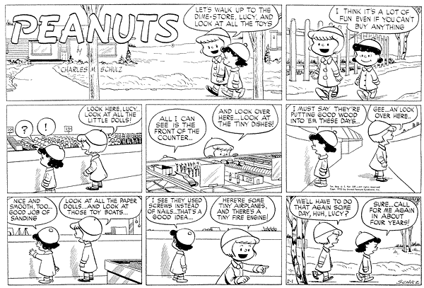

% Nails or Screws — Accessibility watchwords
% William D Ricker
% © 2019, 2026

# "Nails or Screws"

Alas [Peanuts.com](https://Peanuts.com) official archive ~~doesn't include 1953 (yet?)~~ **now has `Upsell` blocking content**, 
and didn't reply when i asked if they knew when it was run, 
but I [found it on a blog](http://peanutsroasted.blogspot.com/2010/08/sunday-february-1-1953-lucy-is.html) ... **which seems to have been hit by a takedown, but it's also now on the Fandom Wiki** [1953-02-01](https://peanuts.fandom.com/wiki/February_1953_comic_strips).

There seems to be a *literary* debate as to whether Lucy is being _sarcastic/ironic_ or _truly appreciative_ of the carpentry!
With hindsight of the Lucy that is-to-be, obviously sarcastic/ironic, and I for one think author's intent is plainly dislosed in Lucy's disgruntled parthian/parting-shot punch-line.

Obviously, neither Ruthie nor I read this in the newspaper in 1953, but only in [Pappa's](./GAR/GAR-Memorial.html) excellent collection.  
But it's the foundation for a family watch-word / catch-phrase
from our 1960s-70s vacation touring. 

> " Hey Ruthie, did `<whatever museum we're in>` use Nails or Screws ? "  
> -- our way of acknowledging height-ism of the architecture within arms reach.

----

   I am *barely* old enough to have seen the last few 5-and-dime / Woolworths / W.T.Grants with wooden bins for loose products arrayed as counters in islands on the floor, before advent of excess packaging and hang-hooks & shelves in aisles. (The modern Dollar store is the dime-store's indirect descendant as a price-point variety store today, but still with excess packaging and hooks-and-aisles. Yeah, a nickel is now a dollar.)

](images/kresge-five-and-dime.jpg)

----

UPDATES

Because of a literary discussion of Peanuts, I discovered the above link's photo-link expired (takedown notice?) (*discussion still there*).

[Permanent ? syndicate link](https://www.gocomics.com/peanuts/1953/02/01) (*login now required*)

[Wiki Feb 1953 Sunday in Color!](https://peanuts.fandom.com/wiki/February_1953_comic_strips)

----

Ruthie was featured by family friend Dan Kennedy's article in NUMagazine (which pushed Gov Dukakis off the cover!), which became a chapter in his book. ([Dan's Book](https://littlepeoplethebook.com/) & [Essays](https://littlepeoplethebook.com/essays-on-dwarfism/) ⇒ ["A Most Congenial Activist"](https://docs.google.com/document/d/1JujaiMNbyDhrLWjjRg5SA6tEtFgvf_s3P-yCPsL-qs8/edit?tab=t.0#heading=h.x7qqy1guz885) )

---
